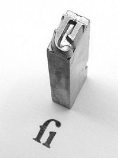

Czy wszystkie dokumenty tworzysz używając czcionki fontu Times New Roman? A może
Arial? Raz na jakiś czas warto coś w życiu zmienić... na początek może być krój
pisma.

Przede wszystkim wyjaśnijmy sobie jedną rzecz.

To jest czcionka:

A to jest krój pisma (_font_):

Nie mówcie więcej, że piszecie czcionką Tahoma, ok? Dzięki.

Skoro mamy to już za sobą, przejdźmy do sedna. Chcemy dziś zainteresować Was...

[LITERNICTWEM](http://pl.wikipedia.org/wiki/Liternictwo)

Do poruszenia tego tematu zainspirowały nas wpisy na blogu
[Bad Language](http://www.badlanguage.net/), a dokładniej
[ten](http://www.badlanguage.net/typography?utm_source=rss&utm_medium=rss&utm_campaign=typography)
i
[ten](http://www.badlanguage.net/creating-and-identifying-fonts?utm_source=rss&utm_medium=rss&utm_campaign=creating-and-identifying-fonts).
Zainteresowani tematem trafiliśmy na fantastyczną stronę
[typografia.info](http://typografia.info/). To właśnie tam polecamy Wam zacząć
przygodę z typografią. Np. od
[cyklu artykułów "Podstawy typografii"](http://typografia.info/artykuly/18-podstawy-typografii). Alternatywą
i uzupełnieniem jest świetna książka (w języku angielskim)
- [practicaltypography.com](http://practicaltypography.com/). Jeden cytat na
rozbudzenie apetytu:

_"If you learn and fol­low these five ty­pog­ra­phy rules, you will be a bet­ter
ty­pog­ra­ph­er than 95% of pro­fes­sion­al writ­ers and 70% of pro­fes­sion­al
de­sign­ers. (The rest of this book will raise you to the 99th per­centile in
both categories.)_

_All it takes is ten min­utes—five min­utes to read these rules once, then five
min­utes to read them again."_

Jeżeli stwierdzicie, że typografia was zafascynowała (nas trochę tak), warto
poszukać kontaktów, np. na facebook'u:

[Typografia po polsku](https://www.facebook.com/typolish?fref=ts)

[liternictwo i typografia - Pracownia Liternictwa (ASP Kraków)](https://www.facebook.com/liternictwo?fref=ts)

Albo przeczytać ten [poradnik](http://www.kentype.pl/?menu=31&group=guide).

Zbyt wiele informacji? Za mała czcionka, tfu, za mały font? W porządku, mamy też
coś dla leniuchów - infografiki dotyczące typografii:

[Podstawy](http://designinstruct.com/roundups/10-infographics-that-will-teach-you-about-typography/),
[ciekawostki](http://blog.psprint.com/designing/10-cool-typography-infographics/),
[historia](http://neomam.com/industry/7-typography-infographics/) (część się
powtarza) i
[coś na dokładkę](http://www.pinterest.com/Akimoto7/infographic-typographic/).

Miłej lektury.
