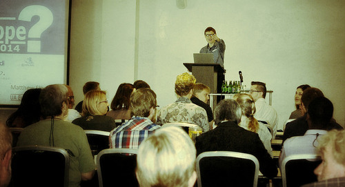

**[Matthew Ellison](http://www.uaeurope.com/conference/speakers.html#ellison)**,
czyli człowiek stojący za
sukcesem [UA Europe](http://www.uaeurope.com/about.html). Na konferencji
poprowadził dwie prezentacje, pierwszą z nich,
**[Tool Support for Creating User Assistance](http://www.uaeurope.com/conference/sessions.html#toolsupportmobileUA)**,
zrelacjonujemy w tym artykule.

<!--truncate-->

### Mobile vs. Non-Mobile

Co odróżnia dokumentację na urządzeniach mobilnych od dokumentacji na innych
nośnikach? Zasadniczo tylko wielkość ekranu. Na urządzeniu mobilnym oczekujemy
tej samej zawartości i łatwej nawigacji po wyświetlanej stronie. Czyli tak samo
jak w przypadku 'tradycyjnej' dokumentacji, na urządzeniach z mniejszymi
ekranami chcielibyśmy widzieć obrazki, spis treści, linki itd. Różnica polega
tylko na tym, że wszystkie te elementy muszą być dostosowane do użycia na małym
ekranie.

Czyli: spis treści owszem, ale w postaci rozwijalnego przycisku; linki, jak
najbardziej, ale takie, aby łatwo się je aktywowało poprzez dotyk; obrazki,
koniecznie, ale dostosowane do wielkości wyświetlacza, żeby w celu ich
obejrzenia nie trzeba było przesuwać ekranu w bok.

### Metoda Responsive Web Design (RWD)

[RWD](http://pl.wikipedia.org/wiki/Responsive_Web_Design) to podejście, w którym
stronę internetową buduje się w taki sposób, aby reagowała (ang. _respond_) na
wielkość ekranu, na którym jest wyświetlana, oraz jego orientację. W praktyce
oznacza to, że tę samą stronę możemy oglądać na dużym monitorze, na tablecie,
czy na telefonie. Co mamy na myśli mówiąc tę samą stronę? Dla nas oznacza to
przede wszystkim tę samą treść, która jest dostosowana do  wyświetlania w
różnych rozdzielczościach.

### Responsive vs. Adaptive

Czym to podejście różni się od **Adaptive Web Design (AWD)**? W przypadku metody
AWD dla każdego topiku (przyjmijmy, że jeden topik oznacza jeden plik)
musielibyśmy stworzyć kilka plików, dla różnych rozdzielczości. Czyli na
przykład jeden plik, który zostanie wyświetlony na ekranie komputera, jeden dla
tabletu, jeden dla telefonu. Przeglądarka rozpozna rozdzielczość ekranu i
przekieruje nas do odpowiedniego zestawu plików. **W przypadku RWD plik będzie
zawsze tylko jeden!** Dostosowany zostanie jedynie wygląd naszej strony według
przyjętych podczas projektowania strony ustawień i stylów.

### Pozycjonowanie stron

Podejście AWD zaburza też pozycjonowanie stron w wyszukiwarkach internetowych
ponieważ w zależności od urządzenia, na którym daną stronę oglądamy,
wyszukiwarka będzie myślała, że są to tak naprawdę różne strony. Czyli otwarcie
danej strony na tablecie, komputerze i telefonie zostanie zinterpretowane jako
otwarcie trzech różnych stron, zamiast trzy wejścia na tę samą witrynę.

### Narzędzia wspierające RWD

Najważniejsze jest jednak to, że większość narzędzi, których używamy na co dzień
w naszej pracy, bardzo ułatwia nam pracę z RWD. Matthew przedstawił  przykłady z
kilku takich narzędzi pokazując najciekawsze i najbardziej przydatne ich funkcje
oraz ich plusy i minusy. Nie chcielibyśmy wchodzić tutaj w szczegółowe opcje
każdego z tych narzędzi, jako że jest to temat na osobny artykuł. Chcielibyśmy
tylko, tak jak Matthew, zaznaczyć, że te narzędzia dają nam takie opcje i
naprawdę warto z nich korzystać.

[**RoboHelp 11**](http://www.adobe.com/pl/products/robohelp.html) \-
predefiniowane szablony, które można edytować; tworzenie wbudowanego systemu
pomocy (ang. _embedded help_) tworzenie własnych media queries bez znajomości
CSSa.

[**MadCap Flare 10**](http://www.madcapsoftware.com/flare10/) \- HTML5;
edytowalne szablony.

[**Doc-To-Help**](https://www.doctohelp.com/) - cztery opcje przeobrażania tabel
w zależności od wielkości wyświetlacza; edytowalne szablony.

**[WebWorks ePublisher](http://www.webworks.com/),** **[Author-it](http://www.author-it.com/),** **DITA**

Polecamy też ciekawą stronę, na której możecie  przeprowadzić symulację
wyświetlania witryn internetowych na różnych
urządzeniach: [http://www.responsinator.com/](http://www.responsinator.com/)

