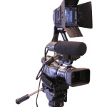
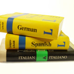

Dzieliliśmy się z Wami pierwszymi wrażeniami z
[konferencji](http://techwriter.pl/ua-europe-conference-pierwsze-wrazenia/ "UA Europe Conference – pierwsze wrażenia"),
dziś kolejna porcja relacji z kilku wybranych prezentacji: **Who are we? A
mirror of UA professionals (Joe Welinske)**, **Trends in user mobile assistance
(Joe Welinske)**, oraz **Automating and managing multiple projects in a
multilingual environment (Thomas Bro-Rasmussen)**. A to jeszcze nie koniec...

## [Who are we? A mirror for UA professionals - Joe Welinske](http://www.uaeurope.com/conference/sessions.html#whoarewe)

Na swojej stronie [Joe Welinske](http://www.writersua.com/) każdego roku
umieszcza ankiety, które mają na celu przybliżenie profilu ludzi zajmujących się
tworzeniem dokumentacji technicznej. W swojej prezentacji Joe przeanalizował
odpowiedzi na niektóre pytania pochodzące z dwóch ankiet: Skills & Technology
(2014) oraz Salary (2013). W tym krótkim streszczeniu, my podzielimy się
najciekawszymi przykładami.

### Umiejętności

Jakie umiejętności są dla dokumentalisty najważniejsze podczas wykonywania
codziennych czynności? Według Joe zaskoczeniem jest, że tylko połowa
ankietowanych odpowiedziała, że praca przy szeroko pojętych multimediach, a
liczba ta nie zmieniła się od poprzedniej ankiety. Jest to o tyle
niespodziewane, iż wydaje się, że coraz więcej informacji przekazywanych jest
użytkownikom wizualnie i zwiększa się też liczba osób pracujących przy tworzeniu
filmów instruktażowych.

Nie zmieniła się również liczba osób, dla których istotne jest testowanie
użyteczności dokumentacji technicznej, czego Joe jest zaciekłym propagatorem.

### Znajomość kodu

W kategorii c*ode-level expertise* wzrosła liczba głosów oddanych na technologię
DITA. HTML i CSS cały czas przodują, ale wydaję się że gdyby te dwie technologie
zostały rozdzielone, CSS otrzymałby dużo niższą liczbę głosów. Co ciekawe,
liczba osób znających języki programowania takie jak C++, C# czy Java wynosi
zaledwie 10%. I tutaj rada od Joe: jeśli umiesz rozczytać kod i umiesz go
opisać, możesz bez namysłu lecieć do USA, a tam Google, Microsoft, Amazon czy
inne tego typu wielkie korporacje przyjmą cię z pocałowaniem ręki i od ręki :)

### Systemy pomocy

Jeśli chodzi o systemy pomocy, to wśród technologii Microsoftu nadal dużą
popularnością cieszy się HTML Help (.chm). I tu ciekawostka: rokiem, w którym po
razy ostatni ten system został zmodyfikowany był 1998! Mimo to jedna czwarta
respondentów nadal uważa go za bardzo ważny system. Najpopularniejsza nadal
pozostaje pomoc użytkownika tworzona w HTMLu lub XMLu i otwierana w
przeglądarce.

### Platformy

Najczęściej wspierane platformy to oczywiście Windows, rośnie też ilość osób
głosujących na MAC OS X oraz platformy mobilne. Tutaj najwięcej dokumentacji
piszemy dla aplikacji webowych (44%), na Androida (39%) i iOS (42%).

### Wynagrodzenie i zadowolenie z pracy

Jeśli chodzi o pytania dotyczące wynagrodzeń, nie da się ich zbytnio odnieść do
polskich warunków. Co jednak ciekawe, na pytanie o doświadczenie zawodowe, aż
77% osób odpowiedziało: 10 lat lub więcej. Najmniej natomiast: 2 lub mniej (3%),
2 - 4 lata (5%). Gdyby to samo pytanie zadać w Polsce, mielibyśmy bez wątpienia
odwrotny wynik.

Jeśli chodzi o zadowolenie z warunków pracy, tutaj tech writerzy wskazywali
przede wszystkim na dużą satysfakcję wynikającą z nakładanej na nich
odpowiedzialności oraz z faktu, że mają bardzo elastyczne godziny pracy.

A z czego są najbardziej niezadowoleni? Według ankiety, firmy wciąż zatrudniają
za mało specjalistów od dokumentacji technicznej. Ci, którzy już pracują mają
więcej pracy wynikającej z rotacji pracowników oraz z coraz większej ilości
projektów.

Co sądzicie o tych statystykach? Jak można je odnieść do Waszej pracy? Jeżeli
chcecie wziąć udział w ankiecie Joe, najnowszą możecie
znaleźć [tutaj](www.surveymonkey.com/s/ua_tools_survey).

## [Trends in mobile user assistance - Joe Welinske](http://www.uaeurope.com/conference/sessions.html#mobileUAtrends)

[Joe Welinske](http://www.writersua.com/) specjalizuje się w projektowaniu
dokumentacji na smartfony i tablety. W swojej kolejnej prezentacji skupił się na
systemie Android oraz iOS. Bardzo skrupulatnie, jasno i sprawnie przekazał
mnóstwo ciekawych porad odnośnie tego jak powinna wyglądać dokumentacja na
urządzenia mobilne.

Kilka krótkich i najważniejszych porad:

- Zmień podejście. Urządzenia mobilne to nie tylko małe ekrany, ale przede
  wszystkim zupełnie inne środowisko ich zastosowania i używania.
- Próba przeniesienia helpa napisanego na Desktopa na urządzenia mobilne to nie
  jest dobry pomysł! :)

Kilka pojęć, z którymi warto się zaznajomić:

- First Time User Experience
- Overlays
- Conditional Programming
- Wizards
- TOC

I najważniejsze - prostota języka. Zmniejsz ilość słów, ale utrzymaj dobrą
komunikację!

Hasło podsumowujące: _Think what is the most important thing that we want to
say!_

**Dla chętnych:** Joe poszukuje osób do recenzji jego nowej, jeszcze niewydanej
książki. Można się z nim skontaktować w tej sprawie wysyłając do niego
[maila](http://www.welinske.com/contact-us/).

## [Automating and managing multiple projects in a multilingual environment - Thomas Bro-Rasmussen](http://www.uaeurope.com/conference/sessions.html#automating)

Thomas Bro-Rasmussen omawiał podczas swojej sesji w jaki sposób narzędzie MadCap
Flare ułatwiło pracę tech writerom w jego firmie. Thomas pracuje w branży
medycznej - w firmie GN Otometrics.

W branży tej cała dokumentacja musi być tworzona w przynajmniej 24 językach co
zajmuje ogromną ilość czasu. Firma potrzebowała zmniejszyć koszty i
zautomatyzować swoje procesy. To wszystko zapewniło im nowe narzędzie MadCap
Flare, które opiera się na metodzie single-sourcing.  Metoda ta umożliwia
publikację w różnych formatach, redukuje możliwość popełnienia prostych błędów,
daje możliwość pracy nad większa ilością projektów, a przede wszystkim znacznie
skraca czas potrzebny na stworzenie i opublikowanie dokumentacji w wielu
językach.
