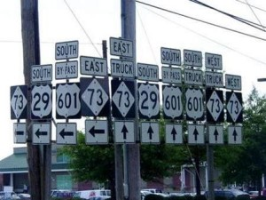

Zapraszamy na kolejną relację z UA Conference. Dzisiaj nasze podsumowanie dwóch
prezentacji: **Maximizing the Effect of Progressive Disclosure (Jang F.M.
Graat)** oraz **Designing Transactions Successfully (Dr Chris Atherton)**.

<!--truncate-->

## [Maximising the Effect of Progressive Disclosure - Jang F.M. Graat](http://www.uaeurope.com/conference/sessions.html#progressivedisclosure)

[Jang F.M. Graat](http://jang.nl/) przedstawia siebie jako filozofa i
minimalistę. Takie też były jego slajdy prezentowane podczas konferencji,
minimalistyczne i trafiające w sedno sprawy. I taka jest też jego filozofia:
minimalizm prowadzi do metody postępującego ujawniania informacji
(ang. *progressive disclosure*), minimalizm musi istnieć w dokumentacji
technicznej.

## Powód istnienia dokumentacji technicznej

Czy celem użytkownika jest czytanie dokumentacji produktu? Nie, jego celem jest
używanie tego produktu, działanie. Użytkownicy sięgają po dokumentację dopiero
gdy mają problem w osiągnięciu jakiegoś celu, gdy potrzebują odpowiedzi na
jakieś pytanie. Użytkownik nie chce czytać o rzeczach które nie są związane z
jego problemem, nie chce dowiadywać się jak działa oprogramowanie, którego
używa. Potrzebuje tylko konkretnej informacji: musi rozpoznać, że popełnił błąd
i go naprawić.

Według Janga, kluczową rzeczą, z jakiej musimy sobie zdać sprawę jest to, że
choćbyśmy nie wiadomo jak się starali, nigdy nie dowiemy się co tak naprawdę wie
nasz użytkownik: co umie, czy jest ekspertem, czy też nowicjuszem w używaniu
danego oprogramowania. Możemy tworzyć różne profile użytkowników, ale po co to
robić skoro tylko on sam wie, czego nie wie.

Jedynym słusznym podejściem według Janga jest tworzenie minimalistycznej
dokumentacji, a to osiągnąć można tylko za sprawą metody _progressive
disclosure_. Poniżej prezentujemy listę porad zebranych przez Janga do
wykorzystania przy tworzeniu dokumentacji w myśl tej metody.

## Podstawowe techniki

**Tooltipy** - zawierają one minimalną ilość potrzebnych informacji.

**Tekst rozwijany w bok (expanding text)** - nie jest to najlepszy sposób i
należy go używać z rozwagą. Minusem tej techniki jest fakt, że rozwijający się
tekst zaburza czytanie i reorganizuje treść na ekranie.

**Tekst rozwijany w dół (drop-down)** - podobnie jak w przypadku tekstu
rozwijającego się w bok, zmienia on strukturę czytanej strony, jednakże nie
zaburza jej.

**Warstwy** - bardzo dobry sposób, ale trudniejszy do implementacji. Użytkownik
lepiej rozumie co dzieje się na ekranie, gdy widzi informacje przedstawione w
warstwach. Ważne jednak, aby zawsze zapewnić użytkownikowi sposób na zamknięcie
każdej nowej pojawiającej się warstwy.

**Osadzone filmy wideo** - jeżeli umieszczamy w treści krótkie filmy, nie
zapominajmy, aby dołączyć do nich przyciski startu, wstrzymania, przewijania
etc. Nigdy też nie należy używać opcji automatycznego odtwarzania filmu.

**Przewodnik** - prawdziwy przewodnik po programie pozwala pracować w trakcie
uzyskiwania wskazówek. Nie polega on na prezentowaniu informacji slajd po
slajdzie, ale wykonywaniu czynności, które są akurat opisywane (np. wprowadzaniu
danych).

## Wskazówki

**Formatowanie tekstu i korzystanie z odpowiedniej nomenklatury w konsekwentny
sposób** sprawia, że użytkownik zawsze wie, czego się spodziewać patrząc na nasz
tekst. Przykładem tego jest używanie podkreślenia i odpowiedniego koloru dla
linków zamieszczonych w tekście. Użytkownik wie, że klikając dane słowo zostanie
przekierowany do innego miejsca z większą ilością informacji. To samo tyczy się
**używania stylów i umiejscowienia elementów na stronie** (np. przycisk pomocy
powinien zawsze znajdować się w tym samym miejscu).

Jeżeli użytkownik klika link w celu uzyskania pomocy, jego **uwaga powinna
pozostać skupiona w tym samym miejscu**. Czyli nie może on zostać przekierowany
w zupełnie inne miejsce na stronie. Po przeczytaniu i zamknięciu dodatkowej
informacji, powinien nadal znajdować się w miejscu, w którym zaczynał. Jeżeli
natomiast dajesz użytkownikowi możliwość przejścia w inne miejsce, **zawsze
zapewnij mu opcję powrotu**.

## Czego unikać

**Oczywista oczywistość** - nie ma konieczności opisywania wszystkiego co
 wyświetla się na ekranie. W końcu produkt powinien zostać stworzony tak, aby
używanie go było intuicyjne. Doskonałym przykładem jest tutaj wyjaśnianie
działania takich przycisków jak _dalej_ albo _anuluj_. Warto też zauważyć, że
opisując funkcje tak oczywiste ryzykujemy, że użytkownikowi umkną informacje
dużo ważniejsze.

**Przesyt informacji** - za dużo opcji, za dużo pól, za dużo informacji. Jeśli
nie wiemy gdzie patrzeć, czujemy się zagubieni.

**Nieprzydatna pomoc** - czyli…
[kill clippy](http://www.cracked.com/blog/clippy-finally-messes-with-the-wrong-word-doc/).

**Dynamiczne menu** - przykład z jednej z wersji MS Office: gdy raz wybierzemy
jakąś opcje w menu, pojawia się ona przy ponownym rozwinięciu menu. Sprawia to,
że program zmienia się za każdym razem gdy klikniemy coś nowego.

[Jang Graat](http://jang.nl/) pokazał wiele przykładów dobrego i złego podejścia
do dokumentacji technicznej. Wydaje się, że w czasach gdy coraz częściej
korzystamy z aplikacji na urządzeniach mobilnych i na nie też tworzymy
dokumentację, takie minimalistyczne podejście bardzo się sprawdza, z ogromną
korzyścią dla użytkownika.

## [**Designing Transactions Successfully - Dr Chris Atherton**](http://www.uaeurope.com/conference/sessions.html#successfultransactions)

[Dr Chris Atherton](http://www.equalexperts.com/) uświadamiała słuchaczom od jak
wielu szczegółów zależy, czy strona jest czytelna i łatwa w obsłudze. Na
podstawie projektu _UK Home Office's Visa and Immigration Service_, w którym
uczestniczyła, śledziliśmy krok po kroku największe problemy i wyzwania w
tworzeniu najlepszego rozwiązania. Hasło podsumowujące:
[Don't drink the Kool Aid](http://en.wikipedia.org/wiki/Drinking_the_Kool-Aid)
