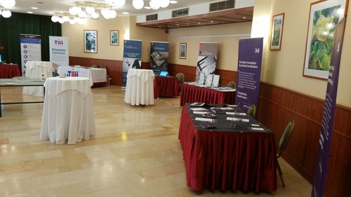
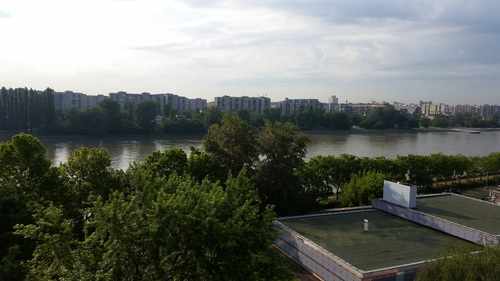

[Konferencja UA Europe](http://uaconference.eu/) (User Assistance Conference) odbywa się co roku w innym mieście. Tym razem uczestnicy mogli spędzić trochę czasu w malowniczym Budapeszczie. Byliśmy tam i my, dlatego zapraszamy na krótką relację.

# Tech writing

UA Europe to przede wszystkim stała kadra prezenterów i spora grupa delegatów, którzy wracają tu co roku. Konferencja odbywa się zatem w bardzo rodzinnej atmosferze, ale to nie znaczy, że nie porusza tematów ważnych dla autorów dokumentacji i innych osób z branży. Wystąpień było sporo, ale nam udało się być tylko na części z nich.

**Dave Gash** miał dwa ciekawe wystąpienia. Pierwsze było o używaniu Markdowna do tworzenia statycznych stron HTML, które mogą być szybkim dodatkiem do dokumentacji online. Mówił też o tym, jak sam tworzył dokumentację do Google API przy użyciu tego języka znaczników. W drugiej prezentacji mówił o tym co oznaczają literki RGB w modelu przestrzeni barw i nauczył nas rozpoznawać jak wygląda kolor #FFFFFF, a jak #1A1A1A. Oba wystąpienia były pełne humoru i błyszczały uwydatniły ciepłą osobowość.

**Matthew Ellison**, jeden z organizatorów konferencji, przeprowadził nas przez ciekawe przykłady pomocy użytkownika. Matthew cyklicznie wraca do tego tematu, pokazując nowe trendy z ostatnich 12 miesięcy. Wystąpienie może być źródłem inspiracji i dobrych praktyk. Ciekawe było na przykład to, że wiele aplikacji zamiast przycisku "OK" używa "Got it".

**Ulrike Parson** mówiła o porzuceniu manuali na rzecz zbiorów wiedzy. Sprawa jest o tyle skomplikowana, że opiera się na stosowaniu ontologii metadanych. Ulrike mówiła o tym jak powinniśmy tworzyć drzewa organizujące nasze produkty i używać tych drzew do nawigacji i wyszukiwania. Mówiła też o powstającym w Niemczech standardzie organizacji metadanych.

**Lea Guren** mówiła o swoich doświadczeniach z ostatnich 35 lat pracy w komunikacji technicznej. Dla początkujących i nie tylko miała kilka rad:

- Get organised - zapisuj wszystko, rób sobie listy, ustawiaj przypomnienia. Nie polegaj na pamięci!
- Kick the dog - zamiast potknąć się o psa, odsuń go z drogi. Zamiast wdrażać maleńką rzecz wielkim kosztem, czasem warto skupić się na efektywności. Perfekcja wcale nie jest naszym najlepszym przyjacielem.
- Ride the wave of technology - nie ignoruj postępów technologicznych, ale naucz się z nimi żyć i bądź na bieżąco. Jesteśmy w końcu **technical** communicators, więc technologia to część naszej pracy.

# Gulasz

Konferencja to nie tylko wiedza, to jeszcze lokalizacja. Sam Budapeszt jest nie lada atrakcją, natomiast hotel, w którym odbywało się wydarzenie znajdował się na wyspie Margitsziget, która jest oazą zieleni w samym środku miasta. Na samej tylko wyspie można było oglądać ruiny klasztoru, altanę-pozytywkę, starą świątynię, ogród japoński, budynek, z którego wypływał wodospad i na pewno wiele innych ciekawych miejsc, na które jednak nie mieliśmy już czasu. No i oczywiście można było dobrze zjeść.

\[caption id="attachment_4611" align="aligncenter" width="5312"\] Widok na miasto z wyspy Margitsziget\[/caption\]

# Ogień

Na konferencji były także okazje do poznania innych uczestników czyli tak zwany networking. Oprócz typowych wieczornych drinków została zorganizowana ciekawa atrakcja - gra plenerowa, w której uczestnicy szukali zadanych słów na terenie hotelu. Poza tym drugiego wieczoru konferencji odbył się pokaz sztuk związanych z ogniem. Niektóre manewry z ogniem, które wykonywali kuglarze były tak niebezpieczne, że mroziły nam krew w żyłach.

https://youtu.be/Jv\_3oTSbgdI

# Następny rok

Organizatorzy już zapowiedzieli kolejną konferencję na rok 2017. Jeszcze nie powiedzieli gdzie się ona odbędzie, ale będzie to północ Wielkiej Brytanii. Jeżeli dostaniemy podobną dawkę wrażeń i wiedzy co w tym roku, to na pewno warto będzie się wybrać.
