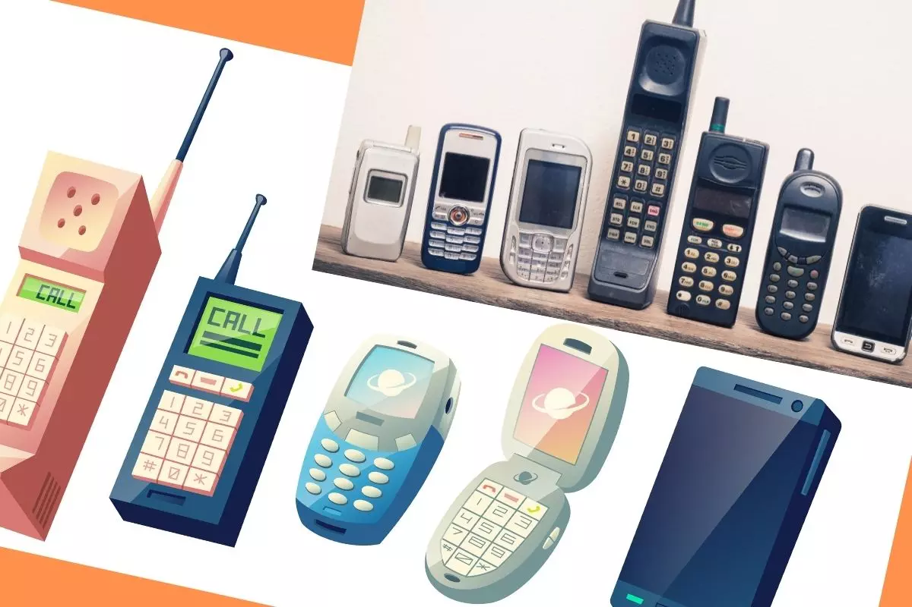
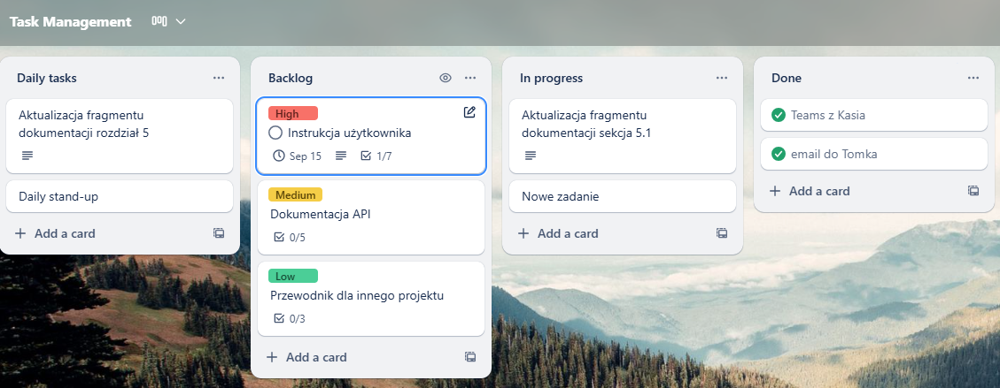
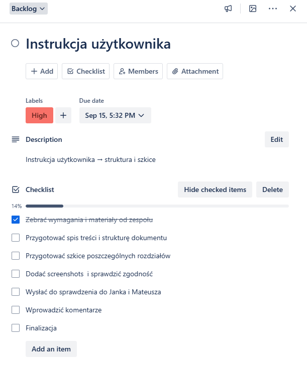
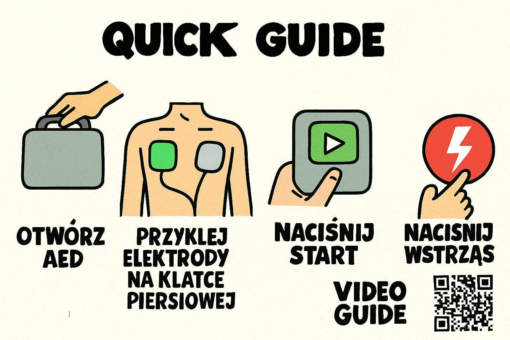
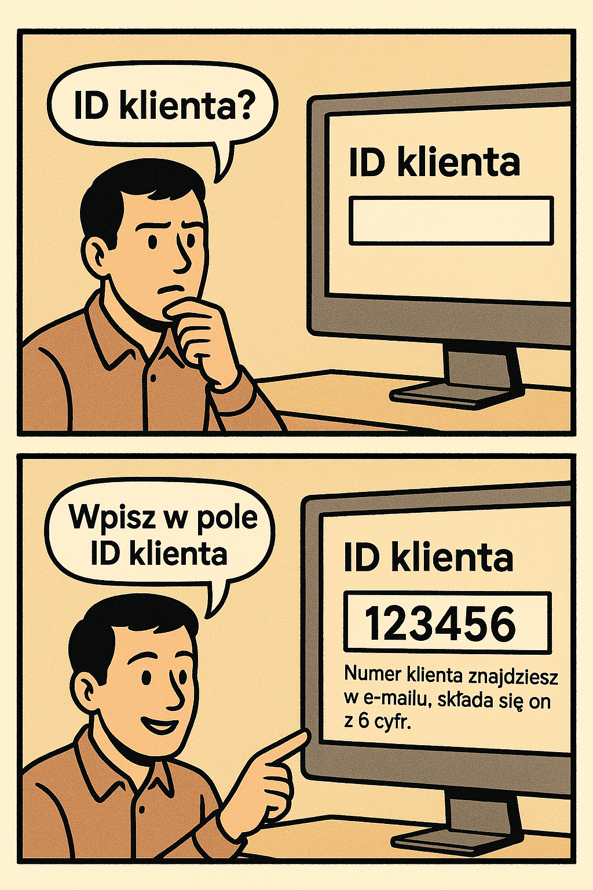

Umiejętności miękkie są równie ważne jak techniczne, ponieważ to od nich zależy,
czy dokumentacja będzie przyjazna w odbiorze i dopasowana do potrzeb
użytkownika. W końcu dobra dokumentacja to nie tylko zestaw danych — to most
między człowiekiem a technologią!

<!--truncate-->

W tym artykule omówimy umiejętności miękkie, które są przydatne w pracy
technical writera i jak one wpływają na jakość i atrakcyjność powstających
tekstów.

## Umiejętności miękkie i ich korzyść dla pisania

W świecie dokumentacji technicznej często skupiamy się na dokładności, spójności
treści, dbałości o szczegóły oraz technicznych aspektach pracy jak na przykład
umiejętność zrozumienia złożonych procesów i przełożenia ich na klarowne
instrukcje. To można określić jako chleb powszedni tej profesji. Ale… to dopiero
początek.

Mistrz tej dziedziny wie, że to nie wystarczy. Użytkownik nie tylko potrzebuje
informacji — on chce je zrozumieć, zapamiętać lub wrócić do nich w razie
potrzeby. To właśnie tutaj na scenę wchodzą umiejętności miękkie, które potrafią
zmienić "suchy" opis w opowieść prowadzącą czytelnika krok po kroku do
rozwiązania jego problemu lub odpowiedzieć na nurtujące go pytania.

Zdecydowaliśmy się przyjrzeć bliżej kilku umiejętnościom, które mogą mieć
znaczenie w dzisiejszym elektronicznym świecie, a które mogą pomoc zarówno w
pracy, jak i w codziennych interakcjach z technologią. Należą do nich:

- 🏋️‍♀️ Elastyczność
- 📖 Upraszczanie złożonych treści oraz storytelling
- 🎨 Kreatywność w prezentowaniu treści
- 🤝 Współpraca zespołowa
- 🗂️ Organizacja pracy
- ❤️ Empatia

## Bycie trochę jak człowiek z gumy

Współczesny świat technologii zmienia się szybciej niż kiedykolwiek. Coraz
częściej i szybciej pojawiają się nowe narzędzia, frameworki czy metody pracy.
To, co dziś jest standardem, jutro może zostać zastąpione przez lepsze, szybsze
i bardziej efektywne rozwiązanie. Zmiany są nieuniknione. Dla autorów tekstów
technicznych oznacza to jedno: elastyczność staje się kluczową umiejętnością.
Dlaczego?

- Technologie mają krótki cykl życia - narzędzia, które dziś opisujecie, za rok
  mogą być już przestarzałe.
- Nowe formaty dokumentacji - AI, interaktywne przewodniki, wideo czy chat boty
  zmieniają sposób, w jaki Wasi odbiorcy chcą konsumować wiedzę.
- Różne środowiska pracy - dokumentacja może być publikowana w chmurze, w
  repozytorium Git, w aplikacjach mobilnych.
- Oczekiwania użytkowników rosną - użytkownicy oczekują szybkich rozwiązań i
  wprowadzania zmian w produkcie czy oprogramowaniu.

Przykład:

---

Technical writer tworzy dokumentację do nowego modelu telefonu komórkowego,
bierze pod uwagę możliwość przyszłych aktualizacji i potencjalnych zmian
technologicznych. Od czego zacząć i o czym pamiętać?

Na początek warto skupić się na funkcjach podstawowych telefonu, jak wykonywanie
połączeń, odbieranie połączeń, wysyłanie wiadomości, będą one częściami stałymi.
Instrukcja taka koncentruje się wtedy na potrzebach użytkownika i opisuje cel
oraz efekt działania, a nie konkretny przycisk.

✅: Użyj **Połącz**, aby rozpocząć rozmowę.

❌: Naciśnij zielony przycisk z lewej strony aby wykonać połączenie.

Wspomniane funkcje podstawowe będą też częścią głównych sekcjach instrukcji. W
przypadku dodania rozszerzeń jak wideo-rozmowy, emotikony, GIF-y czy AR czaty
będzie można je dodać w osobnych modułach. Dzięki temu dokumentacja "starzeje
się" wolniej, podstawy są zawsze aktualne i zachowana jest struktura dokumentu
😉.

Ponadto można opisywać scenariusze - **Jak sprawdzić nieodebrane połączenia**
lub **Jak wysłać wiadomość multimedialną**. W przypadku aktualizacji interfejsu
rozwiązanie to zapobiegnie tworzeniu kolejnej wersji.

Ważnym elementem tej całej układanki są też metadane i kontekst (wersja
urządzenia/oprogramowania, jakie zmiany zostały wprowadzone), aby użytkownik
wiedział, czy instrukcja dotyczy jego telefonu czy nie.

---

Zatem, w pracy elastyczny technical writer, nie tylko nadąża za zmianami, ale
też potrafi je przewidywać i przygotować dokumentację w taki sposób, aby była
użyteczna także wtedy, gdy technologia kolejny raz się zmieni. Wykazuje gotowość
do nauki nowych narzędzi, dostosowuje się do nowych procesów pisania i
publikowania oraz ma świadomość trendów branżowych i aktywnie podąża za nimi.

## Sztuka opowiadania faktów

Wyobraźcie sobie, że technical writer jest niczym reżyser, który potrafi
zamienić skomplikowane zagadnienia w prosty, klarowny język, prowadzi widza -
czyli użytkownika - przez labirynty faktów i kontekstu prostym językiem. Każda
instrukcja, tutorial czy opis API staje się opowieścią. Nie ma tu miejsca na
chaotyczne ciągi poleceń - każdy krok jest następstwem poprzedniego.
_Storytelling_ w techwritingu nie oznacza wymyślania historii science-fiction w
środku instrukcji obsługi. Chodzi raczej o uporządkowanie treści, aby użytkownik
czuł, że podąża logiczną ścieżką i jest w stanie samodzielnie dotrzeć do
rozwiązania.

W praktyce oznacza to:

- Wprowadzenie kontekstu, dlaczego coś robimy.
- Prowadzenie odbiorcy krok po kroku, z jasno określonym punktem startu i celem.
- Podawanie informacji w odpowiedniej kolejności — tak, by nie "zalewać"
  użytkownika danymi, których nie potrzebuje lub które są zbędne na tym etapie.
- Dodawanie przykładów, które pomagają zrozumieć pojęcia.

Jak to można zrobić?

Przykład — opis konfiguracji systemu

---

**Wersja prosta:**

1.  Z menu **Ustawienia** wybierz sekcję **Sieć**.
2.  Włącz opcję **Połącz automatycznie**.
3.  Kliknij **Zapisz**.

**Wersja z narracją:**

Aby Twoje urządzenie łączyło się z siecią bez każdorazowego wprowadzania hasła:

1.  Przejdź do **Ustawienia→Sieć**.
2.  Zaznacz pole **Połącz automatycznie**.
3.  Kliknij **Zapisz**.

Od teraz urządzenie będzie pamiętać Twoje preferencje, a połączenie będzie
działać od razu po włączeniu.

---

Przykład — opis instalacji aplikacji mobilnej

---

**Wersja prosta:**

1.  Otwórz sklep Google Play lub App Store.
2.  Wybierz ikonę **Szukaj**.
3.  Wpisz nazwę aplikacji w wyszukiwarkę.
4.  Kliknij **Zainstaluj**.
5.  Po zakończeniu instalacji, kliknij **Otwórz**.

**Wersja z narracją:**

Aby korzystać z aplikacji na swoim telefonie, otwórz sklep Google Play (na
Androidzie) lub App Store (na iPhonie), następnie wybierz ikonę **Szukaj**.

Wpisz w wyszukiwarkę nazwę aplikacji i wybierz ją z listy wyników.

Kliknij **Zainstaluj**, a system automatycznie pobierze i zainstaluje program.

Cały proces trwa tylko chwilę, a po zakończeniu możesz od razu kliknąć
**Otwórz** i rozpocząć korzystanie z aplikacji.

---

Opowiadanie historii w dokumentacji nie powinno być długie. Czasami wystarczy
dodać **kontekst**, **cel** i **wynik końcowy**. Dzięki temu użytkownik lepiej
rozumie, dlaczego coś robi, widzi sens kolejnych kroków, a cała instrukcja
zmienia się w spójną opowieść, którą łatwo zapamiętać.

## Dogadać się w projekcie

W pracy technical writera współpraca zespołowa jest kluczem do tworzenia
rzetelnej i przydatnej dokumentacji. Oznacza to umiejętność efektywnego
działania w zespole złożonym z ekspertów z różnych dziedzin - od programistów,
przez testerów, po specjalistów UX, lista osób może być długa, a każdy z nich ma
inny styl pracy i komunikacji.

Przykład:

---

Technical writer pracuje nad dokumentacją nowej strony dla sklepu jeździeckiego.
Programista przekazuje mu szczegółowe informacje w formie kodu i używa
technicznego żargonu, tester opisuje problemy w punktach bez kontekstu, a
projektant UX dostarcza makiety ekranów bez opisów, uznając, że nie będą one
potrzebne i same makiety wystarczą. Jak poradzić sobie z tym chaosem?

| Kto             | Dane wejściowe                                                                                                                     | Jak to zrobił technical writer                                                                                                                                                                                                  |
| --------------- | ---------------------------------------------------------------------------------------------------------------------------------- | ------------------------------------------------------------------------------------------------------------------------------------------------------------------------------------------------------------------------------- |
| **Programista** | Dostarczył fragment kodu produktu: `id, name, price, rating, image, tag`.                                                          | Przełożył strukturę kodu na dokumentację API. Opisał każde pole: typ, znaczenie, użycie (`id` (integer) – unikalny identyfikator produktu w systemie. Jest globalny dla całej bazy produktów, a nie tylko dla danej kategorii). |
| **Tester**      | Zgłosił niejasności: brak waluty przy cenie, brak info o skali ratingu, niejasny zakres wartości tagu, co z niedostępnym zdjęciem. | Zamienił uwagi w sformalizowane specyfikacje: dodał opis waluty, zakres ratingu (1–5), charakter pola `tag` (procenty lub słowa), rekomendację dla fallback image.                                                              |
| **UX designer** | Przygotował makietę karty produktu, ale bez opisu zachowania.                                                                      | Połaczył elementy wizualne na dane z kodu (nazwa, cena, rating, zdjęcie, tag). Dodał narrację i przygotował pytania do UX (Czy są ograniczenia długości nazwy? Jak prezentowana jest cena w różnych walutach?).                 |

Zadaniem technical writera jest połączenie tych trzech źródeł w spójną całość,
co oznacza uporządkowanie treści, tłumaczenie technicznego języka programistów
na przystępny opis uzupełnienie luk, na przykład poprzez zadawanie pytań co do
istotności użycia makiet, gdzie dodać elementy graficzne, jak również uwzględnić
czas realizacji całego projektu. To wymaga zarówno umiejętności adaptacji do
różnych stylów pracy, jak i zdolności przekładania technicznego języka na
prosty, przystępny opis.

---

Innymi słowy, technical writer pełni rolę tłumacza i mediatora, który potrafi
znaleźć wspólny język między specjalistami a użytkownikiem, dbając, by
skomplikowane informacje stały się jasne, spójne i przyjazne w odbiorze

## Jak nie utonąć w morzu notatek i ticketów

Technical writer często pracuje nad kilkoma projektami jednocześnie, co wymaga
doskonałej organizacji czasu, priorytetów i wersji dokumentów. Kluczowe jest
utrzymanie terminowości i spójności treści, nawet gdy równolegle powstaje wiele
materiałów w różnych etapach rozwoju produktu.

Przykład:

---

Writer przygotowuje instrukcję użytkownika do nowego systemu, jednocześnie
aktualizując dokumentację API i tworząc przewodnik dla innego projektu. Aby
uporządkować swoje zadania może stworzyć listę priorytetów, podzielić prace na
mniejsze zadania, uwzględnia zmiany zatwierdzone przez osoby przeglądające
dokument. W Trello można to zrobić w następujący sposób:

Dzięki narzędziom do planowania można łatwo dodać zadania, podzielić je według
priorytetów, oznaczyć ich status (**Do zrobienia**, **W toku**, **Gotowe**) oraz
przypisać członków zespołu do poszczególnych kart. Cały proces tworzenia
dokumentacji staje się bardziej przejrzysty i uporządkowany. Z kolei stosowanie
kontroli wersji (Git, CMS) pozwala utrzymać porządek w materiałach, unikając
sytuacji, w której starsza wersja dokumentu trafia do publikacji i co
najważniejsze chaosu, kiedy równolegle tworzy różne typy dokumentacji.

---

Co tu dużo pisać, skuteczny technical writer potrafi być wielozadaniowy.

## Dokumentacja, która nie usypia, czyli magia kreatywności

W pracy technical writera liczy się nie tylko poprawność merytoryczna, ale też
forma przekazu. Dobór odpowiedniego formatu - czy będzie to tekst, infografika,
czy wideo - powinien być dopasowany do odbiorcy, aby treść była nie tylko
informacyjna, lecz także angażująca. Innowacyjne podejście do prezentacji treści
może zainteresować czytelników i ułatwić im przyswajanie informacji, większa
szansa na to, że użytkownik zrozumie i zapamięta kluczowe informacje. I owszem,
nikt nie jest w stanie być kreatywnym przez cały czas (nawet Szekspir musiał
czasem zrobić przerwę), ale warto zapisywać swoje pomysły i korzystać z
dostępnych narządzi by móc się rozwijać . Dziś Wasze notatki mogą być jak szkic
do kiepskiej książki, ale jutro może się okazać, że są inspiracja do projektu.

Przykład:

---

Technical writer ma przygotować instrukcję do obsługi automatycznego
defibrylatora zewnętrznego (AED). Może sam zdecydować jaka to będzie forma, czy
będzie to tekst, infografika, a może wideo?

Co wybrać i dlaczego? Forma wizualna jest bardziej przydatna zwłaszcza w
branżach, gdzie liczy się czas reakcji, bezpieczeństwo albo szybkie wdrożenie.
Wizualna instrukcja będzie najtrafniejszym wyborem, ponieważ ma pomóc
ratownikowi lub osobie pomagającej, szybciej przyswoić informacje, w tym
przypadku nie ma czasu na wątpliwości, liczy się szybka reakcja, nawet w
stresie!

---

Przy instrukcji wizualnej skraca się czas potrzebny na zrozumienie procedury i
zmniejsza się ryzyko popełnienia błędów, sam opis **Przyklej elektrody na klatce
piersiowej** może budzić pewne wątpliwości, dlatego dodanie grafiki może okazać
się kluczowe.

## Jak nie być robotem w świecie ludzi

Empatia to super moc, dzięki której technical writer potrafi wejść w buty
użytkownika, nawet jeśli są to niewygodne szpilki czy dziecięce sandały. Jest to
szczególnie ważne, gdy ten użytkownik może być zestresowany, zdezorientowany lub
dopiero zaczyna. Dzięki empatii technical writer potrafi przewidzieć pytania i
problemy, jakie mogą pojawić się podczas korzystania z narzędzia lub usługi.
Takie podejście pozwala tworzyć dokumentację, która odpowiada na realne potrzeby
odbiorców i prowadząc użytkownika za rękę, zanim ten zdąży się zgubić.

Przykład:

---

Podczas tworzenia dokumentacji technical writer zauważa, że część użytkowników
może mieć wątpliwości, co wpisać w pole ID klienta.

Co może zrobić, aby im pomóc? Zamiast tylko wymienić to pole w instrukcji, można
dodać kontekst, gdzie znaleźć ID klienta (numer klienta znajdziesz w oddzielnym
emailu, składa się on z 6-cyfr) lub dodać na przykład podpowiedź. Użytkownik nie
tylko wie, co wpisać, ale też skąd wziąć potrzebne informacje i jakie błędy mogą
się zdarzyć. Czuje się prowadzony krok po kroku, a ryzyko popełnienia błędu
maleje.

---

Skoro omówiliśmy już trochę teorii o umiejętnościach, to nadszedł czas na cześć
bardziej praktyczną. Umiejętności miękkie nie są zawsze wrodzonym talentem, ale
można je rozwijać tak samo, jak znajomość nowych narzędzi czy języków.

## Ćwiczenia i narzędzia

Poniżej znajdziecie przykłady ćwiczeń i narzędzi, które mogą Wam pomoc w
ulepszeniu umiejętności miękkich pod względem komunikacji, empatii i narracji.
Może okażą się przydatne w Waszej codziennej pracy.

Ćwiczenie 1: Myślenie od problemu do rozwiązania

**Jak można to zrobić:** Zamiast pisać instrukcję od pierwszego kroku, zacznij
od oczekiwanego efektu, a następnie cofnij się krok po kroku do punktu
startowego.

Ćwiczenie 2: Storytelling do codziennych zadań

**Jak można to zrobić:** Zacznijcie od opisywania zwykłych zadań biurowych (jak
na przykład, wprowadzanie danych do systemu) jako krótką historię — z punktem
startowym, problemem, rozwiązaniem i rezultatem.

Narzędzia wspierające rozwój umiejętności miękkie w techwritingu:

- [Loom](https://www.loom.com/) nagrywanie objaśnień w formie wideo
- [Canva](https://www.canva.com/en_gb/) do kreatywnego mapowania procesów i
  tworzenia notatek wizualnych
- [Evernote](https://evernote.com/) aplikacja do tworzenia i przechowywania
  notatek
- Narzędzia oparte na sztucznej inteligencji, chat boty które mogą symulować
  sytuacje społeczne
- [Trello](https://trello.com/) /
  [Jira](https://www.atlassian.com/software/jira) do śledzenia postępów w
  ćwiczeniach i pracy nad komunikacją.

## Na zakończenie

Przedstawiliśmy tylko kilka przykładów jak wykorzystać umiejętności miękkie w
pracy technical writera. Rozwijanie tych umiejętności wymaga świadomej praktyki
i ciągłego uczenia się a inwestowanie w ich rozwój może wkrótce stać się
niezbędne do budowania kariery w dynamicznym świecie zawodowym. Umiejętności
takie jak komunikacja, współpraca czy elastyczność, mają coraz większe
znaczenie, szczególnie w zawodach technicznych, gdzie techniczne umiejętności
muszą iść w parze z efektywnym przekazywaniem informacji.

A wy co o tym myślicie? Czy umiejętności miękkie są ważne w Waszej pracy? Jakie
macie doświadczenia z ich rozwijaniem? Podzielcie się swoimi przemyśleniami w
komentarzach!
