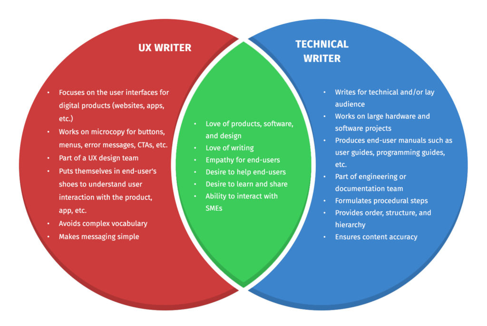

Czym jest UX writing i jakie wyzwania stawia ta rola? Jeśli myślisz o karierze w
UX writingu lub po prostu chcesz się więcej o nim dowiedzieć, ten artykuł omawia
ogólne podstawy i podaje źródła do dalszego zgłębiania wiedzy.

<!--truncate-->

## Czym jest UX writing?

Zacznijmy od wyjaśnienia, czym tak naprawdę jest UX writing i co oznacza w
praktyce. Posłużę się przykładem osoby, która pracuje na stanowisku UX writera w
firmie rozwijającej aplikację bankową. Najczęściej osoba ta będzie
odpowiedzialna za tworzenie wszelkiego rodzaju treści pojawiających się w
aplikacji, takich jak:

- powiadomienia i wiadomości powitalne,
- komunikaty (np. “Nieprawidłowy numer konta”, “Nie odnaleziono w historii”,
  “Brak połączenia z internetem”),
- nazwy przycisków i zakładek,
- teksty pomocnicze i dodatkowe informacje (np. “Hasło musi mieć minimum 8
  znaków”).

Warto też wspomnieć, że UX writing jest ściśle powiązany z interfejsem i bez
niego nie istnieje. W aplikacjach mobilnych kluczowym elementem jest oszczędność
miejsca i przygotowanie treści, które są krótkie, zrozumiałe i łatwe w odbiorze.
W przypadku stron internetowych, UX writer będzie mógł sobie pozwolić na większą
szczegółowość, ponieważ przestrzeń jest znacznie mniej ograniczona.
Projektowanie treści różni się więc w zależności od tego, czy dotyczy aplikacji
mobilnych czy stron internetowych.

W idealnym świecie UX writer powinien mieć do dyspozycji wytyczne, które są
zgodne ze strategią firmy i kierować się nimi podczas swojej pracy. Cały sens
tkwi w tym, aby treści nie tylko wyświetlały się użytkownikom, ale także
spełniały szereg innych wymagań, takich jak spójny ton i prosty styl
komunikacji. To jednak nie wszystko. W firmach, w których dopiero zaczyna się
kłaść nacisk na jakość treści w interfejsie, UX writer zwykle jest pierwszą
osobą odpowiedzialną za zebranie zasad pisowni i wskazówek w ogólnodostępny
poradnik, znany jako UX style guide.

Założeniem UX writingu jest więc nie tylko tworzenie jasnych i skutecznych
tekstów w interfejsie, ale również budowanie spójnego i pozytywnego
doświadczenia użytkownika. To doświadczenie nie zależy wyłącznie od treści, ale
również od jej umiejscowienia i dopasowania graficznego. Krótkie, precyzyjne
komunikaty w odpowiednim miejscu interfejsu pomagają użytkownikowi zrozumieć co
się dzieje, sprawnie wykonywać kolejne kroki lub uniknąć błędów. Długie,
chaotyczne i źle umiejscowione teksty wywołują frustrację i zakłopotanie. UX
writing jest więc niezbędnym elementem w projektowaniu interfejsów, który
realnie wpływa na doświadczenia użytkownika, skuteczność produktu i wyniki
biznesowe.

## Granica między UX writerem a technical writerem

Dla wielu osób praca UX writera i technical writera może wyglądać niemal
identycznie - w końcu obie role polegają na pisaniu tekstów związanych z
produktem. W rzeczywistości jednak różnią się kontekstem pracy i miejscem, w
którym użytkownik spotyka się z ich treściami. UX writer działa w interfejsie
produktu, a technical writer w dokumentacji i materiałach pomocniczych.

Poniższa ilustracja obrazuje te różnice. UX writer skupia się na treściach
wewnątrz produktu i analizuje najmniejsze detale projektowania treści w
interfejsie. Zazwyczaj jest częścią zespołu UX i ściśle współpracuje z UX
designerami nad tworzeniem ścieżki użytkownika. Jego największym wyzwaniem jest
tworzenie treści, które będą zrozumiałe dla użytkowników i pojawią się w
odpowiednim momencie czy miejscu. Technical writer z kolei koncentruje się na
tworzeniu dokumentacji, instrukcji obsługi czy przewodników krok po kroku. Jego
głównym zadaniem jest jasne przekazanie działania produktu i wskazanie
użytkownikowi, jak osiągnąć zamierzony cel.

_Źródło:
[https://technicalwriterhq.com/career/ux-writer-vs-technical-writer](https://technicalwriterhq.com/career/ux-writer-vs-technical-writer)_

Należy pamiętać o tym, że UX writer to dość nowe stanowisko na rynku pracy i w
wielu firmach jego obowiązki może pełnić technical writer. Dzieje się tak z
kilku powodów:

- UX writera i technical writera łączą podobne kompetencje językowe. Technical
  writer pisze prosto i zrozumiale, co jest również jedną z głównych cech w UX
  writingu.
- Osoby pracujące na tych stanowiskach łączy znakomita znajomość produktu i
  użytkownika, a także ciekawość w ich odkrywaniu.
- Tworzenie standardów to codzienność w pracy technical writera, jak i UX
  writera.

W praktyce wiele kompetencji UX writera jest w zasięgu technical writera.
Dlatego naturalnym wydaje się to, że zanim firma wyodrębni stanowisko UX
writera, technical writer zajmuje się pisaniem treści w interfejsie, gdyż
posiada wymagane do tego kompetencje.

## Co zrobić, gdy firma nie ma UX style guide

Z takim problemem boryka się wielu UX writerów, a czasami także technical
writerów, którzy pełnią obowiązki UX writera. Kontynuując przykład aplikacji
bankowej, wyobraźmy sobie, że UX writer musi uporządkować styl i sposób
komunikacji w interfejsie. Przeglądając treści zauważa, że np. komunikaty błędu
są niespójne - w jednym miejscu widnieje “Błędne hasło”, w innym “Nieprawidłowe
hasło”, a jeszcze w innym “Nieprawidłowe dane”. Skoro wszystkie te komunikaty
odnoszą się do jednej sytuacji, powinny brzmieć w jeden, ujednolicony sposób,
aby nie wprowadzać użytkownika w zakłopotanie. To tylko jeden z wielu
przykładów, z którymi UX writerzy mierzą się na co dzień.

Oto kilka pomysłów, które mogą okazać się pomocne w podobnych sytuacjach:.

- **Zrób przegląd istniejących treści**. Zapytaj zespół programistów czy mogą
  wygenerować plik wszystkich treści, które pojawiają się w interfejsie
  produktu. W ten sposób będziesz w stanie przeanalizować styl i język
  napisanych już treści. Pomoże Ci to określić, na jakim etapie jesteś. Być może
  część istniejących treści jest napisana w sposób prawidłowy i może stanowić
  solidną podstawę w tworzeniu bazy zasobów UX.
- **Zacznij pracę nad UX style guide.** Na początek wystarczy zebrać rzeczy,
  które na pierwszy rzut oka wydają się banalne, ale to dobry punkt wyjścia do
  dalszego rozwijania style guide. Wypisz zasady pisowni, które będą stosowane w
  poszczególnych elementach interfejsu produktu. Pamiętaj o tym, że ton, w jakim
  pisane są treści, powinien być spójny z profilem firmy. Możliwe, że będziesz
  potrzebować konsultacji i akceptacji ze strony innych zespołów. Jeśli
  natomiast tworzysz treści w języku angielskim, zdefiniuj, czy będą one w
  brytyjskim, czy amerykańskim angielskim. Te na pozór proste rzeczy będą
  stanowić kluczową część UX style guide.
- **Skonsultuj sporządzane zmiany i zasady z zespołem**. Wszyscy powinni być
  świadomi tego nad jakimi zmianami pracujesz i jak to wpłynie na ich pracę.
  Ważne jest to, aby zasady były zrozumiałe dla wszystkich.
- **Skorzystaj z istniejących już zasobów.** Bardzo często firmy decydują się na
  korzystanie np. z [Google Style Guide](https://developers.google.com/style)
  zamiast tworzenia własnego. Poniżej znajdziesz kilka innych przykładów:
  - [Microsoft](https://learn.microsoft.com/en-us/style-guide/welcome/)
  - [Salesforce](https://www.lightningdesignsystem.com/guidelines/voice-and-tone/)
  - [monday.com](https://www.brand-monday.com/tone-of-voice)
  - [IBM](https://carbondesignsystem.com/guidelines/content/overview/)
  - [Adobe](https://spectrum.adobe.com/page/voice-and-tone/)
  - [Atlassian](https://atlassian.design/content/)
  - [HubSpot](https://community.hubspot.com/t5/Getting-Started-on-the-Community/HubSpot-Voice-and-Tone-Guide/ba-p/632037)

Powyższe przykłady z pewnością posłużą jako inspiracja zarówno przy tworzeniu
pierwszego style guide w firmie, jak i przy rozwijaniu istniejącej bazy zasobów
UX.

## Od czego zacząć naukę UX writingu

Jeśli UX writing wciąż jest jest dla ciebie nieodkrytym lądem, poniżej
znajdziesz listę dodatkowych materiałów, które pozwolą ci poznać bliżej tę
dziedzinę i rozwieją wiele wątpliwości.

**Książki:**

1. Microcopy: The complete guide - Kinneret Yifrah
2. UX writing: Moc języka w produktach cyfrowych - Wojciech Aleksander

**Kurs:**

1. [Introduction To UX Writing](https://www.udemy.com/course/introduction-to-ux-writing/?couponCode=KEEPLEARNING)
   (Udemy)

Oprócz powyższych rekomendacji warto również wspomnieć o [Button](https://www.buttonevents.com/events), 
organizacji, która regularnie przeprowadza konferencje związane z UX writingiem, 
w tym wiele darmowych webinarów. 

UX writing to zdecydowanie więcej niż pisanie krótkich komunikatów. To tworzenie
treści, które są przemyślane, spójne z profilem firmy i umieszczone w
odpowiednich miejscach produktu. Każdy krok w kierunku uporządkowania treści ma
realny wpływ na zadowolenie użytkowników i podnosi jakość produktu.  
Jeśli dopiero zaczynasz swoją przygodę z UX writingiem, korzystanie z dostępnych
materiałów, obserwowanie dobrych praktyk i doskonalenie warsztatu znacząco
ułatwi proces nauki.
