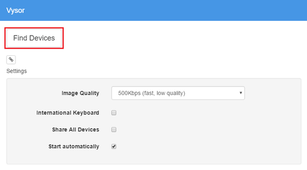
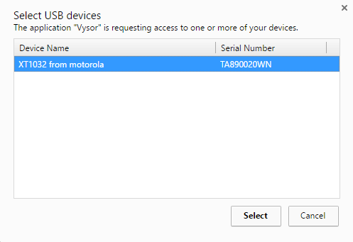
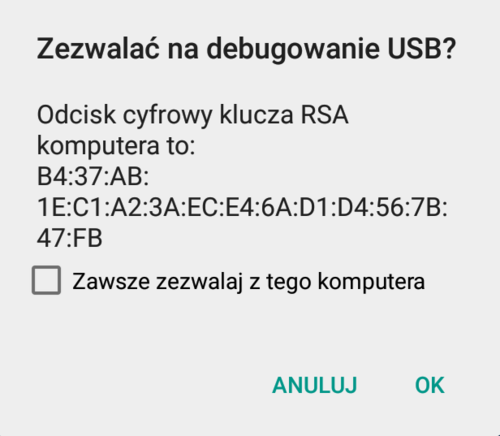
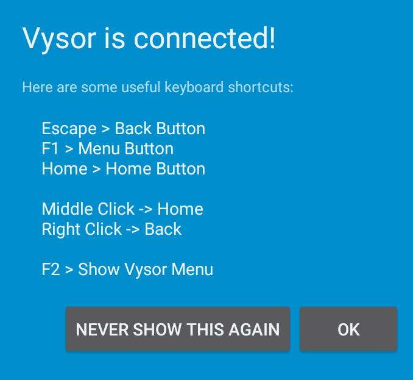
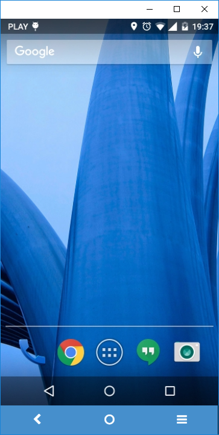

Nie tak dawno mieliśmy okazję przekonać się o tym jak niewygodne może być
testowanie dokumentacji na urządzeniu mobilnym. Po pewnym czasie, "stukanie" w
telefon tak nas zmęczyło, że zaczęliśmy szukać innego rozwiązania. Wtedy
natknęliśmy się na aplikację [Vysor](http://vysor.io/), która ulżyła naszym
cierpieniom, dlatego postanowiliśmy ją przedstawić szerszej publiczności.

## Czym jest Vysor?

Aplikacja [Vysor](http://vysor.io/), dostępna dla przeglądarki
[Google Chrome](https://www.google.com/chrome/), pozwala nam na wyświetlanie i
kontrolowanie na komputerze ekranu naszego urządzenia mobilnego. Występuje ona w
wersji darmowej i płatnej. Wersja darmowa umożliwia nam kontrolowanie urządzenia
z komputera i robienie zrzutów ekranu. Wersja płatna dodatkowo oferuje m.in.
wyświetlanie ekranu w wysokiej rozdzielczości, tryb pełnoekranowy oraz
przeciąganie plików na urządzenie.

## Do czego może nam się przydać?

W niektórych sytuacjach musimy przetestować dokumentację na urządzeniu mobilnym,
żeby sprawdzić czy wyświetla się ona prawidłowo. Taka potrzeba pojawia się
przeważnie kiedy nasza dokumentacja jest dostarczana jako responsywna strona i
musimy upewnić się, że jej układ, style i formatowanie są poprawne. Ten rodzaj
testowania dokumentacji może być uciążliwy, szczególnie jeśli musimy przejść
przez dziesiątki stron, które mają różne adresy. Ciągła zmiana adresu strony w
małym okienku przeglądarki mobilnej nie należy do najprzyjemniejszych zajęć. Do
tego dochodzi jeszcze kwestia raportowania znalezionych błędów. Jeśli znajdziemy
ich sporo, to robienie zrzutów ekranu telefonu, potem przenoszenie ich na
komputer jest również uciążliwe. Przykładowo, Vysor może okazać się pomocny
kiedy musimy przejrzeć dziesiątki stron w celu sprawdzenia czy kolumny w
tabelkach mają odpowiednią szerokość.

Oczywiście możemy też skorzystać z emulatorów urządzeń mobilnych lub po prostu
zmienić w ustawieniach przeglądarki jej rozmiar. Przekonaliśmy się jednak, że
takie rozwiązania nie zawsze wiernie oddają układ wyświetlany na ekranie
urządzenia. Występują pewne różnice, które mogą okazać się kluczowe w sytuacjach
gdzie jeden piksel w lewo lub w prawo ma znaczenie 😊 W przypadku Vysora nie
musimy się o to martwić, ponieważ widzimy dokładnie to samo na komputerze i na
ekranie urządzenia mobilnego.

## Jak go zainstalować?

Instalacja jest łatwa i nie zajmuje dużo czasu. W dalszych sekcjach znajdziecie
informacje o tym co będzie Wam potrzebne oraz przykładowy proces instalacji.

### Co jest potrzebne?

1. Urządzenie mobilne z Androidem.
2. Kabel USB.
3. Komputer z przeglądarką [Google Chrome](https://www.google.com/chrome/).
4. Sterowniki USB odpowiednie dla Twojego systemu operacyjnego i urządzenia
   mobilnego (opcjonalnie).

### Środowisko instalacyjne

Opisaną poniżej instalację przeprowadzaliśmy na takim środowisku:

- System operacyjny komputera: Windows 10 Home 64-bit
- Telefon: Motorola Moto G pierwszej generacji (XT1032)
- System operacyjny telefonu: Android 5.1 (Lollipop)

### Instalacja

Przed rozpoczęciem instalacji, upewnij się, że Twój telefon nie jest podłączony
do komputera.

Następnie, wykonaj poniższe kroki:

1. Jeśli jest to potrzebne, zainstaluj sterowniki USB odpowiednie dla Twojego
   systemu operacyjnego i telefonu.
2. Na komputerze, otwórz
   [stronę aplikacji](https://chrome.google.com/webstore/detail/vysor/gidgenkbbabolejbgbpnhbimgjbffefm)
   w Google Chrome, wybierz **DODAJ DO CHROME**, a następnie potwierdź dodanie
   aplikacji do przeglądarki.
3. Na telefonie, otwórz **Ustawienia > Opcje programisty**. Jeśli nie są
   dostępne, możesz je włączyć w następujący sposób:
   1. Idź do **Informacje o telefonie** i znajdź **Numer kompilacji**.
   2. Kliknij szybko 7 razy pod rząd w numer kompilacji. Opcje programisty
      zostaną włączone.
4. W opcjach programisty, włącz **Debugowanie USB**.
5. Podłącz telefon kablem USB do komputera i poczekaj aż urządzenie zostanie
   rozpoznane.
6. Na komputerze, otwórz Google Chrome i uruchom aplikację Vysor. Do
   zainstalowanych aplikacji możesz się dostać wpisując adres chrome://apps/.
7. W oknie aplikacji Vysor wybierz **Find devices**.
   
8. Po tym jak Twój telefon zostanie znaleziony, zaznacz go na liście i wybierz
   **Select**.
   Na
   telefonie pojawi się komunikat z prośbą o zezwolenie na debugowanie USB przez
   podłączony komputer. Poniżej znajduje się przykład komunikatu.
   
9. Wybierz **OK**. Na komputerze pojawi się okno ekranu telefonu, a w telefonie
   zostanie zainstalowana aplikacja Vysor. Po zakończonej instalacji zostanie
   podjęta próba nawiązania połączenia z telefonem. Jeśli próba się powiedzie,
   na telefonie pojawi się potwierdzenie połączenia.
   
10. Wybierz **OK** lub **NEVER SHOW THIS AGAIN** w zależności od preferencji. W
    oknie na komputerze wyświetli się ekran Twojego telefonu. Teraz możesz
    obsługiwać swój telefon za pomocą myszki i klawiatury komputera.

Na koniec mamy dla Was jeszcze jedną wskazówkę. Żeby ekran telefonu nie wygaszał
się automatycznie, otwórz w telefonie **Ustawienia > Opcje programisty** i
aktywuj opcję **Pozostaw ekran włączony**. Dzięki temu ekran telefonu nie będzie
wygaszał się w trakcie ładowania telefonu. Miłego testowania 😊
