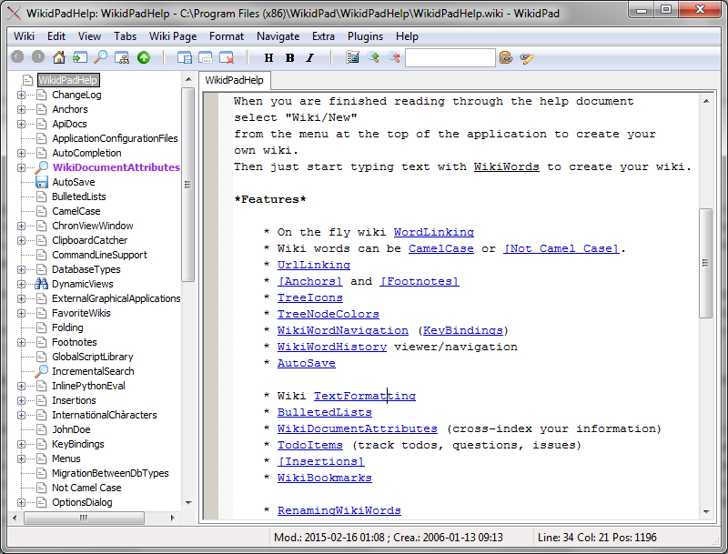
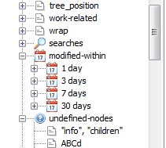
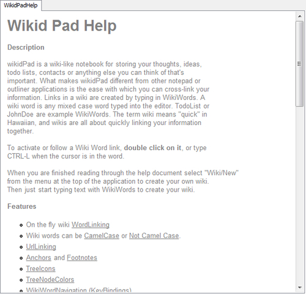
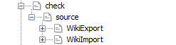

Jakiś
[czas temu](http://techwriter.pl/nie-tylko-wikipedia-czyli-do-czego-moze-sie-przydac-wiki/ 'O wiki')
przekonywaliśmy Was, jak użyteczna dla dokumentalisty może być dobrze prowadzona
Wiki. Dzisiaj chcielibyśmy przedstawić Wam wikidPada, czyli narzędzie, za pomocą
którego możecie tę tezę łatwo zweryfikować.

<!--truncate-->

### Czym jest wikidPad?

Sami autorzy określają go jako „notatnik wikipodobny” i jakkolwiek by to nie
brzmiało, znakomicie podsumowuje ideę tego narzędzia. Jest to aplikacja o bardzo
prostym interfejsie, na pierwszy rzut oka łatwa do pomylenia ze zwykłym
Notepadem. Wystarczy jednak wybrać opcję „Open help wiki” (menu „Help”), by
przekonać się, że pozory w tym przypadku mylą. Naszym oczom ukazuje się w pełni
funkcjonalna wiki będąca równocześnie pomocą programu, jak i znakomitą
demonstracją jego możliwości.

A możliwości są naprawdę spore. Możemy stworzyć własną Wiki bez konieczności
rejestracji w zewnętrznym serwisie i bez zabawy w instalowanie lokalnie serwera
WWW czy bazy danych. WikidPad nie wymaga żadnego dodatkowego oprogramowania i
jest gotowy do pracy zaraz po instalacji. Wszystkie teksty przechowuje lokalnie,
ale możemy łatwo tworzyć kopię zapasową i synchronizować pracę pomiędzy wieloma
komputerami za pomocą dowolnej chmury — wystarczy folder projektu umieścić np.
na Google Drive lub Dropboxie.

Narzędzie pokazuje pełnię swoich możliwości, gdy tworząc tekst musimy ogarnąć
dużą ilość materiałów źródłowych, notatek, luźnych pomysłów. Możemy łatwo
polinkować, pokategoryzować i pooznaczać notki tworząc własne repozytorium
wiedzy. Innymi słowy, gdy potrzebujemy zorganizować informacje w sposób podobny
do wiki społecznościowych, ale bez konieczności współpracy przez wielu
użytkowników, wikidPad sprawdza się znakomicie.

WikidPad nie narzuca nam nic, jeśli chodzi o strukturę wiki — mamy pełną
dowolność w grupowaniu i zagnieżdżaniu haseł. Możemy je tagować i przypisywać im
różne atrybuty (np. ikonki albo kolory), aby łatwiej wyszukać je w drzewku
wizualizującym nasz projekt.

Bardzo użyteczne są szablony — dla danego hasła możemy zdefiniować szablon, co
oznacza, że wszystkie hasła pochodne utworzone podczas edycji swojego rodzica
będą z niego korzystać. Brzmi to może trochę zawile, wyobraźmy więc sobie taki
przykład: nasz tekst obfituje w liczne postacie (np. piszemy „Wielki Leksykon
Słynnych Tech Writerów”). Główny tekst to historia tego zacnego fachu, natomiast
do każdego nazwiska chcielibyśmy przypisać krótką notkę biograficzną. Nic
prostszego — tworzymy szablon takiej notki (imię, nazwisko, rok urodzenia, opis
kariery itp.) i za pomocą specjalnej konstrukcji ustawiamy go jako aktywny
template w naszym leksykonie. Teraz każde nazwisko w tekście określamy jako
hasło wiki. Po kliknięciu w to nazwisko zostajemy przeniesieni do pustego
szablonu — wystarczy wypełnić zdefiniowane wcześniej rubryki i notka gotowa.

### Główne cechy programu:

- Łączenie haseł w czasie rzeczywistym — kiedy chcemy dodać nowe hasło, nie
  musimy przerywać pisania. Wystarczy napisać interesujące nas słowo w pewien
  specjalny sposób — CamelCase lub otaczając je \[Kwadratowymi nawiasami\] — i
  wikidPad sam będzie wiedział, że ma utworzyć i podlinkować nowy, pusty plik.
- Podpowiadanie hasła — wystarczy zacząć pisać hasło, a wikidPad automatycznie
  postara się wyszukać je wśród już istniejących i umieścić w bieżącym tekście.
- Dynamiczne widoki — możemy sprawdzić między innymi listę haseł zmodyfikowanych
  w ciągu jednego, trzech, siedmiu i trzydziestu dni; listę haseł bez rodzica
  (parentless) czy listę zaślepek, które trzeba wypełnić treścią
  (undefined-nodes).
- Łatwa nawigacja po tworzonej wiki — hasła są wyświetlane jako odnośniki,
  wystarczy na jakiś kliknąć (przytrzymując klawisz Control) i już zostajemy
  przeniesieni do jego definicji. Dzięki kolorowaniu łatwo odróżnić już
  istniejące hasła od zaślepek.
- Podstawowe formatowanie — mamy nagłówki (kilka poziomów), pogrubienie i skośny
  tekst. Do tego tabele (z nagłówkami lub bez). Niby niewiele, ale do większości
  zastosowań wystarcza.
- Hierarchiczne tagi — wewnątrz haseł można umieszczać tagi. WikidPad sam
  grupuje strony według nich tworząc łatwe w nawigowaniu drzewo. Działa to
  podobnie jak struktura folderów — jeżeli na przykład dwa hasła oznaczymy
  tagiem \[check.source:\] to w dynamicznym widoku będzie to wyglądało
  następująco:
- Drzewo struktury — przedstawia hierarchię haseł całej wiki, ułatwiając
  nawigację i ocenę struktury tekstu. Jak już wspomnieliśmy, poszczególnym
  elementom drzewa można przypisać różne atrybuty, które zmieniają to, jak są w
  owym drzewie pokazywane. W powyższym przykładzie z „Wielki Leksykon Słynnych
  Tech Writerów” moglibyśmy na przykład dodać ikonkę „ludzika” do wszystkich
  notek biograficznych.
- Lista rzeczy do zrobienia — czyli swojskie ToDo. Wikidpad automatycznie
  rozpoznaje pewne szczególne tagi (action, done, issue, project, question, todo
  oraz track). Są one wyróżnione w drzewku tagów, za ich pomocą można w
  elegancki i czytelny sposób zarządzać własnym projektem. Oto jak wygląda
  przykładowa lista:
- Automatyczny zapis — kolejna funkcja, która pozwala lepiej się skoncentrować
  na pracy, uwalniając nas od konieczności pamiętania o zapisywaniu co jakiś
  czas naszych zmian.
- Eksport do HTML-a — skończony artykuł (czyli całą wiki albo tylko jej część)
  możemy zapisać na kilka sposobów: jako pojedynczą stronę HTML (odnośniki
  „skaczą” w obrębie jednego dokumentu), jako zestaw stron (wtedy linki
  przerzucają nas pomiędzy dokumentami), jako pliki tekstowe (użyteczne, gdy
  chcemy dalej tekst opracowywać np. w Wordzie) lub jako zestaw plików wiki
  (wtedy łatwo nasze strony zaimportować do dowolnej innej wiki — nie koniecznie
  takiej utworzonej w wikidPadzie).
- Możliwość sprawdzania pisowni.

Dla użytkowników z zacięciem programistycznym znających język programowania
Python, gratką będzie zapewne możliwość pisania własnych rozszerzeń. Można w ten
sposób dodać brakujące funkcje lub zmienić już istniejące. Osoby nie potrafiące
programować zawsze mogą skorzystać z gotowych rozszerzeń — ich lista znajduje
się
[tutaj](http://trac.wikidpad2.webfactional.com/wiki/ListOfUserScripts 'Rozszerzenia').

### Podsumowanie

WikidPad jest programem, który na pierwszy rzut oka wygląda dość ubogo.
Wkładając jednak trochę wysiłku w poznanie jego możliwości wyposażymy się w
potężne i bardzo elastyczne narzędzie, które pozwoli opanować nawet
skomplikowane tematy. Nam odpowiada minimalistyczna, pozbawiona większości
gadżetów forma tego programu, która nie rozprasza i pozwala w pełni
skoncentrować się na procesie twórczym.
