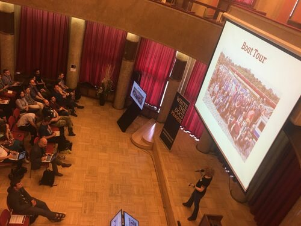
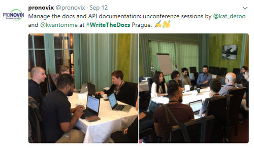
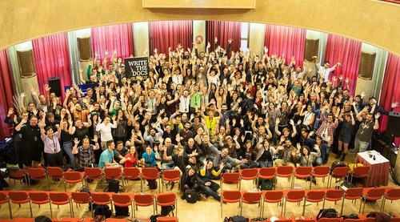

W dniach 10-12 września po raz kolejny odbyła się w Pradze europejska edycja
konferencji [Write the Docs](http://www.writethedocs.org/conf/eu/2017/). I my
ponownie mogliśmy w niej uczestniczyć, a o naszych wrażeniach przeczytacie
poniżej.

# Po pierwsze, Praga!

Każdego roku organizatorka konferencji
[Mikey Ariel](https://twitter.com/ThatDocsLady) powtarza, że jak długo będzie
mieszkać w Pradze, tak długo konferencja będzie się właśnie tam odbywać. Nas to
bardzo cieszy, bo konferencja nie jest jedynym powodem, dla którego co roku tam
jeździmy... W stolicy Czech każdy znajdzie coś dla siebie: zabytki, muzea,
przepiękne parki, teatry, knedliki i porządne piwo. A jeśli Was to nie
przekonuje, to zwracamy uwagę, że w okresie, gdy odbywa się konferencja, ma też
miejsce praskie winobranie, co oznacza dużo festiwali, koncertów i budki z
[burczakiem](https://pl.wikipedia.org/wiki/Bur%C4%8D%C3%A1k) na każdym rogu.

# Po drugie, zabawa!

W sobotę tradycyjnie część uczestników popłynęła statkiem wzdłuż Wełtawy. W
niedzielę odbył się Writing Day, podczas którego uczestnicy pracowali w grupach
nad różnymi projektami. Było dużo rozmów, śmiechu, trochę mniej pisania, ale
efekty były bardzo zadowalające - pamiętamy przecież, że najważniejszym celem
każdej konferencji powinno być dla nas wyniesienie jak najwięcej nowych
znajomości. I tutaj motyw przewodni tegorocznego "networkingu" podczas Write the
Docs brzmiał: codziennie poznać tyle nowych osób, w ilu konferencjach Write the
Docs się uczestniczyło. W poniedziałek wieczorem odbyła się impreza w klubie
Hangar, w samym centrum Pragi. Uczestniczy nie zawiedli i bardzo szybko zamknęli
otwarty rachunek na barze. Co do zabawy, warto wspomnieć, że konferansjerem na
konferencji był jak co roku Sam Wright, który bardzo błyskotliwie wprowadzał
słuchaczy w nastrój kolejnych prezentacji. Nie będziemy próbować powtarzać jego
żartów, ale zdecydowanie polecamy posłuchać ich na żywo.

# Po trzecie, networking!

Write the Docs bardzo mocno stawia na to, żeby uczestnicy poznawali się i
dyskutowali. Często się o tym przypomina ze sceny podkreślając bardzo fajną
zasadę, żeby nie obracać się tylko wśród znajomych, z którymi się przyjechało
oraz, żeby stojąc i dyskutując z ludźmi, zawsze zostawiać trochę wolnego
miejsca, żeby osoby chcące dołączyć do rozmowy nie czuły się skrępowane
wciskając się w nasz zamknięty krąg. Wielu uczestników konferencji (w
szczególności tzw. starych wyjadaczy) przyznaje, że przyjeżdża do Pragi tylko po
to, żeby prowadzić rozmowy w kuluarach, a nie żeby słuchać wystąpień.
Networkingowi sprzyja też idea niekonferencji (unconference), podczas których
uczestnicy siadają przy stole i dyskutują na jeden, ustalony temat.

# Po czwarte, prezentacje!

Jak zwykle na takich konferencjach, prezentacje dzieliły się na bardziej
teoretyczne, oraz te bardziej praktyczne. Mimo, że wszystkie stały na bardzo
wysokim poziomie i z dużą przyjemnością słuchało się wszystkich prelegentów,
przybliżymy wam tematy tylko kilku z nich.

W razie gdybyście mieli nie dotrwać do ostatniego akapitu tej relacji, zaczniemy
od końca, bo tutaj zostaliśmy naprawdę bardzo pozytywnie zaskoczeni. Jeśli
jeszcze nie słyszeliście o inicjatywie **Tech Writers Without Borders**, to
zachęcamy do wejścia na
ich stronę: [https://techwriterswithoutborders.org](https://techwriterswithoutborders.org). Organizacja
działa od niedawna, ale odniosła już spore sukcesy. O szczegółach projektów
opowiadał jeden z założycieli, [Stuart Culshaw](https://twitter.com/ouebguy).
Opowiedział on o projekcie, w którym usprawniano materiały naukowe dla
nauczycieli uczących podczas obozów letnich dla dzieci w Mali i Senegalu. Z
przyjemnością słuchaliśmy o sukcesie, jaki udało się odnieść dzięki grupie
ochotników, którzy swój prywatny czas poświęcili na usprawnienie tych materiałów
szkoleniowych. Stuart pokazywał nam zdjęcia z obozu, podczas którego były one
wykorzystywane, jak również opowiedział o sukcesach dzieci, które brały w nim
udział. Organizacja cały czas się rozwija i szuka ochotników. Pomóc można na
różne sposoby, chociażby usprawniając ich stronę internetową.

Ostatnią prelegentką pierwszego dnia była
[Ruthie Ben Dor](https://twitter.com/unruthless). Podczas prezentacji, w trakcie
której co chwilę wybuchały salwy śmiechu, Ruthie opowiadała na przykładach o
tym, jaki problem mogą sprawić źle nazwane elementy kodu ale też, a może przede
wszystkim o tym, jak trudno jest wymyślać takie nazwy. Ruthie podała kilka
ciekawych powodów, dla których w kodzie tak często natykamy się na nazwy, na
widok których się krzywimy. Warto mieć to na uwadze zanim przeklniemy
programistę, który w ten czy inny sposób nazwał nową klasę, którą teraz musimy
udokumentować. Jednym z powodów jest fakt, że potencjalne nazwy, które mogłyby
bardziej pasować zostały już wykorzystane, więc na siłę trzeba wymyślić coś
innego. Niby oczywiste, ale zapewne rzadko o tym myślimy... Kolejnym powodem
jest to, że słowa, których używamy często wywołują różne skojarzenia, które dla
nazywającego mogą nie być już tak oczywiste. Ciężko więc przewidzieć z czym
różne osoby będą kojarzyły nasze nazwy, i jakie problemy ze zrozumieniem tematu
mogą przez to wyniknąć. Problemem jest też to, że ludzie przywiązują się, albo
po prostu przyzwyczajają do pewnych terminów, zwłaszcza w świecie programowania.
Więc nawet jeśli wiedzą, że coś posiada nieodpowiednią nazwę, nie chcą jej
zmienić, gdyż tak jest im wygodniej. A to oczywiście generuje kolejne problemy.

Ciekawą prezentację miała również [Kate Wilcox](https://twitter.com/ktdocs),
która opowiadała o zmieniającym się stylu pisania. Na przykładach pokazywała
nam, jak zmieniło się podejście do używania pewnych zabiegów stylistycznych oraz
konstrukcji. Ciekawe jest na przykład to, że o ile w przeszłości podręczniki
stylu zniechęcały do zadawania w dokumentacji zbyt wielu pytań, o tyle teraz
często jest to zabieg, który stosuje się, żeby przybliżyć się do zagubionego
czytelnika. To samo dotyczy używania skrótów, które kiedyś były kojarzone ze
zbyt niedbałym stylem, a teraz stały się normą. Obecnie dla wielu Tech Writerów
to właśnie pełne formy brzmią mniej naturalnie i zbyt wydumanie. Warto śledzić
takie zmiany i być na nie otwartym, żeby na bieżąco dostosowywać swój sposób
pisania, zamiast trzymać się zardzewiałych zasad. Pamiętajmy, że nawet
podręczniki stylu, których używamy, też zmieniają zasady w kolejnych swoich
wydaniach.

Ostatnia prezentacja, o której chcielibyśmy wspomnieć jest **Writing a book in
2017**, [Thomasa Parisota](https://twitter.com/oncletom). Przykuła ona naszą
uwagę, bo rzadko na konferencjach możemy usłyszeć o procesie powstawania
książki. Thomas nie opowiadał co prawda o pisaniu powieści fantastycznej, ale i
tak było bardzo ciekawie. Thomas opowiadał o używaniu systemów do kontroli
wersji podczas pisania oraz o odpowiednim przygotowaniu tekstu przed wysłaniem
do recenzji. Mówił też o procesie zbierania feedbacku od osób innych niż
recenzenci, o stresie związanym z pisaniem, o narzędziach, które mu pomogły i o
różnych procesach. Pokazał jak ważne jest, żeby pokazywać to co się pisze,
zbierać opinie, pozwalać się ludziom wypowiadać. To ważne, bo nie tylko pozwala
szybciej poprawić ewentualne błędy, ale też sprawia, że przestajemy się bać
krytyki. Ważne też jest, żeby teksty, które piszemy pokazywać osobom z różnych
środowisk, nie koncentrować się tylko na tym, które jest nam najlepiej znane.
Dzięki temu wyczulamy się na różnych odbiorców i uczymy pisać dla szerszej ich
gamy. Jeżeli chcielibyście sprawdzić efekt pracy Thomasa, książkę można nabyć na
[Amazonie](https://www.amazon.fr/Node-js-pratiques-programmation-JavaScript-applicative/dp/2212139934/ref=sr_1_1?ie=UTF8&qid=1506976882&sr=8-1&keywords=node.js+bonnes+pratiques).

# Po piąte, czy wrócimy?

Tak, do Pragi wrócimy na pewno. Na sto procent! A tych, którzy nigdy na
konferencji nie byli, bardzo do tego zachęcamy. Co bardzo ciekawe, duża część
uczestników konferencji to programiści, testerzy, konsultanci, początkujący Tech
Writerzy. Przedstawiana tematyka jest zróżnicowana, atmosfera jest niezwykle
przyjazna, miasto piękne, pogoda (zazwyczaj) słoneczna. Także zapiszcie sobie w
kalendarzach przypominajkę na kwiecień, wtedy zazwyczaj rozpoczyna się sprzedaż
biletów, no i widzimy się za rok, w Pradze!

