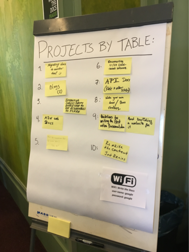
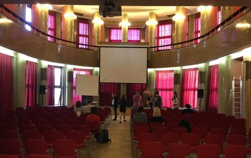
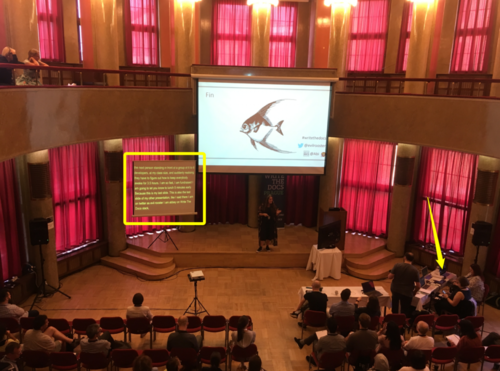
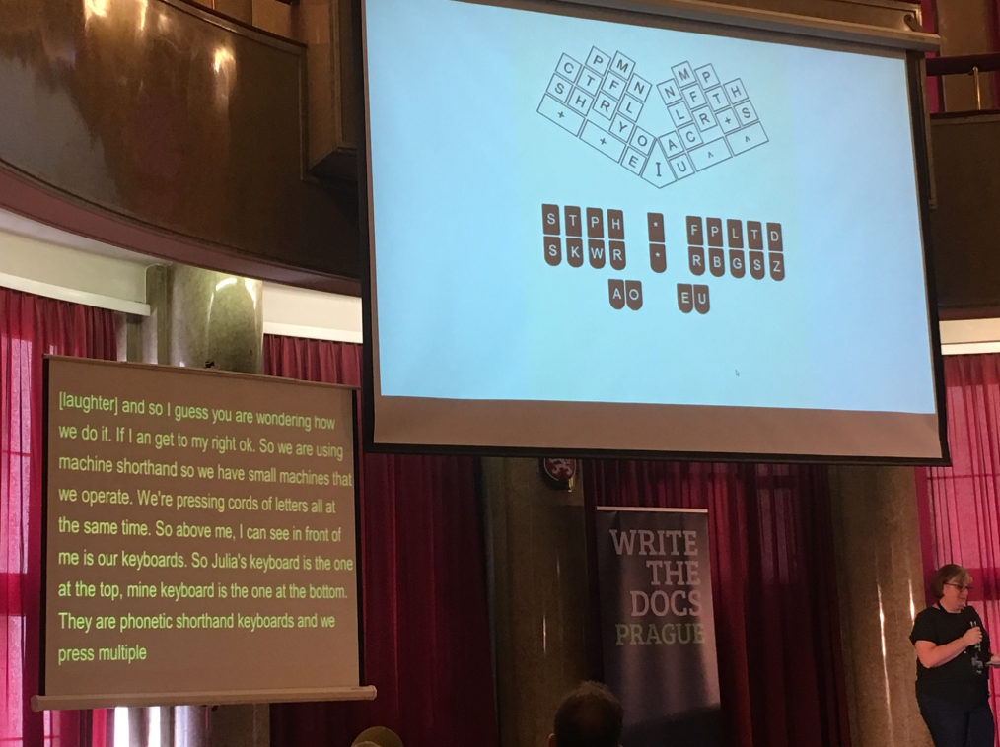
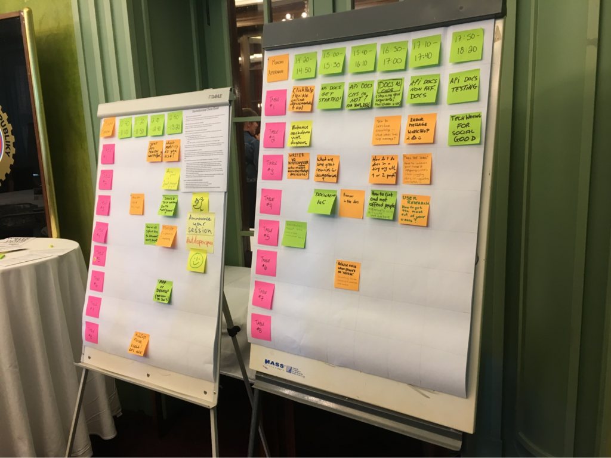
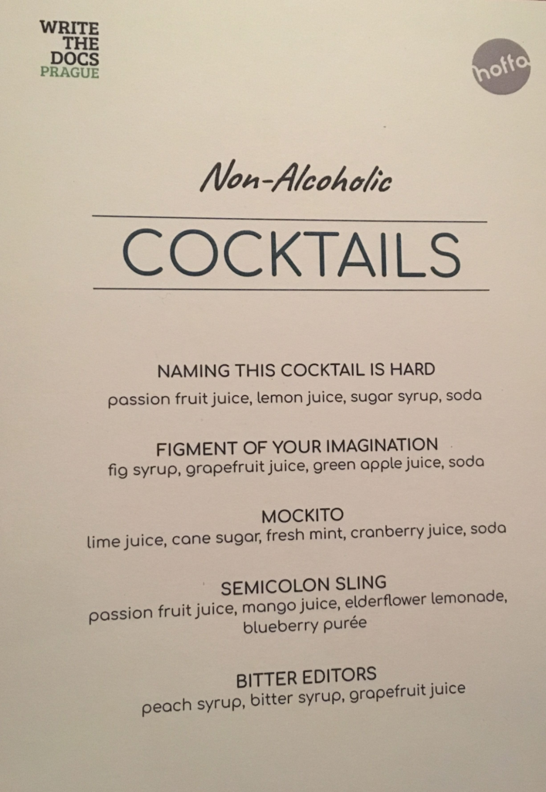
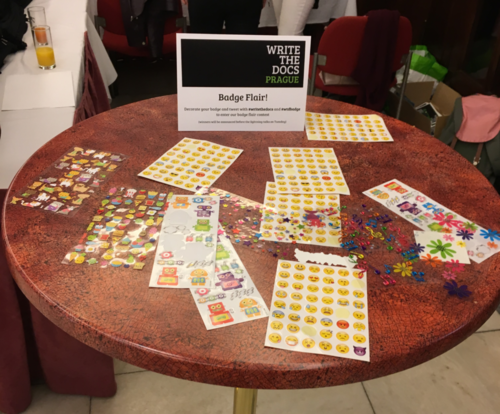

Redakcja Techwriter.pl miała przyjemność uczestniczyć w zeszłorocznej, europejskiej edycji Write the Docs. Kolejny raz byliśmy patronem medialnym tego wydarzenia i kolejny raz możemy być z tego dumni.

Tradycyjnie już konferencja rozpoczęła się w sobotę rejsem statkiem po Wełtawie, w którym wzięło udział około 60 uczestników. Trwająca blisko dwie godziny wyprawa była okazją do poznania organizatorów, nawiązania nowych znajomości i po prostu dobrej zabawy.

\[caption id="" align="aligncenter" width="590"\] Źródło: zasoby organizatora Write the Docs Prague 2018\[/caption\]

W niedzielę główna arena wydarzeń Write the Docs przeniosła się do siedziby Czeskiego Autoklubu. Jest to miejsce wyjątkowej urody, posiadające swój niepowtarzalny klimat. Śmiało można powiedzieć, że ma swoją własną osobowość. Zaraz po rejestracji i krótkiej wycieczce z Welcome Wagonem - specjalną grupą wolontariuszy, którzy przedstawili historię Autoklubu, opowiedzieli o mieście i samej konferencji - rozpoczął się oficjalnie Writing Day.

 Ideą Writing Day jest znalezienie grupy ludzi zainteresowanych daną tematyką i popracowanie nad wspólnym celem. Tym celem niekoniecznie musi być dokument, artykuł, czy gotowe rozwiązanie zdefiniowanego problemu. Czasami jest nim wymiana doświadczeń, przedstawienie swoich racji czy po prostu poszukanie inspiracji. Ilość i różnorodność pomysłów pozwala znaleźć coś dla siebie. Ponadto, jeśli propozycje innych nie przypadną nam do gustu, możemy zdefiniować swój temat i szukać chętnych do współpracy.

 Niedziela upłynęła niezwykle szybko. Popołudnie można było spędzić na zwiedzaniu przepięknej Pragi i zbieraniu sił przed główną częścią konferencji.

## Pierwszy dzień prelekcji (poniedziałek)

Niesamowita przestrzeń modernistycznego budynku Autoklubu świetnie nadaje się na organizację konferencji. Sala taneczna została zaadaptowana na potrzeby prelekcji. Oprócz klasycznego miejsca dla widowni posiada balkon, z którego również można śledzić prezentacje. Stamtąd prowadzona była również relacja na żywo.

\[caption id="" align="aligncenter" width="590"\] Źródło: zasoby organizatora Write the Docs Prague 2018\[/caption\]

Uczestnicy licznie zapełnili główną arenę wydarzeń tworząc iście konferencyjny klimat. Koszulka naszego portalu zdecydowanie pomagała nam nawiązywać nowe kontakty i wyłapywać z tłumu naszych rodaków :). Pojawiło się sporo znajomych twarzy, choćby z krakowskiego soap!. W końcu wybiła dziesiąta i konferencja oficjalnie się rozpoczęła.

Poniedziałek był niezwykle intensywny jeśli chodzi o same prezentacje. Poniżej przedstawiamy najciekawsze z nich.

### Introduction to Write the Docs - Mikey Ariel

Jako pierwsza na scenę wyszła przedstawicielka Write the Docs, Mikey Ariel, by przekazać nam podstawowe informacje na temat wydarzenia. Jeśli nie słyszeliście do tej pory o konferencji Write the Docs, to polecamy zapoznać się z opisem prezentacji poniżej. Jeśli wydarzenie jest Wam dobrze znane, lektura naszego streszczenia pozwoli Wam dowiedzieć się o zmianach od poprzedniej edycji. Write the Docs (WTD) to społeczność mająca na celu wymianę wiedzy i doświadczeń oraz promowanie szeroko pojętej branży komunikacji technicznej. WTD stworzyło również oryginalną nazwę dla roli człowieka związanego z tworzeniem treści - Documentarian. Na konferencjach organizowanych przez WTD każdy członek społeczności może czuć się swobodnie bez względu na wykonywany zawód, doświadczenie, wiek czy płeć (każdy uczestnik zobowiązuje się przestrzegać konferencyjnego [Code of Conduct](https://www.writethedocs.org/code-of-conduct/)). Zespół [WTD](http://www.writethedocs.org/team/) organizuje nie tylko cykliczne konferencje w Portland, Pradze, Cincinnati, Melbourne oraz [Wilnie](http://techwriter.pl/zapraszamy-na-write-the-docs-vilnius-2019/) (pierwszy raz w 2019) ale wspiera też tworzenie lokalnych meetupów. Do tego dochodzi strona społeczności działająca na zasadzie open source - każdy może dodać swoje trzy grosze.

Jeśli chodzi o konferencję w Pradze to zasady są proste:

1. Nie ma pytań z widowni.
2. Wystąpienia trwają 30 minut.
3. Rozmowy z prelegentami mogą być prowadzone w osobnej sali w ramach "unconference talks".
4. Obowiązuje reguła Pac-Man. Jeśli rozmawiasz w grupie, zostaw trochę miejsca dla kolejnej osoby, która chciałaby do Was dołączyć. Jeśli jesteś osobą, która chce dołączyć do grupy, po prostu zapytaj i czuj się do niej zaproszony.
5. W miejscu konferencji dostępny jest też "quiet room" - miejsce gdzie można odpocząć i na chwilę odciąć się od konferencyjnego zgiełku.
6. Wszystkie wystąpienia są transmitowane na żywo i nagrywane ([link do listy](https://www.youtube.com/playlist?list=PLZAeFn6dfHplRZcYDQjST22bAVeeWML4d)).

Ciekawostką WTD 2018 była transkrypcja treści mówionych live. Wszystkie przemówienia prezenterów były wyświetlane na ekranie w czasie rzeczywistym.  Nie mogliśmy otrząsnąć się z ciężkiego szoku, gdy dowiedzieliśmy się, że teksty były pisane przez dwie profesjonalne stenografistki na specjalnej maszynie sprzężonej z dedykowanym oprogramowaniem.

###  How to tear down existing documentation and rewrite docs that actually work - Alexandra White

Jeśli nie pracowaliście nigdy nad “legacy docs” (w wolnym tłumaczeniu "dokumentami, które dostaliście w spadku" :)) to tak naprawdę nie wiecie co to praca z dokumentacją. Taki wniosek można było wyciągnąć po wysłuchaniu tego wystąpienia. Prelegentka jednak wyszła z bardzo ciekawym pomysłem “zrównania dokumentacji z ziemią” i stworzenia jej na nowo. Alexandra omówiła zagrożenia jakie niesie za sobą nieaktualna i źle ustrukturyzowana dokumentacja. Pokazała na własnym przykładzie, że możliwe jest stworzenie czegoś na nowo jeśli tylko mamy dobrą strategię i stworzymy chwytliwy “business case”. Mogliśmy usłyszeć jakie aspekty wziąć pod uwagę tworząc taką propozycję biznesową:

1. Wprowadzenie do problemu, czyli dlaczego to robimy.
2. Zdefiniowanie odbiorców.
3. Wyznaczenie celów.
4. Opracowanie cyklu tworzenia i utrzymania dokumentacji.
5. Stworzenie konkretnego planu działania.
6. Stworzenie planu wdrożeniowego.
7. Zdefiniowanie narzędzi.

Oczywiście nie mogło zabraknąć podzielenia się własnymi błędami. Najważniejsze z nich to:

- Brak testowania dokumentacji przez użytkowników końcowych
- Źle przeprowadzone wdrożenie nowych osób
- Ogólny brak kultury dokumentacyjnej
- Zignorowanie faktu, że różnorodność ma niebagatelne znaczenie dla końcowego sukcesu (kultura, doświadczenie, poziom umiejętności)

### A11y-Friendly Documentation - Carolyn Stransky

A11y - wymawiane "alli" - czyli accessibility (11 liter w słowie) to obecnie jedna z ważniejszych dziedzin w życiu każdego z nas. Dotyczy ona szeroko rozumianej dostępności (w domyśle przez osoby posiadające różnego typu niepełnosprawności).

Obecnie dokumentacja nadal często jest pomijana w kontekście a11y co negatywnie wpływa na całościowe postrzeganie produktu. Z pomocą przychodzi tutaj "assistive technology" (technologia asystująca). Składają się na nią:

- Screenreadery
- Nawigacja klawiaturowa
- Sprzęt do nawigacji (ekrany dotykowe, mouth sticki, myszki do operowania stopami)
- Przełączniki (mechaniczne guziki, maty służące do operowania nogami, czujniki elektroniczne)
- Eye trackery i head trackery

Technologia może jednak pomóc tylko w ograniczonym wymiarze. Jako twórcy treści powinniśmy zdawać sobie sprawę jak możemy wpływać na zwiększenie dostępności naszych treści. Autorka przekonywała nas, że a11y to nasz obowiązek i podała przykłady jak możemy w łatwy sposób zwiększyć poziom "accessibility". Najprostsze z nich to:

1. Odpowiednia struktura i hierarchia informacji:
   - Odpowiednio zbudowane podsekcje
   - Dobrze “poszatkowana treść”
   - Czysty markup
2. Posługiwanie się wytycznymi [ARIA](https://www.w3.org/WAI/standards-guidelines/aria/) (Accessible Rich Internet Applications).
3. Używanie tzw. "focus indicators", czyli tagów służących do wytłuszczania tekstu. Pomagają one ludziom zorientować się gdzie znajdują się w danym momencie czytania.
4. Używanie tzw. "skip links", czyli odnośników do istotnych informacji na stronie. Ta technika jest niezwykle istotna z punktu widzenia screen readerów, gdyż skraca czas potrzebny na dotarcie do kluczowych treści (np. poprzez wskoczenie od razu do wyszukiwarki).
5. Używanie atrybutu "alt" w obrazkach.

Caroline wspomniała także o testowaniu treści pod względem "accessibility" za pomocą dostępnych dodatków i walidatorów, takich jak na przykład Wave. Trzeba przyznać, że wystąpienie było naładowane informacjami i praktycznymi przykładami, które stosunkowo łatwo zastosować w praktyce.

### "It's a Feature" - Documenting Known Issues and Product Shortcomings - Ivana Devcic

Ostatnim wystąpieniem dnia była prezentacja Ivany Devcic na temat dokumentowania Known issues, czyli problemów z oprogramowaniem, które znane są zespołom deweloperskim, ale z jakichś przyczyn nie zostały naprawione na czas. Ivana przedstawiła swoje strategie informowania użytkowników o tym, że nasze oprogramowanie nie działa tak jakbyśmy mogli tego oczekiwać. Do najważniejszych z nich należą:

- Odpowiednie podkreślenie ważności lub stopnia krytyczności błędu
- Jasne stwierdzenie co jest nie tak (limitation), co powinno się stać (goal), jak osiągnąć cel (workaround)
- Podanie obejścia problemu wraz z przykładem jego odtworzenia
- Unikanie obietnic, że coś zostanie naprawione (wiadomo, różnie bywa ;))
- Podanie wskazówek, np. dotyczących nawigowania w niezbyt dobrze zaprojektowanym interfejsie

Warto używać pozytywnego języka, który jednocześnie nie minimalizuje problemu. Zachowanie tej równowagi jest niezwykle istotne, lecz także bardzo trudne. Kolejna kluczowa rada to unikanie kłamstwa. Koniec końców ukrywanie błędów to też kłamstwo, a łatwiej jest naprawić problem niż odzyskać zaufanie klienta.

Intensywny poniedziałek minął bardzo szybko. Był to dzień pełen pasjonujących wystąpień oraz rozmów z niezwykle ciekawymi ludźmi. Wieczorem odbyła się impreza, na której jak zawsze była okazja jeszcze lepiej się poznać i pogadać, nie tylko o dokumentacji.

## Drugi dzień prelekcji (wtorek)

We wtorek rano pojawiliśmy się żądni jeszcze większej wiedzy. Reguły konferencji pozostały niezmienne - część główna odbywała się w sali balowej, Unconference w wydzielonej przestrzeni. Dodatkowo, we wtorek miały miejsce pierwsze w historii konferencji WTD targi pracy, o których wspomnimy nieco później.

### A Year in the Life of The Better Docs Project - Rowan Cota

Z prezentacji najbardziej zapadły nam w pamięć podnoszące na duchu słowa o istotnej roli jaką odgrywa komunikacja techniczna podczas tworzenia oprogramowania i o jej ważności w procesie wdrażania nowych członków zespołu. Rowan podkreśliła, że kod źródłowy jest językiem a inżynierowie są głosicielami pewnych idei. Dodała również, że w programowaniu nie chodzi o matematykę, ale o rozwiązywanie problemów. Natomiast wszystkiego czego nauczyła się w inżynierii, nauczyła się studiując dokumentację.

Autorka podzieliła się swoimi traumatycznymi doświadczeniami o przeszukiwaniu różnych repozytoriów w celu odnalezienia konkretnej wersji dokumentu. Przez kilka pierwszych tygodni była zagubiona w niezliczonych ilościach nieaktualnych treści, ponieważ nikt, tak naprawdę, nie przykładał się do jej tworzenia. Rowan szukała sposobu na poprawę sytuacji i postanowiła zwołać grupę ludzi, którzy pomogli jej rozpocząć projekt uspójnienia i ulepszenia dokumentacji. Padło kilka ciekawych inicjatyw:

- Stworzenie bota, który wyszukiwałby powiązane treści.
- Zorganizowanie Dnia Dokumentacji (Doc Day).
- Stworzenie specjalnego emoji na Slacku, żeby świętować sukcesy.
- Zidentyfikowanie ludzi, którzy mogą pomóc i nagrodzenie ich.

Najważniejszy wniosek po prezentacji to stworzenie kultury dokumentacyjnej w organizacji. Opłaca się włączać jak największą ilość osób w firmie w tworzenie dokumentacji oraz nagradzać najbardziej aktywnych. Jeśli to działa to nie zapomnijcie o świętowaniu sukcesów!

### Learning to love release notes - Anne Edwards

Kolejne wystąpienie skupiło się na nieco pominiętym typie dokumentacji jakim są Noty Wydawcze czyli Release Notes. Okazuje się, że nie jest łatwo znaleźć jednoznaczną definicję tego typu dokumentu. Trudno o spójną strukturę i tzw. voice and tone. Anne pokusiła się więc o stworzenie własnej definicji, w myśl której Release Notes jest nienumerowaną listą, która opisuje nowe funkcjonalności, poprawione błędy i znane problemy. Bardzo często są one tworzone na ostatnią chwilę oraz zasadniczo nie należą do grupy najpiękniejszych dokumentów. Niemniej jednak są bardzo potrzebne, żeby nie powiedzieć konieczne.

Przedstawiając swoje doświadczenia autorka zauważyła, że w większości tekstów umieszczanych w Release Notesach występuje swego rodzaju schemat i można śmiało powiedzieć, że są one powtarzalne. Tworzenie ich jednak wymaga sporego nakładu pracy, ze względu na częsty brak kontekstu, dość spory czas poświęcony na zbadanie tematu i specyficzny ton w jakim (w większości przypadków) muszą zostać napisane. Nie ma co ukrywać, że ich tworzenie nie dostarcza tyle satysfakcji, co tworzenie innych typów dokumentów. Dodać należy, że sporo firm powierza pisanie Notek Wydawczych programistom, ponieważ są oni często jedynym źródłem wiedzy. Fakt jest jednak taki, że nawet oni mają spore problemy z ich tworzeniem. Skupiają się za bardzo na technicznych aspektach, kompletnie nie dbając o odbiór treści przez czytelnika.

Jak zatem poradzić sobie z pisaniem efektywnych Release Notesów? Warto zachować kilka podstawowych zasad:

- Należy pisać precyzyjnym, przejrzyście i zwięźle.
- Trzeba być skoncentrowanym na użytkowniku.
- Warto dodać informacjom wystarczająco dużo kontekstu.
- Niekoniecznie też powinno się mówić użytkownikowi czego nie robić.
- Jeśli firmowe wytyczne na to pozwalają to dobrze sprawdza się używanie mniej formalnego tonu i zwracanie się do użytkownika “Ty”.
- Nie sprawdza się też wchodzenie w szczegóły - użytkownik może czegoś nie zrozumieć.

Anne przedstawiła też kilka bardzo przydatnych technik pisania Release Notesów:

- Rozszerz a potem uprość - najpierw rozłóż zagadnienie na czynniki pierwsze a dopiero potem uprość.
- Wyobraź sobie, że opowiadasz komuś o danym problemie - czy będzie go to w ogóle obchodziło? czy będzie chciał o tym wiedzieć?
- Stwórz szablon - będzie to zawsze mniej “główkowania” dla Ciebie i odbiorców.

Na koniec rada dla wszystkich. Style Guide jest po to, żeby nam pomóc, a nie żeby nas ograniczać, szczególnie w przypadku pisania tak specyficznych dokumentów jakimi są Release Notesy.

### Document What Matters: Lean Best Practice for Process Documentation - Gillian von Runte

Dość interesującym wystąpieniem była prezentacja Gillian von Runte. Pokazała dokumentację z perspektywy Lean: “jeśli tego nie używasz to nadaje się to do kosza”. Zacznijmy jednak od początku. Według autorki, w znacznej większości ludzie nie cierpią dokumentacji. Dodatkowo organizacje zmagają się z wieloma problemami, które mają wpływ na złą jakość lub brak dokumentacji. Są to najczęściej:

- Ograniczenia czasowe
- Brak doświadczenia lub umiejętności
- Brak rąk do pracy

Gillian wymieniła typowe wymówki, którymi posługują się organizacje, które nie dokumentują swoich procesów:

- Nigdy tego nie robiliśmy
- Nie wiedzieliśmy, że musimy
- Mamy za dużo na głowie, więc nie mamy na to czasu
- Chcemy poprawić wszystko, ale jest tego za dużo i nie możemy sobie z tym poradzić

Jak wybrnąć z tej niekomfortowej sytuacji? Lean daje nam rozwiązanie:

1. Ogranicz lub wyeliminuj potrzebę dokumentowania - jeśli nie potrzebujesz czegoś to tego nie rób.
2. Pokaż, nie mów - używaj obrazów.
3. Skup się na wartości dodanej.
4. Jeśli coś nie jest częścią standardowego podejścia - nie rób tego.

Autorka wspomniała również o koncepcji Moment of Truth (MoT) i jej roli w Lean. Istnieją trzy kroki do identyfikacji MoT:

1. Dowiedzieć się w jakich obszarach klient wchodzi w interakcję z produktem.
2. Wyselekcjonować krytyczne obszary (w większości przypadków wszystkich nie da się zaadresować).
3. Poprawić niedziałające interakcje.

Kolejnym ciekawym podejściem jest “use it or lose it” mające na celu eliminowanie informacji, które są nieaktualne. Powinno to dotyczyć każdej zmiany. Na koniec warto zadbać o unifikację i standaryzację podejścia, gdyż każde działanie odbiegające od wytyczonych reguł powoduje w dalszej perspektywie stratę na wielu płaszczyznach.

### Tackling technical debt in the docs - Louise Fahey

Ostatnia prezentacja, o której chcemy wspomnieć mówiła o radzeniu sobie z długiem technicznym, przez co wpisywała się w nurt wystąpień inspirowanych prozą życia Technical Writera. Problem ten dotyka większości dużych organizacji i zdecydowanie nie jest łatwy do rozwiązania bez dodatkowych nakładów czasu i wiedzy.

Louise przedstawiła podstawowe przyczyny powstawania długu technicznego, który utożsamia z długiem dokumentacyjnym:

- Odraczanie wykonania niezbędnych prac
- Presja czasu
- Źle przeprowadzone planowanie
- Przekazywanie projektów, w których stosowano złe nawyki
- Brak standardów
- Brak doświadczenia i umiejętności
- Brak możliwości zmodernizowania istniejących procesów i praktyk

Dostaliśmy także wskazówki jak zorientować się, że dług techniczny nas dotyczy. Louise podkreśliła kilka z nich:

- Wolno budujące się projekty
- Raporty pokazujące nieużywane pliki
- Problemy z lokalizowaniem (tłumaczeniem) produktu
- Częste komentarze w stylu “wrócimy do tego później”

Jak zredukować dług techniczny? Zacznij od audytu, używaj narzędzi do raportowania, pogrupuj swoje problemy i bądź systematyczny. Kolejnymi krokami powinno być spriorytetyzowanie i wycenienie działań oraz dodanie długu dokumentacyjnego do backlogu R&D. Na koniec warto pokusić się o pochwalenie się rezultatami i zaplanować działania mające na celu utrzymywanie jakości na wysokim poziomie.

## Wydarzenia towarzyszące

Elementami, które wyróżniają WTD na tle innych konferencji (oprócz widowni o bardzo zróżnicowanym profilu zawodowym) są bez wątpienia wydarzenia towarzyszące. Niektóre z nich mają charakter czysto rozrywkowy, inne dodają dużą merytoryczną wartość do całości. Oto one.

### Unconference

Równolegle do głównego nurtu konferencji toczyła się seria spotkań o nazwie Unconference. W założeniu są to nie tylko dyskusje grupowe, ale również prezentacje, burze mózgów, czy tak zwane “show and tell” - pokaż projekt i podziel się problemem a zainteresowani współpracą pomogą Ci go rozwiązać.

Pozytywnie zaskoczyła nas skala przedsięwzięcia. Podczas obu dni dyskutowano na niezliczoną ilość tematów. Warto dodać, że w 2018 roku największą popularnością cieszyła się tematyka API, której poświęcono praktycznie cały jednodniowy wątek wypełniony rozmaitymi zagadnieniami.

### Monday Night Social

Niewątpliwą atrakcją WTD jest impreza konferencyjna. Jak co roku organizatorzy postarali się o świetnie dobrane miejsce, pyszne jedzenie i wyjątkowe drinki. Można było nawiązać bardzo ciekawe kontakty z nieprzeciętnymi ludźmi.

### Lightning talks

Czymś co bardzo przypadło nam do gustu były lightning talks - krótkie, 5-minutowe wystąpienia (praktycznie bez przygotowania) na głównej scenie. Każdy uczestnik konferencji mógł zgłosić temat, który następnie był weryfikowany przez komisję i kwalifikowany do realizacji.

https://twitter.com/writethedocs/status/1039082803151949824

Pojawiły się tematy lekkie, trudne zagadnienia techniczne, motywy z pogranicza psychologii oraz śmieszne i kompletnie niezwiązane z tworzeniem treści przemowy. Drugiego dnia pojawił się nawet utwór śpiewany a cappella przez grupę dobrze zintegrowanych na wieczornej imprezie uczestników :) Oczywiście był to utwór o tematyce związanej z dokumentacją.

https://twitter.com/writethedocs/status/1039133977238482949

### Job fairs

Nowością na WTD w 2018 były targi pracy. Było to rozszerzenie powstałego również w ubiegłym roku na stronie społeczności [działu z ofertami pracy](https://jobs.writethedocs.org/jobs/). Trzeba przyznać, że wydarzenie cieszyło się sporym zainteresowaniem i z pewnością inicjatywa będzie kontynuowana.

### Badge Flair

Kolejny raz miał też miejsce konkurs na najlepiej udekorowany konferencyjny badge. Organizatorzy udostępnili kolorowe nalepki i etykietki, dzięki którym każdy chętny mógł stworzyć swojego niepowtarzalnego badge’a.

https://twitter.com/JanHalacek/status/1039428757747101696

## Podsumowanie

Niepostrzeżenie konferencja Write the Docs Prague 2018 dobiegła końca. Kolejny raz jesteśmy nasyceni treścią wystąpień i tematyką rozmów warsztatowych. Główne cele, czyli zdobycie wiedzy i poznanie nowych ludzi, zostały zrealizowane!

WTD Prague 2018 to, jak do tej pory, największa europejska konferencja społeczności Write The Docs. W tym czterodniowym wydarzeniu wzięło udział 260 osób. Jak co roku, konferencja stała na bardzo wysokim poziomie, zarówno pod względem organizacji jak i wystąpień. Zauważyliśmy wzrost znaczenia Unconference i Lightning talks.

Jeśli nie byliście jeszcze na konferencji Write The Docs to koniecznie musicie się na niej pojawić. WTD oprócz merytoryki zapewnia świetną zabawę i dużą dawkę pozytywnych emocji. W tym roku będzie ku temu dodatkowa sposobność ponieważ Write The Docs zorganizuje również [konferencję w Wilnie na Litwie](https://www.writethedocs.org/conf/vilnius/2019/).

_Zdjęcie główne artykułu pochodzi z zasobów organizatora Write the Docs Prague 2018_
