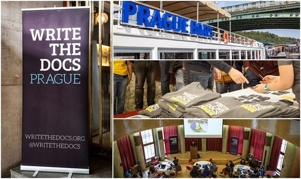
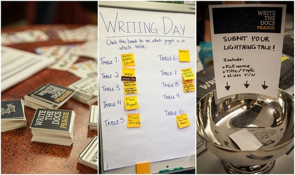
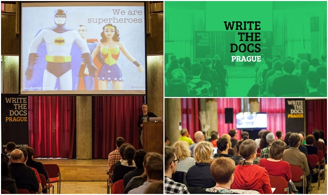

Ponownie, z wielką przyjemnością, zapraszamy Was na konferencję Wrire the Docs
do Pragi. Poniżej znajdziecie garść najważniejszych informacji związanych z
wydarzeniem.

## Krótki powrót do przeszłości

Jako patron medialny nie mogło nas zabraknąć podczas zeszłorocznej edycji Write
the Docs, z której obszerną relację znajdziecie
[tutaj](http://techwriter.pl/write-the-docs-prague-2017-relacja/). Tych, którzy
jeszcze nie znają historii konferencji odsyłamy do lektury
[tekstu wprowadzającego](http://techwriter.pl/poznajcie-write-the-docs-europe/)
;-). Od nas możemy dodać, że zdecydowanie polecamy udział w wydarzeniu - poza
solidną porcją wiedzy, w pakiecie otrzymujecie świetne miejsce, atmosferę oraz
spotkanie z rewelacyjnymi ludźmi z branży.

## Co, gdzie i kiedy?

Wszystkie niezbędne informacje znajdziecie na
[stronie konferencji](http://www.writethedocs.org/conf/prague/2018/). Skrótowy
program wydarzenia wygląda następująco:

- Sobota (8 września) - zwiedzanie Pragi łodzią
  ([link](http://www.writethedocs.org/conf/prague/2018/outing/)) i nawiązywanie
  pierwszych znajomości
- Niedziela (9 września) -
  [Writing Day](http://www.writethedocs.org/conf/prague/2018/writing-day/) czyli
  wspólne pisanie oraz rozwiązywanie związanych z tym problemów
- Poniedziałek (10 września) - pierwszy dzień konferencji - oficjalne otwarcie,
  pierwsze prelekcje,
  [Unconference](http://www.writethedocs.org/conf/prague/2018/unconference/) oraz
  wieczorna impreza zapoznawcza
- Wtorek (11 września) - drugi dzień konferencji - dalsze prelekcje,
  Unconference, Job Fair (nowość w tym roku), zakończenie konferencji.

Poza nowością jaką jest Job Fair (coś w rodzaju targów pracy), struktura
konferencji przebiega podobnie jak te z lat poprzednich. Nie zmieniło się także
miejsce, czyli Auto Klub w Pradze. Termin konferencji to oczywiście **8-11
września 2018 roku**.

Dokładny opis prelekcji i prelegentów nie jest jeszcze znany, jednak na pewno
pojawi się już wkrótce, więc obserwujcie stronę konferencji lub nasz portal -
jak zawsze trzymamy rękę na pulsie i za jakiś czas przekażemy Wam dalsze
informacje ;-).

## Rodzaje i ceny biletów

Bilety są już dostępne zatem chętnych odsyłamy
[tutaj](http://www.writethedocs.org/conf/prague/2018/tickets/), gdzie
znajdziecie szczegółowe informacje dotyczące poniższych rodzajów biletów.

- Bilet społecznościowy - wsparcie dla rozwijającej się społeczności Write the
  Docs - €500
- Bilet korporacyjny – gdy pracodawca płaci za bilet pracownika - €250
- Bilet indywidualny – dla osób jadących na własny koszt, pracujących w
  wolontariacie lub dla firm posiadających mniej niż 10 pracowników - €150
- Bilet dla studentów lub osób nieposiadających zatrudnienia - €75

### Co zawiera cena biletu?

Cana biletu zawiera:

- Wstęp na wszystkie atrakcje i imprezy przewidziane w trakcie całego wydarzenia
- Śniadanie, przekąski oraz obiad podczas wszystkich dni trwania konferencji
- Przyjęcie zapoznawcze w dniu poprzedzającym konferencję oraz party po
  pierwszym dniu konferencji. Podczas obydwu imprez będą serwowane przekąski
  oraz darmowe napoje
- Wi-Fi

Z naszego punktu widzenia cena jest adekwatna do jakości tego za co płacimy,
zatem z czystym sumieniem zachęcamy Was do udziału w Write the Docs Prague 2018.

Źródło zdjęć:
[flickr Write the Docs](https://www.flickr.com/people/writethedocs/)
