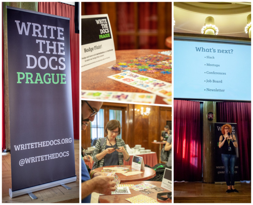
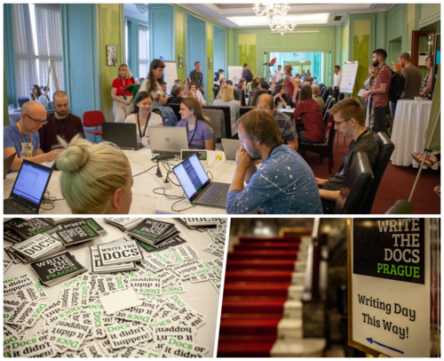
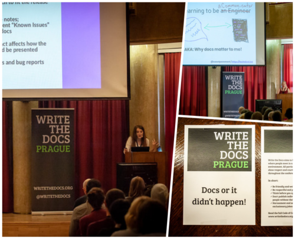

Po raz kolejny, z ogromną radością, zapraszamy Was na konferencję Wrire the Docs do Pragi. Poniżej znajdziecie najważniejsze informacje związane z wydarzeniem.

Będąc stałym patronem medialnym konferencji, nie mogło nas zabraknąć podczas zeszłorocznej edycji Write the Docs w Pradze. Relację z niej znajdziecie [tutaj](http://techwriter.pl/write-the-docs-prague-2018-relacja/). Tych z Was, którzy jeszcze nie znają historii wydarzenia odsyłamy do [tekstu wprowadzającego](http://techwriter.pl/poznajcie-write-the-docs-europe/) ;-). Od siebie możemy dodać, że udział we Write the Docs jest wart uwagi gdyż poza solidną porcją wiedzy, w pakiecie otrzymujecie wizytę w pięknej Pradze, świetną atmosferę oraz spotkanie z rewelacyjnymi ludźmi z branży.

### Najważniejsze informacje

Tegoroczna edycja **Write the Docs Prague** odbędzie się w dniach **15-17 września w Auto Klubie**, miejscu dobrze już znanym uczestnikom wcześniejszych edycji. Tradycyjnie już w dniu poprzedzającym wydarzenie, to jest 14 września, będzie miał miejsce rejs statkiem po Wełtawie, w trakcie którego uczestnicy będą mogli lepiej się poznać. Kolejnym, stałym już punktem, jest Writing Day czyli zespołowe pisanie oraz rozwiązywanie problemów związanych z zadaniem. Ćwiczenia z umiejętności pisarskich odbędą się 15 września i będą doskonałym wstępem dla prelekcji i wykładów, które będą miały miejsce 16 i 17 września. Wszystkie niezbędne informacje znajdziecie [na stronie konferencji](http://www.writethedocs.org/conf/prague/2019/). Skrótowy program wydarzenia wygląda następująco:

- Sobota (14 września) – [zwiedzanie Pragi łodzią](http://www.writethedocs.org/conf/prague/2019/outing/)
- Niedziela (15 września) – [Writing Day](http://www.writethedocs.org/conf/prague/2019/writing-day/)  oraz przyjęcie powitalne
- Poniedziałek (16 września) – pierwszy dzień konferencji – oficjalne otwarcie, pierwsze prelekcje, [Unconference](http://www.writethedocs.org/conf/prague/2019/unconference/) oraz wieczorna impreza zapoznawcza
- Wtorek (17 września) – drugi dzień konferencji – dalsze prelekcje, Unconference, [Job Fair](http://www.writethedocs.org/conf/prague/2019/job-fair/), zakończenie konferencji.

Dokładny opis prelekcji i prelegentów znajdziecie [tutaj](http://www.writethedocs.org/conf/prague/2019/speakers/), a pełny program wydarzenia dostępny jest pod [tym linkiem](http://www.writethedocs.org/conf/prague/2019/schedule/).

### Rodzaje i ceny biletów

Osoby zainteresowane kupnem biletów odsyłamy [tutaj](http://www.writethedocs.org/conf/prague/2019/tickets/), gdzie znajdziecie szczegółowe informacje dotyczące poniższych rodzajów biletów.

- Bilet korporacyjny – gdy pracodawca płaci za bilet pracownika – €300
- Bilet indywidualny – dla osób jadących na własny koszt, pracujących w wolontariacie lub dla firm posiadających mniej niż 10 pracowników – €175
- Bilet dla studentów lub osób nieposiadających zatrudnienia – €75

### Co gwarantuje cena biletu?

Cana biletu zawiera:

- Wstęp na wszystkie atrakcje i imprezy przewidziane w trakcie trwania wydarzenia
- Śniadanie, przekąski oraz obiad podczas wszystkich dni trwania konferencji
- Przyjęcie zapoznawcze w dniu poprzedzającym konferencję oraz po pierwszym dniu konferencji. Podczas obydwu imprez będą serwowane przekąski oraz darmowe napoje
- WiFi.

W naszej opinii cena jest adekwatna do jakości tego za co płacimy. Z czystym sumieniem zachęcamy Was do udziału w Write the Docs Prague 2019.

Źródło zdjęć: zasoby organizatora Write the Docs Prague 2018
