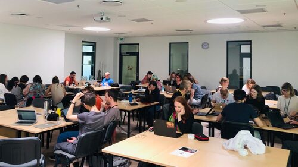
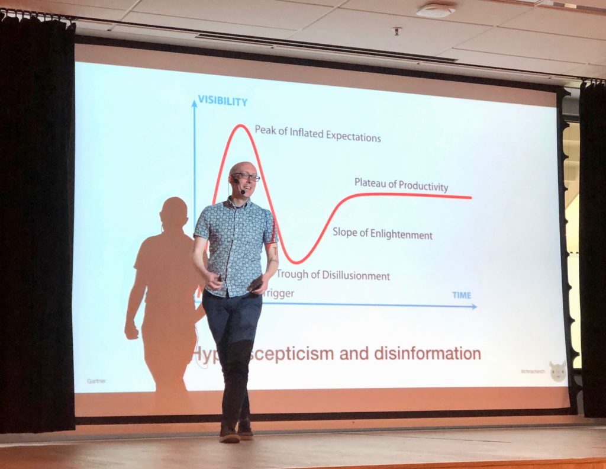

Jak pewnie dobrze wiecie, dostępne
[konferencje w 2019 — drugie półrocze](http://techwriter.pl/konferencje-2019-drugie-polrocze/)
zwłaszcza — zaskakują mnogością oraz szerokim wachlarzem poruszanej tematyki. My
zdecydowaliśmy się wziąć udział w **Write the Docs Vilnius 2019**. Choć sam
format jest już dość popularny, to po raz pierwszy wydarzenie zostało
zorganizowane w stolicy Litwy.

Wydarzenie trwało dwa dni w malowniczym Wilnie, na kampusie SMK University of
Applied Social Sciences i odbyło się w dniach 2-3 czerwca 2019. Było zatem dużo
czasu, aby rozwijać się profesjonalnie i podróżniczo. Ale po kolei!

## Dzień 1: Writing Day

Dla nieobeznanych z ideą, **Writing Day poświęca się w całości praktycznym
zadaniom powiązanym z pisaniem**. Organizatorzy nie narzucają jednak formy
spędzenia tego czasu. Można przyłączyć się do większych grup i popracować
wspólnie nad wybranym projektem, samemu przedstawić problem pisarski i go
wspólnie przedyskutować lub zwyczajnie usiąść sobie przy wolnym stoliku, nawet
samemu, i zwyczajnie pisać.

### Można było zaangażować się m.in. w:

- Udoskonalenie strony [Write the Docs](https://www.writethedocs.org) —
  wprowadzenie poprawek lub dodanie nowej treści
- Pracę nad rozbudową
  [Consultant Tech Writer Toolkit](https://tw-toolkit.netlify.com/)
- Wprowadzenie poprawek do dokumentacji
  [Read the Docs](https://docs.readthedocs.io)
- Testowanie dokumentacji

Wszyscy okazali się wytrwali w przedsięwziętych zdaniach, ponieważ nawet po
przerwie na lunch dopisała liczna gromada chętnych do pracy uczestników. Pracy
towarzyszyły rozmowy. Dotyczyły nie tylko tego, jak można udoskonalić jakiś
fragment dokumentacji, lecz także służyły wymianie informacji.

Uczestnicy ochoczo opowiadali sobie o tym, jakich używają narzędzi, jak dany
problem rozwiązaliby w swoim środowisku pracy, czego ich uczono i wiele innych.
Widać było, że oprócz współpracy, nawiązują się tu znajomości. A między wymianą
uśmiechów i spostrzeżeń dochodzi też do barteru wiedzy.

Po oficjalnym zakończeniu warsztatów wszyscy mogli przenieść się na mniej
oficjalną część konferencji. Zostaliśmy zaproszeni na social event, który miał
miejsce w przytulnej knajpce o nazwie Kas Kas. Tu przenieśliśmy dyskusje
zainicjowane podczas warsztatów. W miarę upływu wieczoru pozwoliliśmy sobie
jednak na większą swobodę tematyczną. Wszakże spotkało się w jednym miejscu 50
dokumentalistek i dokumentalistów pochodzących z 15 krajów!

A przed samym spotkaniem można było sobie pozwolić też na zwiedzanie miasta.
Pogoda dopisywała, umysł po warsztatach domagał się odpoczynku — idealnie więc,
aby przejść się ulicami Wilna.

## Dzień 2: Conference Talks

Następnego dnia czekała nas zgoła inna forma konferencji — prezentacje. Mogliśmy
posłuchać doświadczonych mówców, którzy przyjechali z całego świata, aby
opowiedzieć o swoich doświadczeniach i podzielić się wiedzą.

Poniżej krótkie opisy tegorocznych wystąpień i poruszanej tematyki.

### Hadas Khen — OMG, it's "Error 5"!

https://twitter.com/techwriterpl/status/1135453252319883264

[Hadas Khen](https://www.writethedocs.org/conf/vilnius/2019/speakers/#speaker-vilnius-2019-hadas-khen)
— specjalistka ds. komunikacji technicznej posiadająca doświadczenie w pisaniu
treści dla interfejsów użytkownika wprowadziła swoją publiczność w codzienność
zawodu, który wykonuje. Jej prezentacja nakreślała nie tylko problematykę
związaną z interfejsem użytkownika, lecz także przedstawiała wiedzę teoretyczną,
która może posłużyć jako podstawa do pisania dobrej warstwy tekstowej dla
oprogramowania.

#### Tytułem wstępu

Khen wyróżniła **trzy miejsca, gdzie użytkownik spotyka się z naszym tekstem** w
zależności od doświadczenia w obcowaniu z naszym produktem:

1. **Przed** — zachęca użytkownika, aby został z naszą stroną, aplikacją,
   produktem
2. **W trakcie** — instruuje, jak osiągnąć określony cel
3. **Po** — służy przekazaniu informacji zwrotnej użytkownikowi lub przesłaniu
   opinii użytkownika o naszym produkcie

W dalszej części prezentacji zaznacza, że **napisanie dobrego tekstu wymaga od
nas wyobrażenia sobie, że nasz produkt ma osobowość**. Pozwala to przypisać mu
cechy charakteru i określić zachowanie. To pomoże nam w tym, aby użyty język pod
względem terminologicznym, składniowym i stylowym był dopasowany do opisywanego
produktu. A to w końcowym rozliczeniu składa się na to, że tekst jest bardziej
autentyczny i lepiej trafia do użytkownika końcowego.

Nie dałoby się tego osiągnąć — jak zaznacza Khen — gdyby nie świadomość
nieobycia użytkownika z naszym produktem. Pisząc, powinniśmy stawiać sobie
pytanie, jakie problemy i wątpliwości może mieć osoba korzystająca z naszego
produktu i odpowiadać na nie za pośrednictwem tekstu. Do tego musimy też
rozważyć takie kwestie jak oczekiwania użytkownika, jego obycie z technologią,
poziom zaawansowania i inteligencji (sic!) oraz kompetencje językowe.

Pisząc dbaj o prostotę, precyzję, praktyczność i poprawność. Licz słowa,
dostosuj ton i rejestr, umiejscowienie tekstu w interfejsie użytkownika. I
wreszcie pamiętaj — oferujesz pierwszą linię wsparcia, dlatego nie rezygnuj z
tego, żeby być bezpośrednim, miłym i profesjonalnym.

#### Powiadomienia o błędach — co i jak?

Khen przechodząc do właściwej części wystąpienia, definiuje powiadomienia o
błędach jako komunikaty stojące użytkownikowi na przeszkodzie do osiągnięciu
określonego celu. Dzieli się także spostrzeżeniami na temat tego, jak powinny
one wyglądać.

**Aby skonstruować poprawne notyfikacje, pamiętaj aby:**

- Unikać zbyt szczegółowych informacji o powstaniu błędu.
- Weryfikacja wprowadzanych danych odbywała się w czasie rzeczywistym (kiedy
  użytkownik poda błędną informację, od razu otrzyma stosowny komunikat).
- Językowo skupić się się na koniecznych do wykonania procedurach prowadzących
  do osiągnięcia konkretnego celu.
- Dbać o to, żeby komunikaty oferowały faktyczną pomoc.
- Konstruować komunikaty tak, żeby niwelowały lub ograniczały frustrację
  użytkownika (np. wynikającą z trudności przy obsłudze naszego produktu).

Dlaczego? A dlatego, że wchodzimy w jednostronny dialog z użytkownikiem.
Metaforycznie rzecz ujmując, bierzemy go pod rękę i przeprowadzamy przez odmęty
naszego produktu — obszar dla niego zupełnie nieznany.

**Dobre komunikaty o błędach są:**

- W stronie czynnej (nie biernej!)
- Przejrzyste, praktyczne
- Krótkie i przyjazne czytelnikowi
- Dopasowane do różnic kulturowych
- Położone blisko elementu interfejsu
- Łatwe do zauważenia i odczytania
- Krótkie, lecz oferujące możliwość uzyskania dodatkowych szczegółów

### Chris Ward — Decentralised Documentation – Defining Standards for an Ecosystem

[Chris Ward](https://www.writethedocs.org/conf/vilnius/2019/speakers/#speaker-vilnius-2019-chris-ward),
doświadczony specjalista w branży komunikacji technicznej, autor nie tylko
dokumentacji, lecz także wideo instruktaży, opisał wyzwania, jakie można
napotkać w trakcie pracy nad przypisanym nam projektem.

**Wspomina o trudnościach z:**

- Przejściem przez szum wynikający ze stworzonego hype'u
- Przewalczeniem sceptycyzmu (do naszych pomysłów, wizji rozwoju produktu)
- Nadążeniem za dynamiką powstających i znikających projektów
- Dostosowaniem się do tempa rozwoju projektu, które niejednokrotnie w momencie
  potrafi zwolnić do zera

Ward, jak pokazała mu praktyka, zauważył, że **techwriterzy nierzadko stoją
pośrodku burzy pomysłów zmieszanych z gradem informacji**. Nie przedstawia tego
faktu jednakże jako coś negatywnego. Wspomina, że nawet z przesłanego nam wpisu
napisanego przez marketingowca można wyciągnąć potrzebną do stworzenia
dokumentacji technicznej informację.

Przebywając w środku zawieruchy towarzyszącej budowaniu nowego projektu
dokumentaliści mają szansę wzięcia w ręce steru. Mogą wskazać zatem kierunek
rozwoju projektu. Może okazać się, że **mamy realny wpływ na to, jaką formę
ostateczną dany produkt obierze**. Nie bójmy się tego. Zwłaszcza, jeśli uda nam
się kogoś zatrzymać zanim zdecyduje się na nowo wynaleźć koło.

### Filipe Mendes — The Legend of Documentation: Markdown to The Past

https://twitter.com/techwriterpl/status/1135481276344000512

Kolejnym mówcą był
[Felipe Mendes](https://www.writethedocs.org/conf/vilnius/2019/speakers/#speaker-vilnius-2019-filipe-mendes),
który zdecydował się opowiedzieć o tworzeniu dokumentacji z nieco innej
perspektywy (i nie chodzi tu tylko o nawiązanie do pewnej popularnej gry — ktoś
kojarzy, o jaką chodzi? 😁 ).

Mendes zawodowo nie zajmuje się pisaniem dokumentacji technicznej, a tworzeniem
oprogramowania. Dobrze widzieć zaangażowanie w dziedzinie dokumentacji
technicznej ze strony osoby niezwiązanej ściśle z branżą. Ale przejdźmy do
sedna! Mendes poświęca swoją prezentację omówieniu problemów, jakie napotkał w
swojej pracy.

#### Problem: Brak wiedzy na temat produktu

Po dołączeniu do nowego zespołu, Mendes odkrył, że nie istnieje żadne źródło
wiedzy bazowej na temat produktu, który miałby tworzyć. Brakowało dokumentacji
zarówno dla użytkownika, jak i programisty. Taki stan rzeczy prowadzi do bardzo
frustrujących sytuacji. Oczywiście można — jak zauważa — posiłkować się wiedzą
zawartą w opisie zadań, lecz zazwyczaj kończy się to zadawaniem wielu pytań
innym osobom z zespołu. Zaczynamy być zależni od innych: ich pomocy, czasu i
zaangażowania, a to ma negatywny wpływ na postęp nasz i naszej pracy.

#### Problem: Brak wiedzy na temat zamkniętych spraw

Wielokrotnie pewnie zdarzyło się nam rozwiązywać jakiś problem. W momencie,
kiedy zamykamy zadanie, chcemy o nim zapomnieć. Mendes uważa jednak, że jesteśmy
skazani na te same błędy, jeśli nie będziemy pamiętać, co poszło nie tak.
Zaproponował więc nowy typ dokumentu — post-mortem (ang. _analiza pośmiertna_),
który ma na celu dokładne opisanie błędu, jaki powstał. Zawiera on zatem opis,
przyczynę, źródło, wpływ oraz rozwiązanie błędu. Dzięki temu, jeśli w
przyszłości pojawi się on na naszej drodze, zawsze łatwiej i szybciej będzie się
można z nim uporać.

#### Problem: Brak opisu przeprowadzonych zmian

Kolejnym problematycznym zagadnieniem jest brak opisów we wszelakiego typu
formatkach służących do przedstawienia wykonywanych zadań (np. zadania w Jirze
czy Pull Requesty na GitHubie). Niejednokrotnie okazuje się bowiem, że niewielka
z pozoru zmiana może mieć ogromny wpływ na funkcjonowanie produktu. Efektem
zmian może być konieczność odświeżenia interfejsu użytkownika lub ryzyko
przerwania kompatybilności z poprzednią wersją oprogramowania w przypadku gdy
użytkownik zdecyduje się na aktualizację.

#### Wnioski

Ha! Czyli nasze na wierzchu! Bo wnioski nasuwają się wręcz same — prowadźmy
dokumentację i to nie tylko taką, która jest potrzebna użytkownikom, lecz
również tę przeznaczoną do użytku wewnętrznego. Oszczędzi nam to trudu w
tłumaczeniu pewnych zagadnień nowym członkom zespołu, pomoże w kryzysowej
sytuacji i pozwoli zawładnąć nad stałymi zmianami w projekcie.

### Anna Iosif — How Do We Know Our Documentation Makes Sense?

https://twitter.com/techwriterpl/status/1135509829991174144

[Anna Iosif](https://www.writethedocs.org/conf/vilnius/2019/speakers/#speaker-vilnius-2019-anna-iosif),
techwriterka pracująca przy projekcie open-source musiała zmierzyć się w swojej
karierze zawodowej z jednym z najtrudniejszych zadań. Okazało się bowiem, że
dokumentacja nad którą pracuje ze swoim zespołem nie jest odpowiednio czytelna i
zrozumiała dla nowych użytkowników.

Podstawą w takiej sytuacji — jak sugeruje — to upewnić się, że proces instalacji
produktu musi być tak prosty jak to możliwe. Nierzadko wystarczy zadbać o
odpowiednio obszernie opisane powiadomienia o błędach. Takie, które nie tylko
mówią o zaistniałym problemie, ale pomagałyby go zniwelować.

Dla osób pracujących długo nad danym produktem ocena tego, jaki stopień
szczegółowości może okazać się dużym problemem. Bo jak ocenić czy coś spełnia
swoją funkcję, jeśli znamy problem na wylot i na pamięć? Jeżeli bowiem pracujemy
z danym produktem na co dzień, pewne strzępki informacji uznajemy za wiedzę
ogólną a nie specjalistyczną.

**Pamiętaj, że:**

- - Błędy i luki zauważone przez osoby z zewnątrz są cenne.
    - Opisy oraz linki zawarte w dokumentacji są szalenie istotne.
    - Wszystkie błędy do rozwiązania w społeczeństwie open-source muszą być
      jasno opisane.
    - Dokumentację najlepiej testować na samych użytkownikach.

### Elina McCafferty — How to Turn a Freight Ship Around When All You Have Is a Paddle

https://twitter.com/techwriterpl/status/1135536949677187072

[Elina McCafferty](https://www.writethedocs.org/conf/vilnius/2019/speakers/#speaker-vilnius-2019-elina-mccafferty)
przybywa na konferencję z doświadczeniem wyniesionym z 12-osobowego zespołu
technical writerów, spośród których aż ośmioro pisze od 1985 roku. „Oni pisali
już dokumentację techniczną, a ja dopiero zaczynałam pisać pierwsze słowa” —
przyznaje sama mówczyni.

Jak łatwo się domyślić, prowadzona od tak dawna dokumentacja techniczna rozrosła
się do niebotycznych rozmiarów. Po drodze utracono kontrolę nad tym, co
faktycznie jest przydatne ze strony użytkownika, a co należałoby najzwyczajniej
w świecie usunąć. Mówczyni stanęła przed wielkim wyzwaniem — utrzymywania
dokumentacji, która przez swoją opasłość wymagała więcej czasu niż można go było
poświęcić.

McCafferty słusznie też zauważa, że współcześnie uciekamy od długich i
obszernych dokumentów na rzecz zwięzłych i łatwych do przyswojenia dokumentów.
Jak zatem zawrócić frachtowiec na mieliźnie czasu?

#### Od czego zacząć?

Pora zakasać rękawy i wyruszyć na podbój internetów — tutaj mieści się dużo
informacji o tym, jakie opinie użytkownicy mają o produkcie, który opisujesz i
dokumentacji, którą tworzysz. Przeglądnij fora internetowe, grupy dyskusyjne,
skontaktuj się z przedstawicielami handlowymi, konsultantami lub chociaż pomocą
techniczną.

**Dowiedz się, jak użytkownicy:**

- Korzystają z produktu, do którego opracowujesz dokumentację
- Pozyskują potrzebne im informacje
- Poruszają się po stronie z dokumentacją
- Często zaglądają do sekcji zawartych w dokumentacji

#### Pamiętaj o zasadach

1. **Zasada ludzkiej natury** Pierwsze wrażenie można zrobić tylko raz. Jeśli
   użytkownik napotyka fundamentalny problem — czy to w obsłudze produktu czy
   przeszukiwaniu dokumentacji do niego — traci poczucie, że dobrze wybrał.
2. **Zasada 80/20** 20% włożonej pracy przekłada się na 80% efektów, jakie udaje
   się osiągnąć. Oraz: 80% czytelników polega wyłącznie na 20% dostępnej
   dokumentacji.

#### Zacznij od najważniejszego

Zidentyfikuj 20 najważniejszych sekcji dokumentacji i upewnij się, że są one
napisane perfekcyjnie. Zazwyczaj będą to sekcje na temat przygotowania do
obsługi produktu, instalacji, konfiguracji i administracji. Upewnij się, że
wszystkie linki są sprawne i prowadzą do miejsc, do których powinny. Sprawdź też
tytuły i podtytułu — muszą odnosić się do treści nad którą górują i informować o
tym, czego oczekiwać po danej części dokumentu.

Pamiętaj — największą pochwałą dla wysiłków techwritera jest zmniejszająca się
ilość narzekań ze strony użytkowników.

### Małgorzata Trojanowska — Technically You Can: Creating Technical Content for All Audiences

https://twitter.com/techwriterpl/status/1135537670501949440

Na zakończenie konferencji na scenie pojawiła się nasza rodaczka
[Małgorzata Trojanowska](https://www.writethedocs.org/conf/vilnius/2019/speakers/#speaker-vilnius-2019-malzgorzata-trojanowska),
na co dzień pracująca za granicą. Trojanowska weszła na scenę z przytupem i
bardzo mocną tezą: z planowaniem i tworzeniem treści jest jak z pieczeniem
ciasta — potrzebujemy zarówno substancji, jak i struktury.

Następnie mówczyni przeprowadziła nas przez tak łatwe do zapomnienia podstawy
tworzenia dokumentacji. Pamiętajmy zatem o tym jak ważna jest struktura
dokumentacji. Niejednokrotnie ułożenie tekstu determinuje powodzenie w jego
przyswojeniu i zrozumieniu.

Aby tekst był przejrzysty, pozbądźmy się wszelkich fraz, słów i konstrukcji,
które w ostatecznym rozrachunku przesłaniają właściwą informację zawartą w
dokumencie. W każdej możliwej sytuacji zastępujmy słowa pomocą graficzną w
postaci diagramu, wykresu, czy chociażby tabelki. I nie bójmy się odstępów.
Puste przestrzenie pomiędzy akapitami są nam przyjacielem.

## Write the Docs Vilnius 2019 — Podsumowanie

Uff, jak widzicie — sporo tego. A w międzyczasie pojawiły się też krótkie sesje
lightning talks podczas których ochotnicy mogli poruszyć dowolnie zaproponowany
przez siebie temat. Jeśli jesteście ciekawi o czym mówili, odwiedźcie koniecznie
[nasz profil na Twitterze](https://twitter.com/techwriterpl).

Trzeba zgodnie przyznać, że **konferencja Write the Docs Vilnius 2019** jest
idealna dla osób, które chcą w krótkim czasie mocno poszerzyć swoje horyzonty.
Niniejszy artykuł i tak nie odzwierciedla w pełni ekwipunku wiedzy, z jakim
wróciliśmy do Polski. Jeżeli tylko możecie, wybierzcie się na kolejną edycję
Write the Docs — obiecujemy, że nie będziecie żałować.

_Aktualizacja 12.08.2019: poprawiono „strona aktywna” na „strona czynna”._
