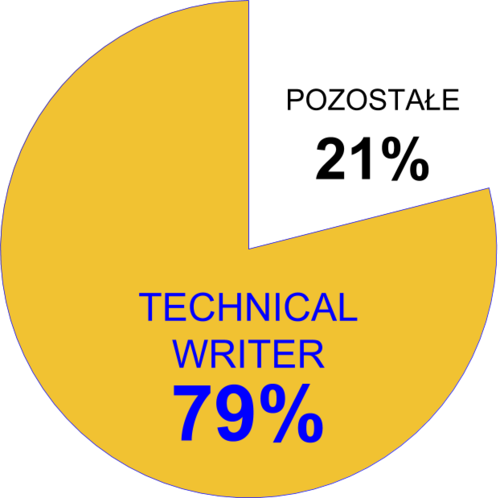
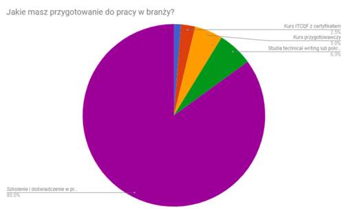
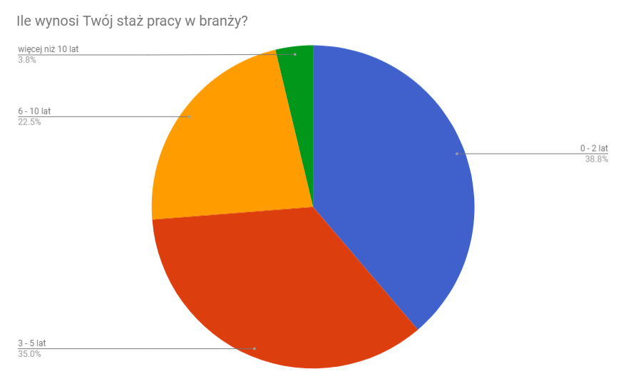
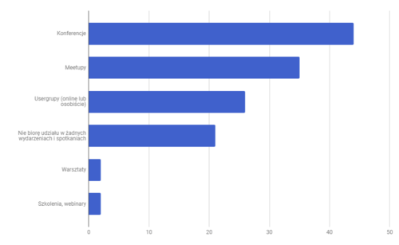
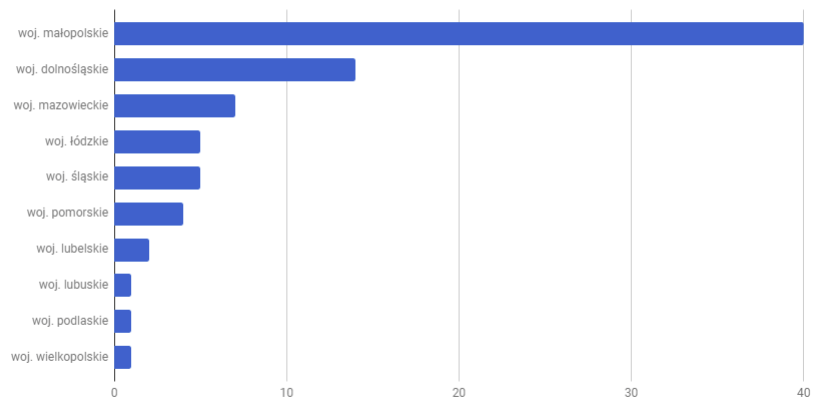
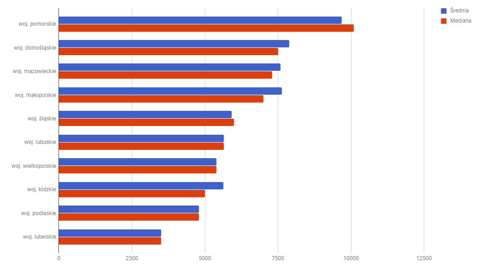
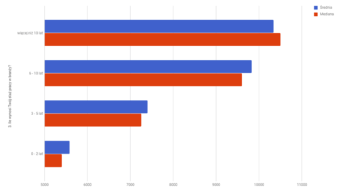

Ile zarabiają specjaliści w branży komunikacji technicznej? Jak różnią się pensje w różnych województwach? Jak na wynagrodzenie wpływa doświadczenie? Przeprowadziliśmy kolejne badanie płac w branży komunikacji technicznej. Oto jego wyniki.

# **Porównanie z poprzednim rokiem**

[Wyniki poprzedniego badania](http://techwriter.pl/wyniki-badania-plac-w-komunikacji-technicznej/) opublikowaliśmy na naszych łamach w kwietniu 2017. Jak wynik zmienił się od poprzedniego roku?

<table><tbody><tr><td></td><td>2017</td><td>2018</td></tr><tr><td>Liczba odpowiedzi</td><td>70</td><td>80</td></tr><tr><td>Średnia pensja brutto</td><td>6 969 zł</td><td>7 352 zł</td></tr><tr><td>Mediana pensji brutto</td><td>6 000 zł</td><td>7 000 zł</td></tr><tr><td>Najniższe wynagrodzenie brutto</td><td>1 970 zł</td><td>3 000 zł</td></tr><tr><td>Najwyższe wynagrodzenie brutto</td><td>15 000 zł</td><td>16 000 zł</td></tr></tbody></table>

Wszystkie z powyższych liczb wzrosły. Trudno spekulować dlaczego, bo możemy mieć do czynienia z inną grupą respondentów. Ale jeżeli tak nie jest, to dobry znak wzrostu.

Trzy najwyższe wynagrodzenia należą do technical writerów z województwa małopolskiego (dwie osoby odpowiedziały 16 tys. i jedna 15 tys.). W tym roku w czołówce nie znalazł się nikt na stanowisku kierowniczym.

# **Profesje**

W zeszłym roku, 87% respondentów identyfikowała się jako technical writerzy. W tym roku ta wartość nieznacznie zwiększyła się na korzyść innych profesji w ramach komunikacji technicznej.

Dokładniej mówiąc, respondenci zaznaczyli następujące kategorie:

<table><tbody><tr><td>Technical writer (specjalista ds. dokumentacji technicznej)</td><td>63</td></tr><tr><td>Documentation manager (szef zespołu dokumentacji)</td><td>5</td></tr><tr><td>Project manager (kierownik projektów)</td><td>4</td></tr><tr><td>Information architect</td><td>3</td></tr><tr><td>Training content developer (specjalista ds. szkoleń)</td><td>2</td></tr><tr><td>Senior Technical Writer</td><td>1</td></tr><tr><td>Release Manager</td><td>1</td></tr><tr><td>Technical illustrator</td><td>1</td></tr><tr><td>Który opis najbardziej pasuje do wykonywanej przez Ciebie pracy?</td><td>LIczba respondentów</td></tr></tbody></table>

Ciekawą kategorią jest “Senior Technical Writer”, bo jest to odpowiedź ręcznie wpisana w polu “inny” przez jedną tylko osobę. W kategorii “Technical writer” na pewno jest szereg osób, których oficjalna nazwa stanowiska to “Senior Technical Writer”, a może też inne, jak na przykład “Principal Technical Writer”.

# **Przygotowanie do zawodu, doświadczenie i rozwój**

85% badanych określa swoje przygotowanie do wykonywania zawodu jako pochodzące ze szkoleń i doświadczenia w pracy. Niewiele się zmieniło od poprzedniego roku, ponieważ w Polsce chyba nadal brakuje kierunków przygotowawczych. Niezbyt też wzrosła liczba szkoleń z ITCQF. Chociaż to może oznaczać, że ludzie nie traktują tego szkolenia jako swojego głównego przygotowania do zawodu, a jedynie jako opcjonalny kurs w ścieżce kariery.

Większość respondentów ma do pięciu lat doświadczenia w branży. Tylko trzy osoby wskazały, że mają więcej niż 10 lat doświadczenia. Jesteśmy więc wciąż młodym zawodem w Polsce.

Jeśli chodzi o dalszy rozwój zawodowy, to tylko 21% respondentów nie bierze udziału w żadnych wydarzeniach. Pozostali dzielą swój czas między różne aktywności, z czego najpopularniejsze są konferencje, a najmniej popularne warsztaty, szkolenia i webinary. Czy to znaczy, że te ostatnie są dla respondentów mniej interesujące, czy że jest ich mniej? Na pewno nie brakuje webinarów, ale może ich tematyka lub godziny w jakich się odbywają nie odpowiadają naszym ankietowanym.

# **Firma, branża**

Większość badanych (ponad 70%) pracuje w firmie zagranicznej, z czego ponad połowa z nich to firmy zatrudniające powyżej 1000 osób.

Jeśli chodzi o rodzaj opisywanych tematów, to większość naszych kolegów i koleżanek pisze dokumentację do oprogramowania i API.

<table><tbody><tr style="height: 48px"><td style="height: 48px"><b>Jaki rodzaj dokumentacji piszesz?</b></td><td style="height: 48px"><b>Liczba respondentów</b></td></tr><tr style="height: 48px"><td style="height: 48px">Do oprogramowania</td><td style="height: 48px">70</td></tr><tr style="height: 48px"><td style="height: 48px">Do API</td><td style="height: 48px">30</td></tr><tr style="height: 48px"><td style="height: 48px">Do urządzeń elektronicznych (np. routery, telefony, budziki)</td><td style="height: 48px">18</td></tr><tr style="height: 48px"><td style="height: 48px">Do sprzętu AGD</td><td style="height: 48px">3</td></tr><tr style="height: 47px"><td style="height: 47px">Do maszyn lub pojazdów</td><td style="height: 47px">3</td></tr><tr style="height: 48px"><td style="height: 48px">compliance, teoria (finanse)</td><td style="height: 48px">1</td></tr><tr style="height: 48px"><td style="height: 48px">End user guides</td><td style="height: 48px">1</td></tr><tr style="height: 48px"><td style="height: 48px">README.md</td><td style="height: 48px">1</td></tr><tr style="height: 48px"><td style="height: 48px">Release Note'y</td><td style="height: 48px">1</td></tr><tr style="height: 48px"><td style="height: 48px">meble, sprzęt wojskowy</td><td style="height: 48px">1</td></tr><tr style="height: 48px"><td style="height: 48px">Administracja serwerów</td><td style="height: 48px">1</td></tr></tbody></table>

# **Geografia**

Zdecydowana większość badanych identyfikuje się z województwem małopolskim.

To może wskazywać na popularność naszego portalu w tym regionie, ale prawdą jest też, że większość inicjatyw związanych z branżą zdaje się koncentrować w tym obszarze. Mamy tutaj między innymi:

- [Konferencję soap!](http://soapconf.com/)
- [Spotkania MeetContentKRK](http://meetcontent.org/)
- [Polską grupę użytkowników MadCap Flare](https://web.facebook.com/groups/PLFUG)
- Większość redakcji techwriter.pl

Do wyjątków spoza regionu należą między innymi [MeetContentWRO](http://meetcontent.org/) na Dolnym Śląsku i [uContentowani](https://www.facebook.com/ucontentowani/) na Pomorzu.

# **Zadowolenie z wykonywanej pracy**

Większość respondentów lubi swoją pracę - **62 osoby (78%)** dało jej 4 lub 5 punktów. Tylko jedna osoba jest bardzo niezadowolona ze swojej pracy. Może [oferty publikowane na techwriter.pl](http://techwriter.pl/category/news/oferty-pracy/) pomogą zrobic pierwszy krok ku zmianie na lepsze?

<table><tbody><tr><td><b>Jak bardzo jesteś zadowolony/a ze swojego obecnego stanowiska?</b></td><td><b>Liczba respondentów</b></td></tr><tr><td>5 - kocham swoją pracę!</td><td>17</td></tr><tr><td>4</td><td>45</td></tr><tr><td>3</td><td>16</td></tr><tr><td>2</td><td>1</td></tr><tr><td>1 - bardzo nie lubię swojej pracy</td><td>1</td></tr></tbody></table>

# **Wynagrodzenia brutto**

## **Według zadowolenia z pracy**

Najwyższe zadowolenie pokrywa się z najwyższą średnią wynagrodzeń, ale nie z najwyższą medianą.

<table><tbody><tr><td><b>Jak bardzo jesteś zadowolony/a ze swojego obecnego stanowiska?</b></td><td><b>Średnia</b></td><td><b>Mediana</b></td><td><b>Liczba respondentów</b></td></tr><tr><td>5 - kocham swoją pracę!</td><td><b>8621</b></td><td>7000</td><td>17</td></tr><tr><td>4</td><td>7646</td><td><b>7500</b></td><td>45</td></tr><tr><td>3</td><td>5500</td><td>5600</td><td>16</td></tr><tr><td>2</td><td>6500</td><td>6500</td><td>1</td></tr><tr><td>1 - bardzo nie lubię swojej pracy</td><td>3000</td><td>3000</td><td>1</td></tr></tbody></table>

## **Według profesji**

Poszczególne profesje posortowane od najwyższej mediany prezentują się następująco:

<table><tbody><tr><td>Który opis najbardziej pasuje do wykonywanej przez Ciebie pracy?</td><td>Średnia</td><td>Mediana</td><td>Liczba respondentów</td></tr><tr><td>Documentation manager (szef zespołu dokumentacji)</td><td>11100</td><td>11500</td><td>5</td></tr><tr><td>Senior Technical Writer</td><td>11000</td><td>11000</td><td>1</td></tr><tr><td>Information architect</td><td>6733</td><td>7700</td><td>3</td></tr><tr><td><b>Technical writer (specjalista ds. dokumentacji technicznej)</b></td><td><b>7139</b></td><td><b>7000</b></td><td><b>63</b></td></tr><tr><td>Technical illustrator</td><td>6800</td><td>6800</td><td>1</td></tr><tr><td>Training content developer (specjalista ds. szkoleń)</td><td>6750</td><td>6750</td><td>2</td></tr><tr><td>Project manager (kierownik projektów)</td><td>6593</td><td>6685</td><td>4</td></tr><tr><td>Release Manager</td><td>5000</td><td>5000</td><td>1</td></tr></tbody></table>

Wśród osób, które identyfikują się ze stanowiskiem technical writer:

- Najwyższe wynagrodzenie wynosi: 15000 - 16000 brutto (3 osoby)
- Najniższe wynosi: 3000 - 4000 brutto (5 osób)

## **Według województw**

Jeżeli spojrzymy na średnią i medianę per województwo, to wizualnie, wygląda to tak:

A szczegółowe dane są takie:

<table><tbody><tr><td><b>W którym województwie pracujesz?</b></td><td><b>Średnia</b></td><td><b>Mediana</b></td><td><b>Liczba respondentów</b></td></tr><tr><td>woj. pomorskie</td><td>9675</td><td>10100</td><td>4</td></tr><tr><td>woj. dolnośląskie</td><td>7886</td><td>7500</td><td>14</td></tr><tr><td>woj. mazowieckie</td><td>7579</td><td>7300</td><td>7</td></tr><tr><td><b>woj. małopolskie</b></td><td><b>7636</b></td><td><b>7000</b></td><td><b>40</b></td></tr><tr><td>woj. śląskie</td><td>5910</td><td>6000</td><td>5</td></tr><tr><td>woj. lubuskie</td><td>5645</td><td>5645</td><td>1</td></tr><tr><td>woj. wielkopolskie</td><td>5400</td><td>5400</td><td>1</td></tr><tr><td>woj. łódzkie</td><td>5627</td><td>5000</td><td>5</td></tr><tr><td>woj. podlaskie</td><td>4800</td><td>4800</td><td>1</td></tr><tr><td>woj. lubelskie</td><td>3500</td><td>3500</td><td>2</td></tr></tbody></table>

Najlepiej zarabiają respondenci z województwa pomorskiego. Województwo małopolskie, które ma najwięcej respondentów, pokazuje też najbardziej uśredniony wynik.

## **Według pochodzenia firmy**

Większość respondentów pracuje dla firm zagranicznych, i tam też mediana i średnia zarobków jest najwyższa.

<table><tbody><tr><td><b>W jakiego rodzaju firmie pracujesz?</b></td><td><b>Średnia</b></td><td><b>Mediana</b></td><td><b>Liczba respondentów</b></td></tr><tr><td>Firma międzynarodowa</td><td>7845</td><td>7150</td><td>62</td></tr><tr><td>Firma polska</td><td>5651</td><td>5255</td><td>18</td></tr></tbody></table>

## **Według stażu pracy**

Staż pracy wydaje się być najprostszym predyktorem wynagrodzenia - im dłużej ktoś pracuje, tym wyższe wynagrodzenie.

## **Według rodzaju dokumentacji**

Większość respondentów tworzy dokumentację do oprogramowania lub API, i nie widać żadnych tendencji w zarobkach względem tego kryterium.

- Ludzie tworzący dokumentację do oprogramowania i API są wśród najlepiej jak i najgorzej zarabiających.
- Nie ma też żadnego innego rodzaju dokumentacji, która by sugerowała wyłącznie niskie lub wyłącznie wysokie wynagrodzenia.

## **Według zaangażowania w rozwój zawodowy**

Wyniki ankiety nie wskazuję korelacji między rozwojem zawodowym a wynagrodzeniem. Osoby, które nie deklarują uczestniczenia w żadnych wydarzeniach czy szkoleniach poza pracą należą do najlepiej jak i najgorzej zarabiających. A szkoda, bo dobrze by było wykazać, że tylko aktywni uczestnicy społeczności zarabiają dobrze. ;)

# **Podsumowanie**

Podobnie jak poprzednim roku, ankieta pokazuje raczej przykładowe dane niż trendy, ponieważ mamy zbyt mała liczbę respondentów, żeby mówić o statystycznej poprawności. Jednak daje to pewien punkt odniesienia - jeżeli jestem technical writerem z doświadczeniem X lat w danym regionie, to mogę zarabiać od Y do Z.

W porównaniu z poprzednim rokiem widzimy też nieśmiałą poprawę w wysokości wynagrodzeń.

Mamy nadzieję, że w kolejnych latach ankiety pokażą kształtujące się trendy, a tymczasem, liczymy na to, że obecne dane będą dla Was przydatne.
