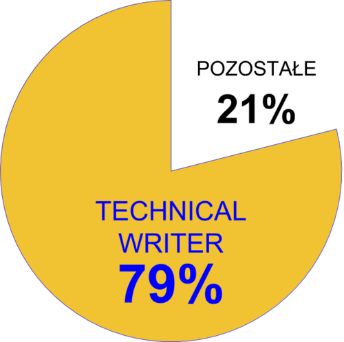
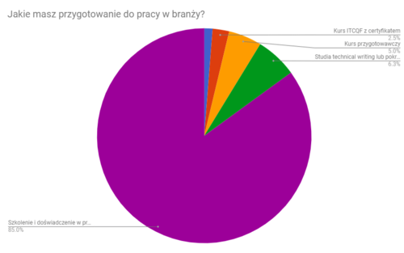
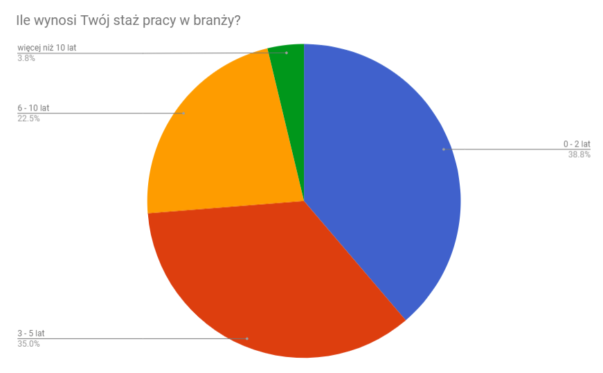
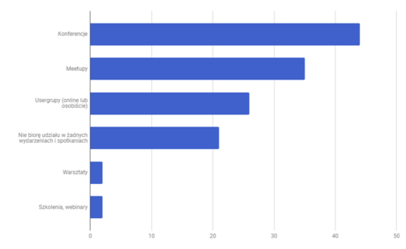
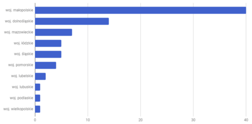
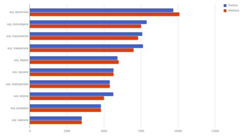
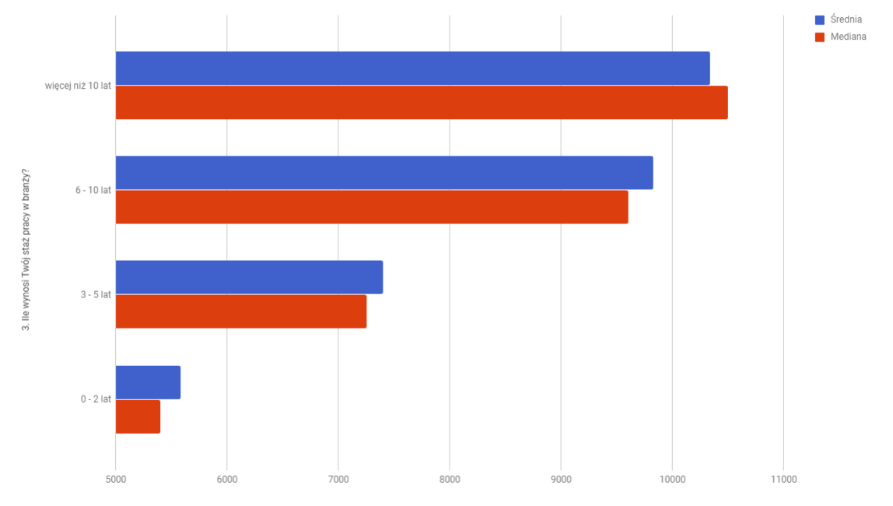

Ile zarabiają specjaliści w branży komunikacji technicznej? Jak różnią się
pensje w różnych województwach? Jak na wynagrodzenie wpływa doświadczenie?
Przeprowadziliśmy kolejne badanie płac w branży komunikacji technicznej. Oto
jego wyniki.

<!--truncate-->

## **Porównanie z poprzednim rokiem**

[Wyniki poprzedniego badania](../wyniki-badania-plac-w-komunikacji-technicznej/index.md)
opublikowaliśmy na naszych łamach w kwietniu 2017. Jak wynik zmienił się od
poprzedniego roku?

|                                | 2017      | 2018      |
| ------------------------------ | --------- | --------- |
| Liczba odpowiedzi              | 70        | 80        |
| Średnia pensja brutto          | 6 969 zł  | 7 352 zł  |
| Mediana pensji brutto          | 6 000 zł  | 7 000 zł  |
| Najniższe wynagrodzenie brutto | 1 970 zł  | 3 000 zł  |
| Najwyższe wynagrodzenie brutto | 15 000 zł | 16 000 zł |

Wszystkie z powyższych liczb wzrosły. Trudno spekulować dlaczego, bo możemy mieć
do czynienia z inną grupą respondentów. Ale jeżeli tak nie jest, to dobry znak
wzrostu.

Trzy najwyższe wynagrodzenia należą do technical writerów z województwa
małopolskiego (dwie osoby odpowiedziały 16 tys. i jedna 15 tys.). W tym roku w
czołówce nie znalazł się nikt na stanowisku kierowniczym.

## **Profesje**

W zeszłym roku, 87% respondentów identyfikowała się jako technical writerzy. W
tym roku ta wartość nieznacznie zwiększyła się na korzyść innych profesji w
ramach komunikacji technicznej.

Dokładniej mówiąc, respondenci zaznaczyli następujące kategorie:

| Technical writer (specjalista ds. dokumentacji technicznej)      | 63                  |
| ---------------------------------------------------------------- | ------------------- |
| Documentation manager (szef zespołu dokumentacji)                | 5                   |
| Project manager (kierownik projektów)                            | 4                   |
| Information architect                                            | 3                   |
| Training content developer (specjalista ds. szkoleń)             | 2                   |
| Senior Technical Writer                                          | 1                   |
| Release Manager                                                  | 1                   |
| Technical illustrator                                            | 1                   |
| Który opis najbardziej pasuje do wykonywanej przez Ciebie pracy? | LIczba respondentów |

Ciekawą kategorią jest “Senior Technical Writer”, bo jest to odpowiedź ręcznie
wpisana w polu “inny” przez jedną tylko osobę. W kategorii “Technical writer” na
pewno jest szereg osób, których oficjalna nazwa stanowiska to “Senior Technical
Writer”, a może też inne, jak na przykład “Principal Technical Writer”.

## **Przygotowanie do zawodu, doświadczenie i rozwój**

85% badanych określa swoje przygotowanie do wykonywania zawodu jako pochodzące
ze szkoleń i doświadczenia w pracy. Niewiele się zmieniło od poprzedniego roku,
ponieważ w Polsce chyba nadal brakuje kierunków przygotowawczych. Niezbyt też
wzrosła liczba szkoleń z ITCQF. Chociaż to może oznaczać, że ludzie nie traktują
tego szkolenia jako swojego głównego przygotowania do zawodu, a jedynie jako
opcjonalny kurs w ścieżce kariery.

Większość respondentów ma do pięciu lat doświadczenia w branży. Tylko trzy osoby
wskazały, że mają więcej niż 10 lat doświadczenia. Jesteśmy więc wciąż młodym
zawodem w Polsce.

Jeśli chodzi o dalszy rozwój zawodowy, to tylko 21% respondentów nie bierze
udziału w żadnych wydarzeniach. Pozostali dzielą swój czas między różne
aktywności, z czego najpopularniejsze są konferencje, a najmniej popularne
warsztaty, szkolenia i webinary. Czy to znaczy, że te ostatnie są dla
respondentów mniej interesujące, czy że jest ich mniej? Na pewno nie brakuje
webinarów, ale może ich tematyka lub godziny w jakich się odbywają nie
odpowiadają naszym ankietowanym.

## **Firma, branża**

Większość badanych (ponad 70%) pracuje w firmie zagranicznej, z czego ponad
połowa z nich to firmy zatrudniające powyżej 1000 osób.

Jeśli chodzi o rodzaj opisywanych tematów, to większość naszych kolegów i
koleżanek pisze dokumentację do oprogramowania i API.

| Jaki rodzaj dokumentacji piszesz?                            | Liczba respondentów |
| ------------------------------------------------------------ | ------------------- |
| Do oprogramowania                                            | 70                  |
| Do API                                                       | 30                  |
| Do urządzeń elektronicznych (np. routery, telefony, budziki) | 18                  |
| Do sprzętu AGD                                               | 3                   |
| Do maszyn lub pojazdów                                       | 3                   |
| compliance, teoria (finanse)                                 | 1                   |
| End user guides                                              | 1                   |
| README.md                                                    | 1                   |
| Release Note'y                                               | 1                   |
| meble, sprzęt wojskowy                                       | 1                   |
| Administracja serwerów                                       | 1                   |

## **Geografia**

Zdecydowana większość badanych identyfikuje się z województwem małopolskim.

To może wskazywać na popularność naszego portalu w tym regionie, ale prawdą jest
też, że większość inicjatyw związanych z branżą zdaje się koncentrować w tym
obszarze. Mamy tutaj między innymi:

- Konferencję soap!
- [Spotkania MeetContentKRK](http://meetcontent.org/)
- [Polską grupę użytkowników MadCap Flare](https://web.facebook.com/groups/PLFUG)
- Większość redakcji techwriter.pl

Do wyjątków spoza regionu należą między innymi
[MeetContentWRO](http://meetcontent.org/) na Dolnym Śląsku i
[uContentowani](https://www.facebook.com/ucontentowani/) na Pomorzu.

## **Zadowolenie z wykonywanej pracy**

Większość respondentów lubi swoją pracę - **62 osoby (78%)** dało jej 4 lub 5
punktów. Tylko jedna osoba jest bardzo niezadowolona ze swojej pracy. Może
oferty publikowane na techwriter.pl pomogą zrobic pierwszy krok ku zmianie na
lepsze?

| Jak bardzo jesteś zadowolony/a ze swojego obecnego stanowiska? | Liczba respondentów |
| -------------------------------------------------------------- | ------------------- |
| 5 - kocham swoją pracę!                                        | 17                  |
| 4                                                              | 45                  |
| 3                                                              | 16                  |
| 2                                                              | 1                   |
| 1 - bardzo nie lubię swojej pracy                              | 1                   |

## **Wynagrodzenia brutto**

### **Według zadowolenia z pracy**

Najwyższe zadowolenie pokrywa się z najwyższą średnią wynagrodzeń, ale nie z
najwyższą medianą.

| Jak bardzo jesteś zadowolony/a ze swojego obecnego stanowiska? | Średnia | Mediana | Liczba respondentów |
| -------------------------------------------------------------- | ------- | ------- | ------------------- |
| 5 - kocham swoją pracę!                                        | 8621    | 7000    | 17                  |
| 4                                                              | 7646    | 7500    | 45                  |
| 3                                                              | 5500    | 5600    | 16                  |
| 2                                                              | 6500    | 6500    | 1                   |
| 1 - bardzo nie lubię swojej pracy                              | 3000    | 3000    | 1                   |

### **Według profesji**

Poszczególne profesje posortowane od najwyższej mediany prezentują się
następująco:

| Który opis najbardziej pasuje do wykonywanej przez Ciebie pracy? | Średnia | Mediana | Liczba respondentów |
| ---------------------------------------------------------------- | ------- | ------- | ------------------- |
| Documentation manager (szef zespołu dokumentacji)                | 11100   | 11500   | 5                   |
| Senior Technical Writer                                          | 11000   | 11000   | 1                   |
| Information architect                                            | 6733    | 7700    | 3                   |
| Technical writer (specjalista ds. dokumentacji technicznej)      | 7139    | 7000    | 63                  |
| Technical illustrator                                            | 6800    | 6800    | 1                   |
| Training content developer (specjalista ds. szkoleń)             | 6750    | 6750    | 2                   |
| Project manager (kierownik projektów)                            | 6593    | 6685    | 4                   |
| Release Manager                                                  | 5000    | 5000    | 1                   |

Wśród osób, które identyfikują się ze stanowiskiem technical writer:

- Najwyższe wynagrodzenie wynosi: 15000 - 16000 brutto (3 osoby)
- Najniższe wynosi: 3000 - 4000 brutto (5 osób)

### **Według województw**

Jeżeli spojrzymy na średnią i medianę per województwo, to wizualnie, wygląda to
tak:

A szczegółowe dane są takie:

| W którym województwie pracujesz? | Średnia | Mediana | Liczba respondentów |
| -------------------------------- | ------- | ------- | ------------------- |
| woj. pomorskie                   | 9675    | 10100   | 4                   |
| woj. dolnośląskie                | 7886    | 7500    | 14                  |
| woj. mazowieckie                 | 7579    | 7300    | 7                   |
| woj. małopolskie                 | 7636    | 7000    | 40                  |
| woj. śląskie                     | 5910    | 6000    | 5                   |
| woj. lubuskie                    | 5645    | 5645    | 1                   |
| woj. wielkopolskie               | 5400    | 5400    | 1                   |
| woj. łódzkie                     | 5627    | 5000    | 5                   |
| woj. podlaskie                   | 4800    | 4800    | 1                   |
| woj. lubelskie                   | 3500    | 3500    | 2                   |

Najlepiej zarabiają respondenci z województwa pomorskiego. Województwo
małopolskie, które ma najwięcej respondentów, pokazuje też najbardziej
uśredniony wynik.

### **Według pochodzenia firmy**

Większość respondentów pracuje dla firm zagranicznych, i tam też mediana i
średnia zarobków jest najwyższa.

| W jakiego rodzaju firmie pracujesz? | Średnia | Mediana | Liczba respondentów |
| ----------------------------------- | ------- | ------- | ------------------- |
| Firma międzynarodowa                | 7845    | 7150    | 62                  |
| Firma polska                        | 5651    | 5255    | 18                  |

### **Według stażu pracy**

Staż pracy wydaje się być najprostszym predyktorem wynagrodzenia - im dłużej
ktoś pracuje, tym wyższe wynagrodzenie.

### **Według rodzaju dokumentacji**

Większość respondentów tworzy dokumentację do oprogramowania lub API, i nie
widać żadnych tendencji w zarobkach względem tego kryterium.

- Ludzie tworzący dokumentację do oprogramowania i API są wśród najlepiej jak i
  najgorzej zarabiających.
- Nie ma też żadnego innego rodzaju dokumentacji, która by sugerowała wyłącznie
  niskie lub wyłącznie wysokie wynagrodzenia.

### **Według zaangażowania w rozwój zawodowy**

Wyniki ankiety nie wskazuję korelacji między rozwojem zawodowym a
wynagrodzeniem. Osoby, które nie deklarują uczestniczenia w żadnych wydarzeniach
czy szkoleniach poza pracą należą do najlepiej jak i najgorzej zarabiających. A
szkoda, bo dobrze by było wykazać, że tylko aktywni uczestnicy społeczności
zarabiają dobrze. 😉

## **Podsumowanie**

Podobnie jak poprzednim roku, ankieta pokazuje raczej przykładowe dane niż
trendy, ponieważ mamy zbyt mała liczbę respondentów, żeby mówić o statystycznej
poprawności. Jednak daje to pewien punkt odniesienia - jeżeli jestem technical
writerem z doświadczeniem X lat w danym regionie, to mogę zarabiać od Y do Z.

W porównaniu z poprzednim rokiem widzimy też nieśmiałą poprawę w wysokości
wynagrodzeń.

Mamy nadzieję, że w kolejnych latach ankiety pokażą kształtujące się trendy, a
tymczasem, liczymy na to, że obecne dane będą dla Was przydatne.
