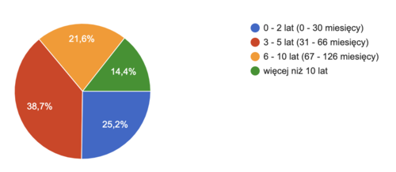
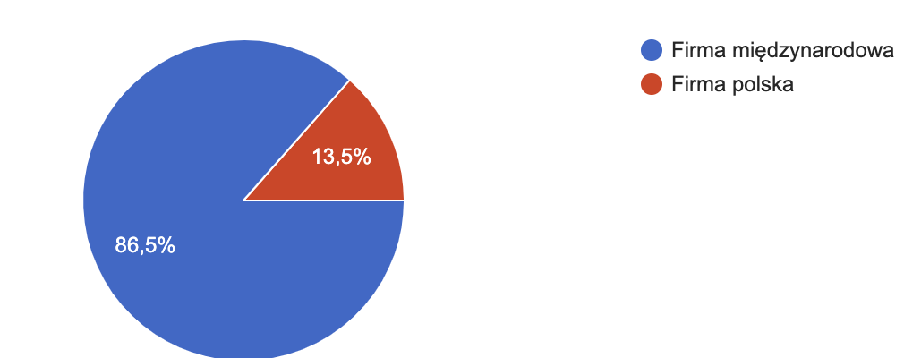
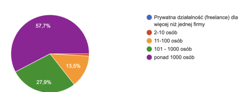
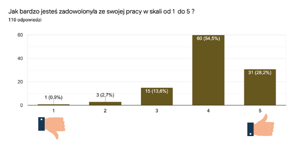

Tradycyjnie już, przedstawiamy Wam wyniki corocznej ankiety dotyczącej płac w
komunikacji technicznej. Znajdziecie tu, między innymi, odpowiedzi na pytania:
ile zarabiają specjaliści w branży komunikacji technicznej? Jak różnią się
pensje w różnych województwach? Jak na wynagrodzenie wpływa doświadczenie? Jeśli
ciekawi Was co zmieniło się w 2020 roku, zapraszamy do poniższego podsumowania.

## Porównanie z poprzednimi latami

Wyniki poprzednich badań znajdziecie tu:

- [Wyniki 2019](http://techwriter.pl/wyniki-badania-plac-w-komunikacji-technicznej-2019/)
- [Wyniki 2018](http://techwriter.pl/wyniki-badania-plac-w-komunikacji-technicznej-2018/)
- [Wyniki 2017](http://techwriter.pl/wyniki-badania-plac-w-komunikacji-technicznej/)

Oto jak sytuacja zmieniła się na przestrzeni lat.

|                                | 2017      | 2018      | 2019      | 2020      |
| ------------------------------ | --------- | --------- | --------- | --------- |
| **Liczba odpowiedzi**          | 70        | 80        | 103       | 111       |
| Średnie wynagrodzenie brutto   | 6 969 zł  | 7 352 zł  | 8 877 zł  | 9 131 zł  |
| Mediana wynagrodzeń brutto     | 6 000 zł  | 7 000 zł  | 8 000 zł  | 8 700 zł  |
| Najniższe wynagrodzenie brutto | 1 970 zł  | 3 000 zł  | 3 500 zł  | 3 000 zł  |
| Najwyższe wynagrodzenie brutto | 15 000 zł | 16 000 zł | 20 000 zł | 20 500 zł |

Czyli na lepsze zmieniają się następujące rzeczy:

- mamy więcej uczestników ankiety
- uczestnicy zarabiają więcej, choć mediana wynagrodzeń wzrasta nieco wolniej.

## Profesje

Podobnie jak w latach poprzednich, większość osób biorących udział w ankiecie
identyfikuje się jako Technical Writer (78,4%). W porównaniu do poprzedniego
roku można zaobserwować niewielki wzrost procentowy tej profesji. Dodatkowo
warto zauważyć, że wśród innych stanowisk dominuje w tym roku Documentation Team
Leader, co może świadczyć o tworzeniu w firmach większych projektów związanych z
dokumentacją.

Poniżej tabela ze szczegółowym zestawem stanowisk w ramach branży wraz z ilością
udzielonych przez respondentów odpowiedzi:

<table style="border-collapse: collapse; width: 51.9651%; height: 240px;"><tbody><tr style="height: 20px;"><td style="width: 30.8753%; height: 20px; text-align: left;">STANOWISKO</td><td style="width: 12.1516%; height: 20px; text-align: right;">LICZBA ODPOWIEDZI</td></tr><tr style="height: 20px;"><td style="width: 30.8753%; height: 20px; text-align: left;">Technical writer / Technical author</td><td style="width: 12.1516%; height: 20px; text-align: right;">88</td></tr><tr style="height: 20px;"><td style="width: 30.8753%; height: 20px; text-align: left;">Documentation team leader</td><td style="width: 12.1516%; height: 20px; text-align: right;">11</td></tr><tr style="height: 20px;"><td style="width: 30.8753%; height: 20px; text-align: left;">Information architect</td><td style="width: 12.1516%; height: 20px; text-align: right;">4</td></tr></tbody></table>

Wśród odpowiedzi pojawiły się także pojedyncze przykłady innych profesji,
których nie braliśmy pod uwagę w powyższym zestawieniu. Były to na przykład
stanowiska:

- Visual designer /Technical Illustrator (5 600 zł)
- Training content developer (6 500 zł)
- Konsultant techcomm (15 000 zł).

## Wynagrodzenie

Zarobki w poszczególnych grupach kształtują się następująco (posortowane wg
średniego wynagrodzenia brutto):

<table dir="ltr" style="width: 73.1441%;" border="1" cellspacing="0" cellpadding="0"><colgroup><col width="590"/> <col width="100"/> <col width="100"/> <col width="100"/></colgroup><tbody><tr><td style="width: 34.3229%;" data-sheets-value="{&quot;1&quot;:2,&quot;2&quot;:&quot;PROFESJA&quot;}">PROFESJA</td><td style="width: 9.45444%; text-align: right;" data-sheets-value="{&quot;1&quot;:2,&quot;2&quot;:&quot;ODPOWIEDZI&quot;}">ODPOWIEDZI</td><td style="width: 14.4437%; text-align: right;" data-sheets-value="{&quot;1&quot;:2,&quot;2&quot;:&quot;ŚREDNIA&quot;}">ŚREDNIA</td><td style="width: 15.5492%; text-align: right;" data-sheets-value="{&quot;1&quot;:2,&quot;2&quot;:&quot;MEDIANA&quot;}">MEDIANA</td></tr><tr><td style="width: 34.3229%;" data-sheets-value="{&quot;1&quot;:2,&quot;2&quot;:&quot;Technical writer / Technical author&quot;}">Technical writer / Technical author</td><td style="width: 9.45444%; text-align: right;" data-sheets-value="{&quot;1&quot;:3,&quot;3&quot;:88}">88</td><td style="width: 14.4437%; text-align: right;" data-sheets-value="{&quot;1&quot;:3,&quot;3&quot;:8771.693181818182}" data-sheets-numberformat="{&quot;1&quot;:2,&quot;2&quot;:&quot;_(* #,##0.00_)\\ [$zł-415]_);\\(#,##0.00\\)\\ [$zł-415]_);_(* \&quot;-\&quot;??_)\\ [$zł-415]_);_(@&quot;,&quot;3&quot;:1}">8&nbsp;771,69 zł</td><td style="width: 15.5492%; text-align: right;" data-sheets-value="{&quot;1&quot;:3,&quot;3&quot;:8000}" data-sheets-numberformat="{&quot;1&quot;:2,&quot;2&quot;:&quot;_(* #,##0.00_)\\ [$zł-415]_);\\(#,##0.00\\)\\ [$zł-415]_);_(* \&quot;-\&quot;??_)\\ [$zł-415]_);_(@&quot;,&quot;3&quot;:1}">8 000 zł</td></tr><tr><td style="width: 34.3229%;" data-sheets-value="{&quot;1&quot;:2,&quot;2&quot;:&quot;Documentation team leader&quot;}">Documentation team leader</td><td style="width: 9.45444%; text-align: right;" data-sheets-value="{&quot;1&quot;:3,&quot;3&quot;:11}">11</td><td style="width: 14.4437%; text-align: right;" data-sheets-value="{&quot;1&quot;:3,&quot;3&quot;:12000}" data-sheets-numberformat="{&quot;1&quot;:2,&quot;2&quot;:&quot;_(* #,##0.00_)\\ [$zł-415]_);\\(#,##0.00\\)\\ [$zł-415]_);_(* \&quot;-\&quot;??_)\\ [$zł-415]_);_(@&quot;,&quot;3&quot;:1}">12 000 zł</td><td style="width: 15.5492%; text-align: right;" data-sheets-value="{&quot;1&quot;:3,&quot;3&quot;:12500}" data-sheets-numberformat="{&quot;1&quot;:2,&quot;2&quot;:&quot;_(* #,##0.00_)\\ [$zł-415]_);\\(#,##0.00\\)\\ [$zł-415]_);_(* \&quot;-\&quot;??_)\\ [$zł-415]_);_(@&quot;,&quot;3&quot;:1}">12 500 zł</td></tr><tr><td style="width: 34.3229%;" data-sheets-value="{&quot;1&quot;:2,&quot;2&quot;:&quot;Information architect&quot;}">Information architect</td><td style="width: 9.45444%; text-align: right;" data-sheets-value="{&quot;1&quot;:3,&quot;3&quot;:4}">4</td><td style="width: 14.4437%; text-align: right;" data-sheets-value="{&quot;1&quot;:3,&quot;3&quot;:10700}" data-sheets-numberformat="{&quot;1&quot;:2,&quot;2&quot;:&quot;_(* #,##0.00_)\\ [$zł-415]_);\\(#,##0.00\\)\\ [$zł-415]_);_(* \&quot;-\&quot;??_)\\ [$zł-415]_);_(@&quot;,&quot;3&quot;:1}">10 700 zł</td><td style="width: 15.5492%; text-align: right;" data-sheets-value="{&quot;1&quot;:3,&quot;3&quot;:9750}" data-sheets-numberformat="{&quot;1&quot;:2,&quot;2&quot;:&quot;_(* #,##0.00_)\\ [$zł-415]_);\\(#,##0.00\\)\\ [$zł-415]_);_(* \&quot;-\&quot;??_)\\ [$zł-415]_);_(@&quot;,&quot;3&quot;:1}">9 750 zł</td></tr></tbody></table>

Przedziały wynagrodzenia według profesji wyglądają tak:

<table dir="ltr" style="width: 61.0694%;" border="1" cellspacing="0" cellpadding="0"><colgroup><col width="590"/> <col width="100"/> <col width="100"/></colgroup><tbody><tr><td style="width: 37.9684%;" data-sheets-value="{&quot;1&quot;:2,&quot;2&quot;:&quot;PROFESJA&quot;}">PROFESJA</td><td style="width: 14.0825%; text-align: right;" data-sheets-value="{&quot;1&quot;:2,&quot;2&quot;:&quot;NAJWYŻSZA&quot;}">NAJNIŻSZA</td><td style="width: 16.3044%; text-align: right;" data-sheets-value="{&quot;1&quot;:2,&quot;2&quot;:&quot;NAJNIŻSZA&quot;}">NAJWYŻSZA</td></tr><tr><td style="width: 37.9684%;" data-sheets-value="{&quot;1&quot;:2,&quot;2&quot;:&quot;Technical writer / Technical author&quot;}">Technical writer / Technical author</td><td style="width: 14.0825%; text-align: right;" data-sheets-value="{&quot;1&quot;:3,&quot;3&quot;:20500}" data-sheets-numberformat="{&quot;1&quot;:2,&quot;2&quot;:&quot;_(* #,##0.00_)\\ [$zł-415]_);\\(#,##0.00\\)\\ [$zł-415]_);_(* \&quot;-\&quot;??_)\\ [$zł-415]_);_(@&quot;,&quot;3&quot;:1}">3 000 zł</td><td style="width: 16.3044%; text-align: right;" data-sheets-value="{&quot;1&quot;:3,&quot;3&quot;:3000}" data-sheets-numberformat="{&quot;1&quot;:2,&quot;2&quot;:&quot;_(* #,##0.00_)\\ [$zł-415]_);\\(#,##0.00\\)\\ [$zł-415]_);_(* \&quot;-\&quot;??_)\\ [$zł-415]_);_(@&quot;,&quot;3&quot;:1}">20 500 zł</td></tr><tr><td style="width: 37.9684%;" data-sheets-value="{&quot;1&quot;:2,&quot;2&quot;:&quot;Documentation team leader&quot;}">Documentation team leader</td><td style="width: 14.0825%; text-align: right;" data-sheets-value="{&quot;1&quot;:3,&quot;3&quot;:15700}" data-sheets-numberformat="{&quot;1&quot;:2,&quot;2&quot;:&quot;_(* #,##0.00_)\\ [$zł-415]_);\\(#,##0.00\\)\\ [$zł-415]_);_(* \&quot;-\&quot;??_)\\ [$zł-415]_);_(@&quot;,&quot;3&quot;:1}">9 500 zł</td><td style="width: 16.3044%; text-align: right;" data-sheets-value="{&quot;1&quot;:3,&quot;3&quot;:9500}" data-sheets-numberformat="{&quot;1&quot;:2,&quot;2&quot;:&quot;_(* #,##0.00_)\\ [$zł-415]_);\\(#,##0.00\\)\\ [$zł-415]_);_(* \&quot;-\&quot;??_)\\ [$zł-415]_);_(@&quot;,&quot;3&quot;:1}">15 700 zł</td></tr><tr><td style="width: 37.9684%;" data-sheets-value="{&quot;1&quot;:2,&quot;2&quot;:&quot;Information architect&quot;}">Information architect</td><td style="width: 14.0825%; text-align: right;" data-sheets-value="{&quot;1&quot;:3,&quot;3&quot;:15700}" data-sheets-numberformat="{&quot;1&quot;:2,&quot;2&quot;:&quot;_(* #,##0.00_)\\ [$zł-415]_);\\(#,##0.00\\)\\ [$zł-415]_);_(* \&quot;-\&quot;??_)\\ [$zł-415]_);_(@&quot;,&quot;3&quot;:1}">7 600 zł</td><td style="width: 16.3044%; text-align: right;" data-sheets-value="{&quot;1&quot;:3,&quot;3&quot;:7600}" data-sheets-numberformat="{&quot;1&quot;:2,&quot;2&quot;:&quot;_(* #,##0.00_)\\ [$zł-415]_);\\(#,##0.00\\)\\ [$zł-415]_);_(* \&quot;-\&quot;??_)\\ [$zł-415]_);_(@&quot;,&quot;3&quot;:1}">15 700 zł</td></tr></tbody></table>

Zastanawiający jest rozstrzał wysokości pensji na stanowisku Technical Writer
(od 3000 zł po 20 500 zł). Być może dotyczy to różnych poziomów stanowisk
(Junior, Senior, Principal), a może osoba z tak wysokim wynagrodzeniem pełni
także inne funkcje w firmie, czego nie określiła w ankiecie.

## Przygotowanie do zawodu, doświadczenie i rozwój

Tak jak w poprzednich latach, większość ankietowanych nauczyło się zawodu w
pracy. Ciągle brakuje osób chętnych, by skorzystać z
[kierunkowych studiów](http://techwriter.pl/studia-podyplomowe-z-komunikacji-technicznej/),
choć i tu ich liczba nieznacznie wzrosła. Powoli wzrasta także liczba osób z
certyfikatem [ITCQF](http://techwriter.pl/szkolenie-itcqf-relacja/).

<table dir="ltr" style="width: 71.6996%;" border="1" cellspacing="0" cellpadding="0"><colgroup><col width="227"/> <col width="53"/> <col width="60"/></colgroup><tbody><tr><td style="width: 49.7817%;" data-sheets-value="{&quot;1&quot;:2,&quot;2&quot;:&quot;Przygotowanie&quot;}">PRZYGOTOWANIE</td><td style="width: 16.0349%; text-align: right;" data-sheets-value="{&quot;1&quot;:2,&quot;2&quot;:&quot;Procentowo&quot;}">PROCENTOWO</td><td style="width: 75.933%; text-align: right;" data-sheets-value="{&quot;1&quot;:2,&quot;2&quot;:&quot;Liczba osób, które zaznaczyły odpowiedź&quot;}">

LICZBA ODPOWIEDZI

</td></tr><tr><td style="width: 49.7817%;" data-sheets-value="{&quot;1&quot;:2,&quot;2&quot;:&quot;Szkolenie i doświadczenie w pracy&quot;}">Szkolenie i doświadczenie w pracy</td><td style="width: 16.0349%; text-align: right;" data-sheets-value="{&quot;1&quot;:3,&quot;3&quot;:0.8558558558558559}" data-sheets-numberformat="{&quot;1&quot;:3,&quot;2&quot;:&quot;0.00%&quot;,&quot;3&quot;:1}" data-sheets-formula="=R[0]C[1]/R[15]C[-3]">85,59%</td><td style="width: 75.933%; text-align: right;" data-sheets-value="{&quot;1&quot;:3,&quot;3&quot;:95}" data-sheets-formula="=SUMA.JEŻELI(R[-4]C[-5]:R[14]C[-5];&quot;*Szkolenie i doświadczenie w pracy*&quot;;R[-4]C[-4]:R[14]C[-4])">95</td></tr><tr><td style="width: 49.7817%;" data-sheets-value="{&quot;1&quot;:2,&quot;2&quot;:&quot;Studia technical writing lub pokrewne&quot;}">Studia technical writing lub pokrewne</td><td style="width: 16.0349%; text-align: right;" data-sheets-value="{&quot;1&quot;:3,&quot;3&quot;:0.09009009009009009}" data-sheets-numberformat="{&quot;1&quot;:3,&quot;2&quot;:&quot;0.00%&quot;,&quot;3&quot;:1}" data-sheets-formula="=R[0]C[1]/R[14]C[-3]">9,01%</td><td style="width: 75.933%; text-align: right;" data-sheets-value="{&quot;1&quot;:3,&quot;3&quot;:10}" data-sheets-formula="=SUMA.JEŻELI(R[-5]C[-5]:R[13]C[-5];&quot;*Studia technical writing lub pokrewne*&quot;;R[-5]C[-4]:R[13]C[-4])">10</td></tr><tr><td style="width: 49.7817%;" data-sheets-value="{&quot;1&quot;:2,&quot;2&quot;:&quot;Kurs ITCQF z certyfikatem&quot;}">Kurs ITCQF z certyfikatem</td><td style="width: 16.0349%; text-align: right;" data-sheets-value="{&quot;1&quot;:3,&quot;3&quot;:0.12612612612612611}" data-sheets-numberformat="{&quot;1&quot;:3,&quot;2&quot;:&quot;0.00%&quot;,&quot;3&quot;:1}" data-sheets-formula="=R[0]C[1]/R[13]C[-3]">12,61%</td><td style="width: 75.933%; text-align: right;" data-sheets-value="{&quot;1&quot;:3,&quot;3&quot;:14}" data-sheets-formula="=SUMA.JEŻELI(R[-6]C[-5]:R[12]C[-5];&quot;*Kurs ITCQF z certyfikatem*&quot;;R[-6]C[-4]:R[12]C[-4])">14</td></tr><tr><td style="width: 49.7817%;" data-sheets-value="{&quot;1&quot;:2,&quot;2&quot;:&quot;Kurs ITCQF bez certyfikatu&quot;}">Kurs ITCQF bez certyfikatu</td><td style="width: 16.0349%; text-align: right;" data-sheets-value="{&quot;1&quot;:3,&quot;3&quot;:0.02702702702702703}" data-sheets-numberformat="{&quot;1&quot;:3,&quot;2&quot;:&quot;0.00%&quot;,&quot;3&quot;:1}" data-sheets-formula="=R[0]C[1]/R[12]C[-3]">2,70%</td><td style="width: 75.933%; text-align: right;" data-sheets-value="{&quot;1&quot;:3,&quot;3&quot;:3}" data-sheets-formula="=SUMA.JEŻELI(R[-7]C[-5]:R[11]C[-5];&quot;*Kurs ITCQF bez certyfikatu*&quot;;R[-7]C[-4]:R[11]C[-4])">3</td></tr><tr><td style="width: 49.7817%;" data-sheets-value="{&quot;1&quot;:2,&quot;2&quot;:&quot;Inny kurs lub certyfikat&quot;}">Inny kurs lub certyfikat</td><td style="width: 16.0349%; text-align: right;" data-sheets-value="{&quot;1&quot;:3,&quot;3&quot;:0.06306306306306306}" data-sheets-numberformat="{&quot;1&quot;:3,&quot;2&quot;:&quot;0.00%&quot;,&quot;3&quot;:1}" data-sheets-formula="=R[0]C[1]/R[11]C[-3]">6,31%</td><td style="width: 75.933%; text-align: right;" data-sheets-value="{&quot;1&quot;:3,&quot;3&quot;:7}" data-sheets-formula="=SUMA.JEŻELI(R[-8]C[-5]:R[10]C[-5];&quot;*Inny kurs lub certyfikat*&quot;;R[-8]C[-4]:R[10]C[-4])">7</td></tr><tr><td style="width: 49.7817%;" data-sheets-value="{&quot;1&quot;:2,&quot;2&quot;:&quot;Inne studia&quot;}">Inne studia</td><td style="width: 16.0349%; text-align: right;" data-sheets-value="{&quot;1&quot;:3,&quot;3&quot;:0.036036036036036036}" data-sheets-numberformat="{&quot;1&quot;:3,&quot;2&quot;:&quot;0.00%&quot;,&quot;3&quot;:1}" data-sheets-formula="=R[0]C[1]/R[10]C[-3]">3,60%</td><td style="width: 75.933%; text-align: right;" data-sheets-value="{&quot;1&quot;:3,&quot;3&quot;:4}" data-sheets-formula="=R[1]C[-4]+R[4]C[-4]+R[8]C[-4]+R[9]C[-4]">4</td></tr><tr><td style="width: 49.7817%;" data-sheets-value="{&quot;1&quot;:2,&quot;2&quot;:&quot;Bez doświadczenia&quot;}">Bez doświadczenia</td><td style="width: 16.0349%; text-align: right;" data-sheets-value="{&quot;1&quot;:3,&quot;3&quot;:0.07207207207207207}" data-sheets-numberformat="{&quot;1&quot;:3,&quot;2&quot;:&quot;0.00%&quot;,&quot;3&quot;:1}" data-sheets-formula="=R[0]C[1]/R[9]C[-3]">7,21%</td><td style="width: 75.933%; text-align: right;" data-sheets-value="{&quot;1&quot;:3,&quot;3&quot;:8}" data-sheets-formula="=R[-10]C[-4]+R[-2]C[-4]+R[-1]C[-4]+R[6]C[-4]">8</td></tr></tbody></table>

Jak zatem doświadczenie w zawodzie wpływa na zarobki? Jak widać poniżej, ma ono
dość znaczący i pozytywny wpływ na to jakie otrzymujemy wynagrodzenie za pracę.

<table dir="ltr" style="width: 58.6311%;" border="1" cellspacing="0" cellpadding="0"><colgroup><col width="590"/> <col width="100"/> <col width="100"/></colgroup><tbody><tr><td style="width: 32.6303%;" data-sheets-value="{&quot;1&quot;:2,&quot;2&quot;:&quot;DO&quot;}">DOŚWIADCZENIE</td><td style="width: 18.0669%; text-align: right;">ŚREDNIA</td><td style="width: 15.9564%; text-align: right;">MEDIANA</td></tr><tr><td style="width: 32.6303%;" data-sheets-value="{&quot;1&quot;:2,&quot;2&quot;:&quot;Nie posiada doświadczenia&quot;}">Nie posiada doświadczenia</td><td style="width: 18.0669%; text-align: right;" data-sheets-value="{&quot;1&quot;:3,&quot;3&quot;:6418.125}" data-sheets-numberformat="[null,4,&quot;#,##0\\ [$zł-415]&quot;]">6&nbsp;418 zł</td><td style="width: 15.9564%; text-align: right;" data-sheets-value="{&quot;1&quot;:3,&quot;3&quot;:6300}" data-sheets-numberformat="[null,4,&quot;#,##0\\ [$zł-415]&quot;]">6&nbsp;300 zł</td></tr><tr><td style="width: 32.6303%;" data-sheets-value="{&quot;1&quot;:2,&quot;2&quot;:&quot;Posiada doświadczenie&quot;}">Posiada doświadczenie</td><td style="width: 18.0669%; text-align: right;" data-sheets-value="{&quot;1&quot;:3,&quot;3&quot;:9588.094736842106}" data-sheets-numberformat="[null,4,&quot;#,##0\\ [$zł-415]&quot;]">9&nbsp;588 zł</td><td style="width: 15.9564%; text-align: right;" data-sheets-value="{&quot;1&quot;:3,&quot;3&quot;:9000}" data-sheets-numberformat="[null,4,&quot;#,##0\\ [$zł-415]&quot;]">9&nbsp;000 zł</td></tr></tbody></table>

Sprawdziliśmy także jak na wysokość pensji wpływa nasze przygotowania do zawodu
czyli posiadanie studiów kierunkowych czy kursu zawodowego - szczegóły poniżej.
Naszym zdaniem warto się uczyć ;-)

<table dir="ltr" style="width: 57.3209%; height: 60px;" border="1" cellspacing="0" cellpadding="0"><colgroup><col width="590"/> <col width="100"/> <col width="100"/></colgroup><tbody><tr style="height: 20px;"><td style="height: 20px; width: 33.4981%;" data-sheets-value="{&quot;1&quot;:2,&quot;2&quot;:&quot;STUDIA&quot;}">STUDIA</td><td style="text-align: right; height: 20px; width: 14.5797%;">ŚREDNIA</td><td style="text-align: right; height: 20px; width: 17.7165%;">MEDIANA</td></tr><tr style="height: 20px;"><td style="height: 20px; width: 33.4981%;" data-sheets-value="{&quot;1&quot;:2,&quot;2&quot;:&quot;Brak studiów kierunkowych&quot;}">Brak studiów kierunkowych</td><td style="text-align: right; height: 20px; width: 14.5797%;" data-sheets-value="{&quot;1&quot;:3,&quot;3&quot;:9074.346534653465}" data-sheets-numberformat="[null,4,&quot;#,##0\\ [$zł-415]&quot;]">9&nbsp;074 zł</td><td style="text-align: right; height: 20px; width: 17.7165%;" data-sheets-value="{&quot;1&quot;:3,&quot;3&quot;:8500}" data-sheets-numberformat="[null,4,&quot;#,##0\\ [$zł-415]&quot;]">8&nbsp;500 zł</td></tr><tr style="height: 20px;"><td style="height: 20px; width: 33.4981%;" data-sheets-value="{&quot;1&quot;:2,&quot;2&quot;:&quot;Ukończone studia kierunkowe&quot;}">Ukończone studia kierunkowe</td><td style="text-align: right; height: 20px; width: 14.5797%;" data-sheets-value="{&quot;1&quot;:3,&quot;3&quot;:9705}" data-sheets-numberformat="[null,4,&quot;#,##0\\ [$zł-415]&quot;]">9&nbsp;705 zł</td><td style="text-align: right; height: 20px; width: 17.7165%;" data-sheets-value="{&quot;1&quot;:3,&quot;3&quot;:10200}" data-sheets-numberformat="[null,4,&quot;#,##0\\ [$zł-415]&quot;]">10&nbsp;200 zł</td></tr></tbody></table>

<table dir="ltr" style="font-size: 14px; font-weight: normal; word-spacing: normal; width: 54.7005%;" border="1" cellspacing="0" cellpadding="0"><colgroup><col width="590"/> <col width="100"/> <col width="100"/></colgroup><tbody><tr><td style="width: 31.8771%;" data-sheets-value="{&quot;1&quot;:2,&quot;2&quot;:&quot;CERTyfikat ITCQF&quot;}">KURS ITCQF</td><td style="text-align: right; width: 14.1263%;">ŚREDNIA</td><td style="text-align: right; width: 17.3311%;">MEDIANA</td></tr><tr><td style="width: 31.8771%;" data-sheets-value="{&quot;1&quot;:2,&quot;2&quot;:&quot;Brak kursu&quot;}">Brak kursu</td><td style="text-align: right; width: 14.1263%;" data-sheets-value="{&quot;1&quot;:3,&quot;3&quot;:8849.308510638299}" data-sheets-numberformat="[null,4,&quot;#,##0\\ [$zł-415]&quot;]">8&nbsp;849 zł</td><td style="text-align: right; width: 17.3311%;" data-sheets-value="{&quot;1&quot;:3,&quot;3&quot;:8250}" data-sheets-numberformat="[null,4,&quot;#,##0\\ [$zł-415]&quot;]">8&nbsp;250 zł</td></tr><tr><td style="width: 31.8771%;" data-sheets-value="{&quot;1&quot;:2,&quot;2&quot;:&quot;Kurs ITCQF bez certyfikatu&quot;}">Kurs ITCQF bez certyfikatu</td><td style="text-align: right; width: 14.1263%;" data-sheets-value="{&quot;1&quot;:2,&quot;2&quot;:&quot;8 933 zł&quot;}">8 933 zł</td><td style="text-align: right; width: 17.3311%;" data-sheets-value="{&quot;1&quot;:2,&quot;2&quot;:&quot;9 500 zł&quot;}">9 500 zł</td></tr><tr><td style="width: 31.8771%;" data-sheets-value="{&quot;1&quot;:2,&quot;2&quot;:&quot;Kurs ITCQF z certyfikatem&quot;}">Kurs ITCQF z certyfikatem</td><td style="text-align: right; width: 14.1263%;" data-sheets-value="{&quot;1&quot;:2,&quot;2&quot;:&quot;11 066 zł&quot;}">11 066 zł</td><td style="text-align: right; width: 17.3311%;" data-sheets-value="{&quot;1&quot;:2,&quot;2&quot;:&quot;9 762 zł&quot;}">9 762 zł</td></tr></tbody></table>

## Staż pracy w branży

Jeżeli chodzi o staż pracy, to nadal jesteśmy młodym zawodem, choć jak pokazuje
wykres poniżej, większość respondentów ma od 3 do 5 lat doświadczenia (38,7%).
14,4% (16 osób) zadeklarowało staż pracy dłuższy niż 10 lat.

Jakie jest więc odzwierciedlenie długości stażu pracy w zarobkach? Podobnie jak
w przypadku posiadanego doświadczenia i tu widać znaczący wzrost pensji wraz z
upływem lat pracy.

<table dir="ltr" style="width: 62.7801%;" border="1" cellspacing="0" cellpadding="0"><colgroup><col width="590"/> <col width="100"/> <col width="100"/></colgroup><tbody><tr><td style="width: 36.1226%;" data-sheets-value="{&quot;1&quot;:2,&quot;2&quot;:&quot;STAŻ PRACY&quot;}">STAŻ PRACY</td><td style="width: 18.8463%; text-align: right;" data-sheets-value="{&quot;1&quot;:2,&quot;2&quot;:&quot;ŚREDNIA&quot;}">ŚREDNIA</td><td style="width: 16.8649%; text-align: right;" data-sheets-value="{&quot;1&quot;:2,&quot;2&quot;:&quot;MEDIANA&quot;}">MEDIANA</td></tr><tr><td style="width: 36.1226%;" data-sheets-value="{&quot;1&quot;:2,&quot;2&quot;:&quot;0 - 2 lat (0 - 30 miesięcy)&quot;}">0 - 2 lat (0 - 30 miesięcy)</td><td style="width: 18.8463%; text-align: right;" data-sheets-value="{&quot;1&quot;:3,&quot;3&quot;:6254.25}" data-sheets-numberformat="[null,4,&quot;#,##0\\ [$zł-415]&quot;]">6&nbsp;254 zł</td><td style="width: 16.8649%; text-align: right;" data-sheets-value="{&quot;1&quot;:3,&quot;3&quot;:6300}" data-sheets-numberformat="[null,4,&quot;#,##0\\ [$zł-415]&quot;]">6&nbsp;300 zł</td></tr><tr><td style="width: 36.1226%;" data-sheets-value="{&quot;1&quot;:2,&quot;2&quot;:&quot;3 - 5 lat (31 - 66 miesięcy)&quot;}">3 - 5 lat (31 - 66 miesięcy)</td><td style="width: 18.8463%; text-align: right;" data-sheets-value="{&quot;1&quot;:3,&quot;3&quot;:8948.139534883721}" data-sheets-numberformat="[null,4,&quot;#,##0\\ [$zł-415]&quot;]">8&nbsp;948 zł</td><td style="width: 16.8649%; text-align: right;" data-sheets-value="{&quot;1&quot;:3,&quot;3&quot;:9000}" data-sheets-numberformat="[null,4,&quot;#,##0\\ [$zł-415]&quot;]">9&nbsp;000 zł</td></tr><tr><td style="width: 36.1226%;" data-sheets-value="{&quot;1&quot;:2,&quot;2&quot;:&quot;6 - 10 lat (67 - 126 miesięcy)&quot;}">6 - 10 lat (67 - 126 miesięcy)</td><td style="width: 18.8463%; text-align: right;" data-sheets-value="{&quot;1&quot;:3,&quot;3&quot;:10296.666666666666}" data-sheets-numberformat="[null,4,&quot;#,##0\\ [$zł-415]&quot;]">10&nbsp;297 zł</td><td style="width: 16.8649%; text-align: right;" data-sheets-value="{&quot;1&quot;:3,&quot;3&quot;:10000}" data-sheets-numberformat="[null,4,&quot;#,##0\\ [$zł-415]&quot;]">10&nbsp;000 zł</td></tr><tr><td style="width: 36.1226%;" data-sheets-value="{&quot;1&quot;:2,&quot;2&quot;:&quot;więcej niż 10 lat&quot;}">więcej niż 10 lat</td><td style="width: 18.8463%; text-align: right;" data-sheets-value="{&quot;1&quot;:3,&quot;3&quot;:12909.375}" data-sheets-numberformat="[null,4,&quot;#,##0\\ [$zł-415]&quot;]">12&nbsp;909 zł</td><td style="width: 16.8649%; text-align: right;" data-sheets-value="{&quot;1&quot;:3,&quot;3&quot;:12750}" data-sheets-numberformat="[null,4,&quot;#,##0\\ [$zł-415]&quot;]">12&nbsp;750 zł</td></tr></tbody></table>

## Firma, branża

86,5% z pośród uczestników ankiety pracuje w firmie zagranicznej, a 13,5% w
firmie polskiej. Nadal nie ma wśród nas freelancerów.

Poniżej odzwierciedlenie tego czynnika w wynagrodzeniu:

<table dir="ltr" style="width: 55.3557%;" border="1" cellspacing="0" cellpadding="0"><colgroup><col width="590"/> <col width="100"/> <col width="100"/></colgroup><tbody><tr><td style="width: 29.1563%;" data-sheets-value="{&quot;1&quot;:2,&quot;2&quot;:&quot;Rodzaj firmy&quot;}">RODZAJ FIRMY</td><td style="width: 18.0542%; text-align: right;">ŚREDNIA</td><td style="width: 16.7561%; text-align: right;">MEDIANA</td></tr><tr><td style="width: 29.1563%;" data-sheets-value="{&quot;1&quot;:2,&quot;2&quot;:&quot;Firma międzynarodowa&quot;}">Firma międzynarodowa</td><td style="width: 18.0542%; text-align: right;" data-sheets-value="{&quot;1&quot;:3,&quot;3&quot;:9341.760416666666}" data-sheets-numberformat="[null,4,&quot;#,##0\\ [$zł-415]&quot;]">9&nbsp;342 zł</td><td style="width: 16.7561%; text-align: right;" data-sheets-value="{&quot;1&quot;:3,&quot;3&quot;:8800}" data-sheets-numberformat="[null,4,&quot;#,##0\\ [$zł-415]&quot;]">8&nbsp;800 zł</td></tr><tr><td style="width: 29.1563%;" data-sheets-value="{&quot;1&quot;:2,&quot;2&quot;:&quot;Firma polska&quot;}">Firma polska</td><td style="width: 18.0542%; text-align: right;" data-sheets-value="{&quot;1&quot;:3,&quot;3&quot;:7783.333333333333}" data-sheets-numberformat="[null,4,&quot;#,##0\\ [$zł-415]&quot;]">7&nbsp;783 zł</td><td style="width: 16.7561%; text-align: right;" data-sheets-value="{&quot;1&quot;:3,&quot;3&quot;:7000}" data-sheets-numberformat="[null,4,&quot;#,##0\\ [$zł-415]&quot;]">7&nbsp;000 zł</td></tr></tbody></table>

Jak pokazuje powyższy wykres, większość z nas pracuje w dużych firmach, w
których jest ponad 1000 pracowników (57,7%). Tylko jedna osoba zadeklarowała
pracę w firmie mającej od 2 do 10 pracowników. Jak te dane wpływają na zarobki?
Oto wyniki:

<table dir="ltr" style="width: 48.4771%;" border="1" cellspacing="0" cellpadding="0"><colgroup><col width="590"/> <col width="100"/> <col width="100"/></colgroup><tbody><tr><td style="width: 26.4268%;" data-sheets-value="{&quot;1&quot;:2,&quot;2&quot;:&quot;Wielkość firmy&quot;}">WIELKOŚĆ FIRMY</td><td style="text-align: right; width: 16.4344%;">ŚREDNIA</td><td style="text-align: right; width: 13.6531%;">MEDIANA</td></tr><tr><td style="width: 26.4268%;" data-sheets-value="{&quot;1&quot;:2,&quot;2&quot;:&quot;2-10 osób&quot;}">2-10 osób</td><td style="text-align: right; width: 16.4344%;" data-sheets-value="{&quot;1&quot;:3,&quot;3&quot;:15000}" data-sheets-numberformat="[null,4,&quot;#,##0\\ [$zł-415]&quot;]">15&nbsp;000 zł</td><td style="text-align: right; width: 13.6531%;" data-sheets-value="{&quot;1&quot;:3,&quot;3&quot;:15000}" data-sheets-numberformat="[null,4,&quot;#,##0\\ [$zł-415]&quot;]">15&nbsp;000 zł</td></tr><tr><td style="width: 26.4268%;" data-sheets-value="{&quot;1&quot;:2,&quot;2&quot;:&quot;11-100 osób&quot;}">11-100 osób</td><td style="text-align: right; width: 16.4344%;" data-sheets-value="{&quot;1&quot;:3,&quot;3&quot;:10081.333333333334}" data-sheets-numberformat="[null,4,&quot;#,##0\\ [$zł-415]&quot;]">10&nbsp;081 zł</td><td style="text-align: right; width: 13.6531%;" data-sheets-value="{&quot;1&quot;:3,&quot;3&quot;:10000}" data-sheets-numberformat="[null,4,&quot;#,##0\\ [$zł-415]&quot;]">10&nbsp;000 zł</td></tr><tr><td style="width: 26.4268%;" data-sheets-value="{&quot;1&quot;:2,&quot;2&quot;:&quot;101 - 1000 osób&quot;}">101 - 1000 osób</td><td style="text-align: right; width: 16.4344%;" data-sheets-value="{&quot;1&quot;:3,&quot;3&quot;:8204.258064516129}" data-sheets-numberformat="[null,4,&quot;#,##0\\ [$zł-415]&quot;]">8&nbsp;204 zł</td><td style="text-align: right; width: 13.6531%;" data-sheets-value="{&quot;1&quot;:3,&quot;3&quot;:7600}" data-sheets-numberformat="[null,4,&quot;#,##0\\ [$zł-415]&quot;]">7&nbsp;600 zł</td></tr><tr><td style="width: 26.4268%;" data-sheets-value="{&quot;1&quot;:2,&quot;2&quot;:&quot;ponad 1000 osób&quot;}">ponad 1000 osób</td><td style="text-align: right; width: 16.4344%;" data-sheets-value="{&quot;1&quot;:3,&quot;3&quot;:9265.734375}" data-sheets-numberformat="[null,4,&quot;#,##0\\ [$zł-415]&quot;]">9&nbsp;266 zł</td><td style="text-align: right; width: 13.6531%;" data-sheets-value="{&quot;1&quot;:3,&quot;3&quot;:8750}" data-sheets-numberformat="[null,4,&quot;#,##0\\ [$zł-415]&quot;]">8&nbsp;750 zł</td></tr></tbody></table>

Jednocześnie ogromna większość z nas pisze dokumentację do oprogramowania.

<table dir="ltr" style="width: 70.8991%;" border="1" cellspacing="0" cellpadding="0"><colgroup><col width="247"/> <col width="100"/> <col width="100"/></colgroup><tbody><tr><td style="width: 44.5947%;" data-sheets-value="{&quot;1&quot;:2,&quot;2&quot;:&quot;Rodzaj dokumentacji&quot;}">RODZAJ DOKUMENTACJI</td><td style="width: 20.2209%; text-align: right;" data-sheets-value="{&quot;1&quot;:2,&quot;2&quot;:&quot;Procentowo&quot;}">PROCENTOWO</td><td style="width: 74.4599%; text-align: right;" data-sheets-value="{&quot;1&quot;:2,&quot;2&quot;:&quot;Liczba osób, które zaznaczyły odpowiedź&quot;}">

LICZBA ODPOWIEDZI

</td></tr><tr><td style="width: 44.5947%;" data-sheets-value="{&quot;1&quot;:2,&quot;2&quot;:&quot;Do API&quot;}">Do API</td><td style="width: 20.2209%; text-align: right;" data-sheets-value="{&quot;1&quot;:3,&quot;3&quot;:0.4774774774774775}" data-sheets-numberformat="{&quot;1&quot;:3,&quot;2&quot;:&quot;0.00%&quot;,&quot;3&quot;:1}" data-sheets-formula="=R[0]C[1]/R21C3">47,75%</td><td style="width: 74.4599%; text-align: right;" data-sheets-value="{&quot;1&quot;:3,&quot;3&quot;:53}" data-sheets-formula="=SUMA.JEŻELI(R[-2]C[-5]:R[16]C[-5];&quot;*Do API*&quot;;R[-2]C[-4]:R[16]C[-4])">53</td></tr><tr><td style="width: 44.5947%;" data-sheets-value="{&quot;1&quot;:2,&quot;2&quot;:&quot;Do maszyn i pojazdów&quot;}">Do maszyn i pojazdów</td><td style="width: 20.2209%; text-align: right;" data-sheets-value="{&quot;1&quot;:3,&quot;3&quot;:0.18018018018018017}" data-sheets-numberformat="{&quot;1&quot;:3,&quot;2&quot;:&quot;0.00%&quot;,&quot;3&quot;:1}" data-sheets-formula="=R[0]C[1]/R21C3">18,02%</td><td style="width: 74.4599%; text-align: right;" data-sheets-value="{&quot;1&quot;:3,&quot;3&quot;:20}" data-sheets-formula="=SUMA.JEŻELI(R[-3]C[-5]:R[15]C[-5];&quot;*Do maszyn i pojazdów*&quot;;R[-3]C[-4]:R[15]C[-4])">20</td></tr><tr><td style="width: 44.5947%;" data-sheets-value="{&quot;1&quot;:2,&quot;2&quot;:&quot;Do oprogramowania&quot;}">Do oprogramowania</td><td style="width: 20.2209%; text-align: right;" data-sheets-value="{&quot;1&quot;:3,&quot;3&quot;:0.8108108108108109}" data-sheets-numberformat="{&quot;1&quot;:3,&quot;2&quot;:&quot;0.00%&quot;,&quot;3&quot;:1}" data-sheets-formula="=R[0]C[1]/R21C3">81,08%</td><td style="width: 74.4599%; text-align: right;" data-sheets-value="{&quot;1&quot;:3,&quot;3&quot;:90}" data-sheets-formula="=SUMA.JEŻELI(R[-4]C[-5]:R[14]C[-5];&quot;*Do oprogramowania*&quot;;R[-4]C[-4]:R[14]C[-4])">90</td></tr><tr><td style="width: 44.5947%;" data-sheets-value="{&quot;1&quot;:2,&quot;2&quot;:&quot;Do urządzeń elektronicznych / AGD&quot;}">Do urządzeń elektronicznych / AGD</td><td style="width: 20.2209%; text-align: right;" data-sheets-value="{&quot;1&quot;:3,&quot;3&quot;:0.16216216216216217}" data-sheets-numberformat="{&quot;1&quot;:3,&quot;2&quot;:&quot;0.00%&quot;,&quot;3&quot;:1}" data-sheets-formula="=R[0]C[1]/R21C3">16,22%</td><td style="width: 74.4599%; text-align: right;" data-sheets-value="{&quot;1&quot;:3,&quot;3&quot;:18}" data-sheets-formula="=SUMA.JEŻELI(R[-5]C[-5]:R[13]C[-5];&quot;*Do urządzeń elektronicznych / AGD*&quot;;R[-5]C[-4]:R[13]C[-4])">18</td></tr><tr><td style="width: 44.5947%;" data-sheets-value="{&quot;1&quot;:2,&quot;2&quot;:&quot;Pozostałe&quot;}">Pozostałe</td><td style="width: 20.2209%; text-align: right;" data-sheets-value="{&quot;1&quot;:3,&quot;3&quot;:0.04504504504504504}" data-sheets-numberformat="{&quot;1&quot;:3,&quot;2&quot;:&quot;0.00%&quot;,&quot;3&quot;:1}" data-sheets-formula="=R[0]C[1]/R21C3">4,50%</td><td style="width: 74.4599%; text-align: right;" data-sheets-value="{&quot;1&quot;:3,&quot;3&quot;:5}" data-sheets-formula="=R[-3]C[-4]+R[-1]C[-4]+R[4]C[-4]+R[5]C[-4]+R[11]C[-4]">5</td></tr></tbody></table>

## Geografia

W tym roku najwięcej uczestników ankiety pochodzi z województw: małopolskiego,
dolnośląskiego i śląskiego.

<table><tbody><tr><td>WOJEWÓDZTWO</td><td style="text-align: right;">LICZBA ANKIETOWANYCH</td></tr><tr><td>małopolskie</td><td style="text-align: right;">45</td></tr><tr><td>dolnośląskie</td><td style="text-align: right;">36</td></tr><tr><td>śląskie</td><td style="text-align: right;">16</td></tr><tr><td>pomorskie</td><td style="text-align: right;">4</td></tr><tr><td>łódzkie</td><td style="text-align: right;">2</td></tr><tr><td>mazowieckie</td><td style="text-align: right;">2</td></tr><tr><td>podkarpackie</td><td style="text-align: right;">2</td></tr><tr><td>wielkopolskie</td><td style="text-align: right;">2</td></tr><tr><td>opolskie</td><td style="text-align: right;">1</td></tr><tr><td>podlaskie</td><td style="text-align: right;">1</td></tr></tbody></table>

Osoba deklarująca najwyższe zarobki (20 500 zł) pochodzi z województwa
małopolskiego. Natomiast najwyższe średnie zarobki (9 825 zł) oraz mediana (9
250 zł) w tym roku należą do województwa pomorskiego.

## Zadowolenie

W jednym z pytań pytaliśmy o to, jak bardzo jesteś zadowolony/a ze swojej pracy
w skali od 1 (bardzo nie lubię swojej pracy) do 5 (kocham swoją pracę). Jaki był
wynik?

Odpowiedzi ankietowanych pokazują, że ich poziom zadowolenia z pracy jest nadal
na wysokim poziomie. Najczęściej wybieraną oceną była czwórka. Ponownie tylko
jedna osoba jest bardzo niezadowolona, a dwie dały ocenę 2.

## Podsumowanie

Z uwagi na niewielką liczbę respondentów (111 w tym roku) ankieta ma charakter
poglądowy, a nie statystyczny. Jednak cieszymy się, że z roku na rok Wasz odzew
jest coraz większy. Dziękujemy wszystkim, którzy zdecydowali się poświęcić czas
na wypełnienie formularza. Liczymy, że w przyszłym roku zgłoszeń będzie jeszcze
więcej, co pozwoli nam opisać kolejne zmiany zachodzące w naszej branży.

Mamy nadzieję, że informacje wynikające z badania są dla Was przydatne.
