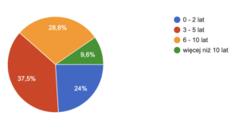
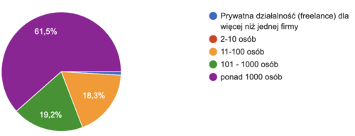
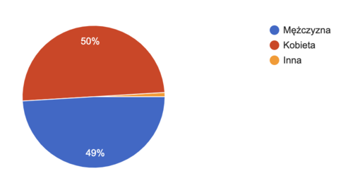

Nadszedł czas na opublikowanie wyników corocznej ankiety dotyczącej płac w
komunikacji technicznej. Szczegóły poniżej.

<!--truncate-->

#### O co pytaliśmy?

W tym roku zadaliśmy Wam 12 pytań, wśród których znalazły się dwa nowe
zagadnienia. Jedno z nich odnosi się do płci, a drugie do formalnej nazwy
stanowiska, jakie widnieje na umowie z pracodawcą. Standardowo pytaliśmy też,
między innymi, o to ile zarabiają specjaliści w branży komunikacji technicznej,
jak różnią się pensje w różnych województwach, czy jak na wynagrodzenie wpływa
doświadczenie. Jeśli ciekawi Was co zmieniło się od 2020 roku, zapraszamy do
poniższego podsumowania.

#### Porównanie z poprzednimi latami

Wyniki poprzednich badań znajdziecie tu:

- [Wyniki 2020](http://techwriter.pl/wyniki-badania-plac-w-komunikacji-technicznej-2020/)
- [Wyniki 2019](http://techwriter.pl/wyniki-badania-plac-w-komunikacji-technicznej-2019/)
- [Wyniki 2018](http://techwriter.pl/wyniki-badania-plac-w-komunikacji-technicznej-2018/)
- [Wyniki 2017](http://techwriter.pl/wyniki-badania-plac-w-komunikacji-technicznej/)

Oto jak sytuacja zmieniała się na przestrzeni lat, w których przeprowadzaliśmy
badania:

| 2017                           | 2018      | 2019      | 2020      | 2021      |
| ------------------------------ | --------- | --------- | --------- | --------- | --------- |
| Liczba odpowiedzi              | 70        | 80        | 103       | 111       | 104       |
| Średnie wynagrodzenie brutto   | 6 969 zł  | 7 352 zł  | 8 877 zł  | 9 131 zł  | 10 018 zł |
| Mediana wynagrodzeń brutto     | 6 000 zł  | 7 000 zł  | 8 000 zł  | 8 700 zł  | 9 000 zł  |
| Najniższe wynagrodzenie brutto | 1 970 zł  | 3 000 zł  | 3 500 zł  | 3 000 zł  | 4 000 zł  |
| Najwyższe wynagrodzenie brutto | 15 000 zł | 16 000 zł | 20 000 zł | 20 500 zł | 21 500 zł |

Pierwsze wnioski jakie możemy wyciągnąć z powyższych danych to:

- liczba uczestników ankiety utrzymuje się w okolicach 100 - tym, którzy
  udzielili odpowiedzi bardzo dziękujemy! Zastanawia nas, co możemy zrobić, by
  liczba odpowiedzi w kolejnych latach była wyższa.
- zarobki nadal mają tendencję wzrostową, co nas bardzo cieszy.

### Profesje

Podobnie jak w latach poprzednich, większość osób biorących udział w ankiecie
identyfikuje się jako Technical Writer (79,8%). W porównaniu do poprzedniego
roku można zaobserwować niewielki wzrost procentowy tej profesji (o 1,4%).
Dodatkowo warto zauważyć, że wśród innych stanowisk, podobnie jak rok temu,
dominuje Documentation Team Leader, co może świadczyć o dalszym rozwoju
większych projektów związanych z dokumentacją.

Poniżej tabela ze szczegółowym zestawieniem stanowisk w ramach branży wraz z
ilością udzielonych przez respondentów odpowiedzi:

| STANOWISKO                                                                | LICZBA ODPOWIEDZI |
| ------------------------------------------------------------------------- | ----------------- |
| Technical writer (specjalista ds. dokumentacji technicznej)               | 83                |
| Documentation team leader (szef zespołu dokumentacji)                     | 9                 |
| Product owner / Business Analyst (menadżer produktu / analityk systemowy) | 4                 |

Wśród odpowiedzi pojawiły się także pojedyncze przykłady innych profesji,
których nie braliśmy pod uwagę w powyższym zestawieniu. Były to na przykład
stanowiska:

- Training content developer (8 700 zł)
- Information architect (10 500 zł)
- Customer Success Manager / Information Developer (9 000 zł)

W tym roku poprosiliśmy Was o wpisanie do ankiety formalnej nazwy Waszego
stanowiska - tej, którą macie wpisaną na umowie o pracę. Chcieliśmy sprawdzić
jak dużo wersji stanowisk z branży komunikacji technicznej krąży wśród
pracodawców. Musimy przyznać, że wynik nas zaskoczył, bo podaliście ponad 30
różnych określeń! Większość z nich to Junior/Senior Technical Writerzy czy
Specjaliści ds. dokumentacji, jednak są także: Autorzy techniczni,
Dokumentaliści techniczni, Technical Content Developerzy, Information
Developerzy, Content Designerzy czy Redaktorzy dokumentacji technicznej. Nie
zawsze stanowisko "na papierze" pokrywa się z tym, jak określiliście Wasze
obowiązki w pytaniu: Który opis najbardziej pasuje do wykonywanej przez Ciebie
pracy? Wniosek z tego taki, że branża komunikacji technicznej pokrywa szeroki
obszar umiejętności oraz, że tłumaczenie stanowisk na język rodzimy nie zawsze
ma sens.

### **Wynagrodzenie**

Zarobki w poszczególnych grupach kształtują się następująco (posortowane wg
średniego wynagrodzenia brutto):

| PROFESJA                                                                  | ODPOWIEDZI | ŚREDNIA   | MEDIANA   |
| ------------------------------------------------------------------------- | ---------- | --------- | --------- |
| Technical writer (specjalista ds. dokumentacji technicznej)               | 83         | 9 672 zł  | 8 800 zł  |
| Documentation team leader (szef zespołu dokumentacji)                     | 9          | 13 675 zł | 13 000 zł |
| Product owner / Business Analyst (menadżer produktu / analityk systemowy) | 4          | 8 075 zł  | 8 250 zł  |

Przedziały wynagrodzenia według profesji wyglądają tak:

| PROFESJA                                                                  | NAJNIŻSZA | NAJWYŻSZA |
| ------------------------------------------------------------------------- | --------- | --------- |
| Technical writer (specjalista ds. dokumentacji technicznej)               | 4 000 zł  | 21 000 zł |
| Documentation Team Leader (szef zespołu dokumentacji)                     | 6 500 zł  | 21 500 zł |
| Product owner / Business Analyst (menadżer produktu / analityk systemowy) | 6 000 zł  | 9 800 zł  |

Zastanawiający jest rozstrzał wysokości pensji na stanowiskach Technical Writer
(od 4000 zł po 21 000 zł) oraz Documentation Team Leader (od 6 500 zł po 21 500
zł). W przypadku Technical Writera rozbieżność zarobków wynika z różnych
poziomów stanowisk (Junior, Senior, Principal). W przypadku Documentation Team
Leadera nie jest to już tak widoczne. Być może osoba z tak wysokim
wynagrodzeniem pełni także inne funkcje w firmie, czego nie określiła w
ankiecie. Po średniej i medianie widać, że skrajne wartości płac występują
rzadko.

### **Przygotowanie do zawodu, doświadczenie i rozwój**

Tak jak w poprzednich latach, większość ankietowanych nauczyło się zawodu w
pracy - to blisko 85% uczestników badania. Na drugim miejscu - 10,6% - to osoby,
które ukończyły kurs i zdobyły certyfikat [ITCQF](https://itcqf.org/). Ciągle
brakuje osób chętnych, by skorzystać ze
[studiów kierunkowych](http://techwriter.pl/studia-podyplomowe-z-komunikacji-technicznej/).
Według ankiety w tym roku to niespełna 9% respondentów.

| PRZYGOTOWANIE                         | PROCENTOWO | LICZBA ODPOWIEDZI |
| ------------------------------------- | ---------- | ----------------- |
| Szkolenie i doświadczenie w pracy     | 84,6%      | 88                |
| Kurs ITCQF z certyfikatem             | 10,6%      | 11                |
| Studia technical writing lub pokrewne | 8,7%       | 9                 |
| Inny kurs lub certyfikat              | 7,7%       | 8                 |
| Bez doświadczenia                     | 4,8%       | 5                 |
| Kurs ITCQF bez certyfikatu            | 3,8%       | 4                 |

Jak zatem doświadczenie w zawodzie wpływa na zarobki? Jak widać poniżej, ma ono
dość znaczący i pozytywny wpływ na to jakie otrzymujemy wynagrodzenie za pracę.

| PRZYGOTOWANIE                         | PROCENTOWO | LICZBA ODPOWIEDZI |
| ------------------------------------- | ---------- | ----------------- |
| Szkolenie i doświadczenie w pracy     | 84,6%      | 88                |
| Kurs ITCQF z certyfikatem             | 10,6%      | 11                |
| Studia technical writing lub pokrewne | 8,7%       | 9                 |
| Inny kurs lub certyfikat              | 7,7%       | 8                 |
| Bez doświadczenia                     | 4,8%       | 5                 |
| Kurs ITCQF bez certyfikatu            | 3,8%       | 4                 |

Sprawdziliśmy także jak na wysokość pensji wpływa nasze przygotowania do zawodu
czyli posiadanie studiów kierunkowych czy kursu zawodowego – szczegóły poniżej.
Naszym zdaniem warto się uczyć 😉

| STUDIA                      | ŚREDNIA   | MEDIANA  |
| --------------------------- | --------- | -------- |
| Brak studiów kierunkowych   | 9 942 zł  | 9 000 zł |
| Ukończone studia kierunkowe | 10 822 zł | 7 750 zł |

| KURS ITCQF                 | ŚREDNIA   | MEDIANA  |
| -------------------------- | --------- | -------- |
| Brak kursu                 | 9 956 zł  | 9 000 zł |
| Kurs ITCQF bez certyfikatu | 8 150 zł  | 7 550 zł |
| Kurs ITCQF z certyfikatem  | 11 198 zł | 9 700 zł |

### **Staż pracy w branży**

Jeżeli chodzi o staż pracy, to nadal jesteśmy młodym zawodem, choć jak pokazuje
wykres poniżej, większość respondentów ma od 3 do 5 lat doświadczenia (37,5%).
9,6% (10 osób) zadeklarowało staż pracy dłuższy niż 10 lat.

Jakie jest więc odzwierciedlenie długości stażu pracy w zarobkach? Podobnie jak
w przypadku posiadanego doświadczenia i tu widać znaczący wzrost pensji wraz z
upływem lat pracy.

| STAŻ PRACY                     | ŚREDNIA   | MEDIANA   |
| ------------------------------ | --------- | --------- |
| 0 – 2 lat (0 – 30 miesięcy)    | 7 772 zł  | 7 125 zł  |
| 3 – 5 lat (31 – 66 miesięcy)   | 9 049 zł  | 8 500 zł  |
| 6 – 10 lat (67 – 126 miesięcy) | 11 344 zł | 11 000 zł |
| więcej niż 10 lat              | 15 433 zł | 16 000 zł |

### **Firma, branża**

84,6% z pośród uczestników ankiety pracuje w firmie zagranicznej, a 15,4% w
firmie polskiej.

Poniżej odzwierciedlenie tego czynnika w wynagrodzeniu:

| RODZAJ FIRMY         | ŚREDNIA   | MEDIANA  |
| -------------------- | --------- | -------- |
| Firma międzynarodowa | 10 257 zł | 9 250 zł |
| Firma polska         | 8 703 zł  | 8 350 zł |

Jak pokazuje powyższy wykres, większość z nas pracuje w dużych firmach, w
których jest ponad 1000 pracowników (61,5%). Tylko jedna osoba zadeklarowała
pracę jako freelancer. W tym roku nikt nie zaznaczył przedziału 2-10 osób. Jak
te dane wpływają na zarobki? Oto wyniki:

| WIELKOŚĆ FIRMY  | ŚREDNIA   | MEDIANA   |
| --------------- | --------- | --------- |
| Freelance       | 15 000 zł | 15 000 zł |
| 11-100 osób     | 9 478 zł  | 9 000 zł  |
| 101 – 1000 osób | 10 000 zł | 8 900 zł  |
| ponad 1000 osób | 10 106 zł | 9 000 zł  |

Ogromna większość z nas pisze dokumentację do oprogramowania.

| RODZAJ DOKUMENTACJI               | PROCENTOWO | LICZBA ODPOWIEDZI |
| --------------------------------- | ---------- | ----------------- |
| Do oprogramowania                 | 85,6%      | 89                |
| Do API&nbsp;                      | 40,4%      | 42                |
| Do urządzeń elektronicznych / AGD | 11,5%      | 12                |
| Do maszyn i pojazdów              | 8,7%       | 9                 |

### **Geografia**

Podobnie jak w zeszłym roku najwięcej uczestników ankiety pochodzi z województw:
małopolskiego, dolnośląskiego i śląskiego.

| WOJEWÓDZTWO         | LICZBA ANKIETOWANYCH |
| ------------------- | -------------------- |
| małopolskie         | 42                   |
| dolnośląskie        | 18                   |
| śląskie             | 14                   |
| mazowieckie         | 9                    |
| pomorskie           | 6                    |
| łódzkie             | 4                    |
| podlaskie           | 3                    |
| podkarpackie        | 2                    |
| wielkopolskie       | 2                    |
| lubelskie           | 2                    |
| warmińsko-mazurskie | 1                    |
| opolskie            | 1                    |

Osoba deklarująca najwyższe zarobki (21 500 zł) pochodzi z województwa
pomorskiego, w którym zanotowano także najwyższe średnie zarobki (14 250 zł)
oraz medianę (14 000 zł).

### **Zadowolenie**

Pytaliśmy też o to, jak bardzo jesteś zadowolony/a ze swojej pracy w skali od 1
(bardzo nie lubię swojej pracy) do 5 (kocham swoją pracę). Jaki był wynik?

Odpowiedzi ankietowanych pokazują, że ich poziom zadowolenia z pracy jest nadal
na wysokim poziomie. Najczęściej wybieraną oceną była czwórka. Ponownie tylko
jedna osoba jest bardzo niezadowolona, a dwie dały ocenę 2.

### Tożsamość płciowa

W tym roku poszerzyliśmy pulę pytań i poprosiliśmy Was o określenie tożsamości
płciowej. Jak pokazuje poniższy wykres w branży komunikacji technicznej panuje
równowaga:

Jak zatem tożsamość płciowa wpływa na zarobki?

| TOŻSAMOŚĆ | ŚREDNIA   | MEDIANA  |
| --------- | --------- | -------- |
| Kobieta   | 9 297 zł  | 8 550 zł |
| Mężczyzna | 10 812 zł | 9 100 zł |

Ponieważ mieliśmy tylko jedną odpowiedź, w której osoba odpowiadająca określiła
swoją tożsamość płciową jako "inna", nie policzyliśmy średniej i mediany z racji
braku reprezentatywnej próbki.

Jak widać także w naszej branży istnieje rozbieżność pomiędzy zarobkami kobiet i
mężczyzn (tzw. pay gap). Dane pokazują, że różnica w zarobkach pojawia się już
na starcie i rośnie wraz z długością stażu na niekorzyść kobiet.

| STAŻ PRACY        | PŁEĆ      | ŚREDNIA   | MEDIANA   |
| ----------------- | --------- | --------- | --------- |
| 0 - 2 lat         | Kobieta   | 6 730 zł  | 6 550 zł  |
|                   | Mężczyzna | 8 572 zł  | 8 400 zł  |
| 3 - 5 lat         | Kobieta   | 8 977 zł  | 8 450 zł  |
|                   | Mężczyzna | 9 165 zł  | 8 500 zł  |
| 6 - 10 lat        | Kobieta   | 10 114 zł | 9 700 zł  |
|                   | Mężczyzna | 12 285 zł | 12 500 zł |
| więcej niż 10 lat | Kobieta   | 13 846 zł | 12 500 zł |
|                   | Mężczyzna | 17 020 zł | 18 500 zł |

### **Podsumowanie**

Z uwagi na wciąż niewielką liczbę respondentów (104 w tym roku) ankieta ma
charakter poglądowy, a nie statystyczny. Cieszymy się, że Wasz odzew jest nadal
na tyle duży, by warto było przeprowadzać badanie. Dziękujemy wszystkim, którzy
zdecydowali się poświęcić czas na wypełnienie formularza. Liczymy, że w
przyszłym roku zgłoszeń będzie więcej, co pozwoli nam opisać kolejne zmiany
zachodzące w naszej branży.

Mamy nadzieję, że informacje wynikające z badania są dla Was przydatne. Jeśli
macie uwagi lub sugestie - jak zawsze czekamy na komentarze.

P.S. Jeśli chcielibyście porównać nasze wyniki z odpowiedziami udzielonymi przez
uczestników badania zorganizowanego przez społeczność Write the Docs -
zapraszamy [tutaj](https://www.writethedocs.org/surveys/salary-survey/2020/).
