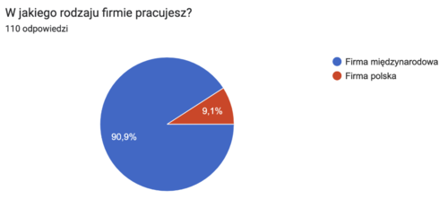
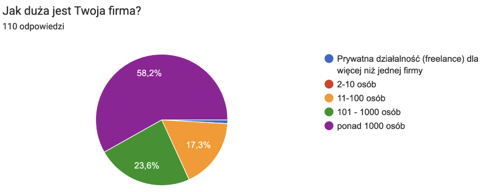
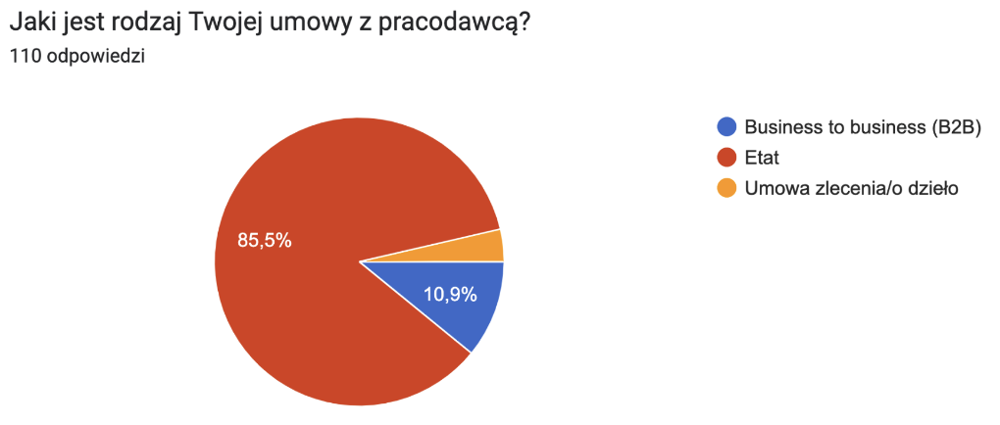
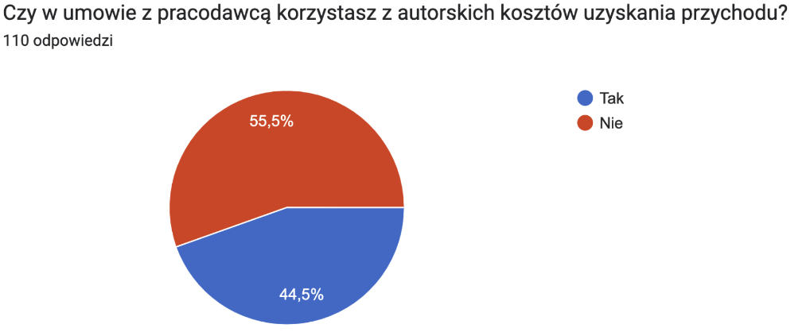
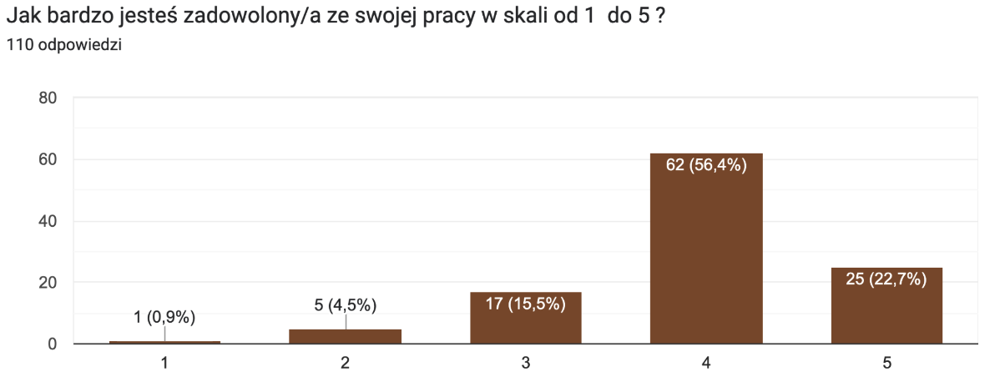

Najwyższa pora, by opublikować wyniki corocznej ankiety dotyczącej płac w
komunikacji technicznej. Szczegóły poniżej.

### O co pytaliśmy?

W tym roku poszerzyliśmy listę pytań o dwa kolejne, które dotyczyły rodzaju
umowy oraz korzystania (bądź nie) z autorskich kosztów uzyskania przychodu. Jako
co roku, pytaliśmy też, między innymi, o to ile zarabiają specjaliści w branży
komunikacji technicznej, jak różnią się pensje w różnych województwach, czy jak
na wynagrodzenie wpływa doświadczenie. Jeśli ciekawi Was co zmieniło się od 2021
roku, zapraszamy do poniższego podsumowania.

### Porównanie z poprzednimi latami

Wyniki poprzednich badań znajdziecie tu:

- [Wyniki 2021](http://techwriter.pl/wyniki-badania-plac-w-komunikacji-technicznej-2021/)
- [Wyniki 2020](http://techwriter.pl/wyniki-badania-plac-w-komunikacji-technicznej-2020/)
- [Wyniki 2019](http://techwriter.pl/wyniki-badania-plac-w-komunikacji-technicznej-2019/)
- [Wyniki 2018](http://techwriter.pl/wyniki-badania-plac-w-komunikacji-technicznej-2018/)
- [Wyniki 2017](http://techwriter.pl/wyniki-badania-plac-w-komunikacji-technicznej/)

Oto jak sytuacja zmieniała się na przestrzeni lat, w których przeprowadzaliśmy
badania:

<table dir="ltr" style="height: 350px;" border="1" width="650" cellspacing="0" cellpadding="0"><colgroup><col width="170"/> <col width="80"/> <col width="80"/> <col width="80"/> <col width="80"/> <col width="80"/> <col width="80"/></colgroup><tbody><tr><td></td><td style="text-align: center;" data-sheets-value="{&quot;1&quot;:3,&quot;3&quot;:2017}"><strong>2017</strong></td><td style="text-align: center;" data-sheets-value="{&quot;1&quot;:3,&quot;3&quot;:2018}"><strong>2018</strong></td><td style="text-align: center;" data-sheets-value="{&quot;1&quot;:3,&quot;3&quot;:2019}"><strong>2019</strong></td><td style="text-align: center;" data-sheets-value="{&quot;1&quot;:3,&quot;3&quot;:2020}"><strong>2020</strong></td><td style="text-align: center;" data-sheets-value="{&quot;1&quot;:3,&quot;3&quot;:2021}"><strong>2021</strong></td><td style="text-align: center;" data-sheets-value="{&quot;1&quot;:3,&quot;3&quot;:2021}"><strong>2022</strong></td></tr><tr><td style="text-align: left;" data-sheets-value="{&quot;1&quot;:2,&quot;2&quot;:&quot;Liczba odpowiedzi&quot;}">Liczba odpowiedzi</td><td style="text-align: center;" data-sheets-value="{&quot;1&quot;:3,&quot;3&quot;:70}">70</td><td style="text-align: center;" data-sheets-value="{&quot;1&quot;:3,&quot;3&quot;:80}">80</td><td style="text-align: center;" data-sheets-value="{&quot;1&quot;:3,&quot;3&quot;:103}">103</td><td style="text-align: center;" data-sheets-value="{&quot;1&quot;:3,&quot;3&quot;:111}">111</td><td style="text-align: center;" data-sheets-value="{&quot;1&quot;:3,&quot;3&quot;:104}">104</td><td style="text-align: center;" data-sheets-value="{&quot;1&quot;:3,&quot;3&quot;:104}">110</td></tr><tr><td style="text-align: left;" data-sheets-value="{&quot;1&quot;:2,&quot;2&quot;:&quot;Średnie wynagrodzenie brutto&quot;}">Średnie wynagrodzenie brutto</td><td style="text-align: center;" data-sheets-value="{&quot;1&quot;:2,&quot;2&quot;:&quot;6 969 zł&quot;}" data-sheets-numberformat="{&quot;1&quot;:4,&quot;2&quot;:&quot;#,##0\\ [$zł-415]&quot;}">6 969 zł</td><td style="text-align: center;" data-sheets-value="{&quot;1&quot;:2,&quot;2&quot;:&quot;7 352 zł&quot;}" data-sheets-numberformat="{&quot;1&quot;:4,&quot;2&quot;:&quot;#,##0\\ [$zł-415]&quot;}">7 352 zł</td><td style="text-align: center;" data-sheets-value="{&quot;1&quot;:2,&quot;2&quot;:&quot;8 877 zł&quot;}" data-sheets-numberformat="{&quot;1&quot;:4,&quot;2&quot;:&quot;#,##0\\ [$zł-415]&quot;}">8 877 zł</td><td style="text-align: center;" data-sheets-value="{&quot;1&quot;:2,&quot;2&quot;:&quot;9 131 zł&quot;}" data-sheets-numberformat="{&quot;1&quot;:4,&quot;2&quot;:&quot;#,##0\\ [$zł-415]&quot;}">9 131 zł</td><td style="text-align: center;" data-sheets-value="{&quot;1&quot;:2,&quot;2&quot;:&quot;10 018 zł&quot;}" data-sheets-numberformat="{&quot;1&quot;:4,&quot;2&quot;:&quot;#,##0\\ [$zł-415]&quot;}">10 018 zł</td><td style="text-align: center;" data-sheets-value="{&quot;1&quot;:2,&quot;2&quot;:&quot;10 018 zł&quot;}" data-sheets-numberformat="{&quot;1&quot;:4,&quot;2&quot;:&quot;#,##0\\ [$zł-415]&quot;}">11 461 zł</td></tr><tr><td style="text-align: left;" data-sheets-value="{&quot;1&quot;:2,&quot;2&quot;:&quot;Mediana wynagrodzeń brutto&quot;}">Mediana wynagrodzeń brutto</td><td style="text-align: center;" data-sheets-value="{&quot;1&quot;:2,&quot;2&quot;:&quot;6 000 zł&quot;}" data-sheets-numberformat="{&quot;1&quot;:4,&quot;2&quot;:&quot;#,##0\\ [$zł-415]&quot;}">6 000 zł</td><td style="text-align: center;" data-sheets-value="{&quot;1&quot;:2,&quot;2&quot;:&quot;7 000 zł&quot;}" data-sheets-numberformat="{&quot;1&quot;:4,&quot;2&quot;:&quot;#,##0\\ [$zł-415]&quot;}">7 000 zł</td><td style="text-align: center;" data-sheets-value="{&quot;1&quot;:2,&quot;2&quot;:&quot;8 000 zł&quot;}" data-sheets-numberformat="{&quot;1&quot;:4,&quot;2&quot;:&quot;#,##0\\ [$zł-415]&quot;}">8 000 zł</td><td style="text-align: center;" data-sheets-value="{&quot;1&quot;:2,&quot;2&quot;:&quot;8 700 zł&quot;}" data-sheets-numberformat="{&quot;1&quot;:4,&quot;2&quot;:&quot;#,##0\\ [$zł-415]&quot;}">8 700 zł</td><td style="text-align: center;" data-sheets-value="{&quot;1&quot;:2,&quot;2&quot;:&quot;9 000 zł&quot;}" data-sheets-numberformat="{&quot;1&quot;:4,&quot;2&quot;:&quot;#,##0\\ [$zł-415]&quot;}">9 000 zł</td><td style="text-align: center;" data-sheets-value="{&quot;1&quot;:2,&quot;2&quot;:&quot;9 000 zł&quot;}" data-sheets-numberformat="{&quot;1&quot;:4,&quot;2&quot;:&quot;#,##0\\ [$zł-415]&quot;}">10 500 zł</td></tr><tr><td style="text-align: left;" data-sheets-value="{&quot;1&quot;:2,&quot;2&quot;:&quot;Najniższe wynagrodzenie brutto&quot;}">Najniższe wynagrodzenie brutto</td><td style="text-align: center;" data-sheets-value="{&quot;1&quot;:2,&quot;2&quot;:&quot;1 970 zł&quot;}" data-sheets-numberformat="{&quot;1&quot;:4,&quot;2&quot;:&quot;#,##0\\ [$zł-415]&quot;}">1 970 zł</td><td style="text-align: center;" data-sheets-value="{&quot;1&quot;:2,&quot;2&quot;:&quot;3 000 zł&quot;}" data-sheets-numberformat="{&quot;1&quot;:4,&quot;2&quot;:&quot;#,##0\\ [$zł-415]&quot;}">3 000 zł</td><td style="text-align: center;" data-sheets-value="{&quot;1&quot;:2,&quot;2&quot;:&quot;3 500 zł&quot;}" data-sheets-numberformat="{&quot;1&quot;:4,&quot;2&quot;:&quot;#,##0\\ [$zł-415]&quot;}">3 500 zł</td><td style="text-align: center;" data-sheets-value="{&quot;1&quot;:2,&quot;2&quot;:&quot;3 000 zł&quot;}" data-sheets-numberformat="{&quot;1&quot;:4,&quot;2&quot;:&quot;#,##0\\ [$zł-415]&quot;}">3 000 zł</td><td style="text-align: center;" data-sheets-value="{&quot;1&quot;:2,&quot;2&quot;:&quot;4 000 zł&quot;}" data-sheets-numberformat="{&quot;1&quot;:4,&quot;2&quot;:&quot;#,##0\\ [$zł-415]&quot;}">4 000 zł</td><td style="text-align: center;" data-sheets-value="{&quot;1&quot;:2,&quot;2&quot;:&quot;4 000 zł&quot;}" data-sheets-numberformat="{&quot;1&quot;:4,&quot;2&quot;:&quot;#,##0\\ [$zł-415]&quot;}">4 500 zł</td></tr><tr><td style="text-align: left;" data-sheets-value="{&quot;1&quot;:2,&quot;2&quot;:&quot;Najwyższe wynagrodzenie brutto&quot;}">Najwyższe wynagrodzenie brutto</td><td style="text-align: center;" data-sheets-value="{&quot;1&quot;:2,&quot;2&quot;:&quot;15 000 zł&quot;}" data-sheets-numberformat="{&quot;1&quot;:4,&quot;2&quot;:&quot;#,##0\\ [$zł-415]&quot;}">15 000 zł</td><td style="text-align: center;" data-sheets-value="{&quot;1&quot;:2,&quot;2&quot;:&quot;16 000 zł&quot;}" data-sheets-numberformat="{&quot;1&quot;:4,&quot;2&quot;:&quot;#,##0\\ [$zł-415]&quot;}">16 000 zł</td><td style="text-align: center;" data-sheets-value="{&quot;1&quot;:2,&quot;2&quot;:&quot;20 000 zł&quot;}" data-sheets-numberformat="{&quot;1&quot;:4,&quot;2&quot;:&quot;#,##0\\ [$zł-415]&quot;}">20 000 zł</td><td style="text-align: center;" data-sheets-value="{&quot;1&quot;:2,&quot;2&quot;:&quot;20 500 zł&quot;}" data-sheets-numberformat="{&quot;1&quot;:4,&quot;2&quot;:&quot;#,##0\\ [$zł-415]&quot;}">20 500 zł</td><td style="text-align: center;" data-sheets-value="{&quot;1&quot;:2,&quot;2&quot;:&quot;21 500 zł&quot;}" data-sheets-numberformat="{&quot;1&quot;:4,&quot;2&quot;:&quot;#,##0\\ [$zł-415]&quot;}">21 500 zł</td><td style="text-align: center;" data-sheets-value="{&quot;1&quot;:2,&quot;2&quot;:&quot;21 500 zł&quot;}" data-sheets-numberformat="{&quot;1&quot;:4,&quot;2&quot;:&quot;#,##0\\ [$zł-415]&quot;}">31 000 zł</td></tr></tbody></table>

Pierwsze wnioski jakie możemy wyciągnąć z powyższych danych to:

- liczba uczestników ankiety utrzymuje się w okolicach 100, a w tym roku prawie
  osiągnęliśmy rekord z 2020 roku (111 odpowiedzi). Osobom, które udzieliły
  odpowiedzi serdecznie dziękujemy! Zastanawia nas, co możemy zrobić, by liczba
  odpowiedzi w kolejnych latach była wyższa. Będziemy wdzięczni za wszelkie
  sugestie w komentarzach ;).
- zarobki nadal mają tendencję wzrostową, co nas bardzo cieszy.

## **Profesje**

Podobnie jak w latach poprzednich, większość osób biorących udział w ankiecie
identyfikuje się jako Technical Writer (79,1%). W porównaniu do poprzedniego
roku można zaobserwować niewielki spadek procentowy tej profesji (o 0,7%).
Dodatkowo warto zauważyć, że wśród innych stanowisk, podobnie jak w zeszłych
latach, dominuje Documentation Team Leader, co może świadczyć o dalszym rozwoju
większych projektów związanych z dokumentacją.

Poniżej tabela ze szczegółowym zestawieniem stanowisk w ramach branży wraz z
ilością udzielonych przez respondentów odpowiedzi:

<table><tbody><tr><td>STANOWISKO</td><td style="text-align: center;">LICZBA ODPOWIEDZI</td></tr><tr><td>Technical writer (specjalista ds. dokumentacji technicznej)</td><td style="text-align: center;">87</td></tr><tr><td>Documentation team leader (szef zespołu dokumentacji)</td><td style="text-align: center;">13</td></tr><tr><td>Product owner / Business Analyst (menadżer produktu / analityk systemowy)</td><td style="text-align: center;">4</td></tr></tbody></table>

Wśród odpowiedzi pojawiły się także pojedyncze przykłady innych profesji,
których nie braliśmy pod uwagę w powyższym zestawieniu. Były to na przykład
stanowiska:

- Lead Content Developer (17 400 zł),
- Information architect (11 000 zł),
- Technical Documentation Coordinator (9 000 zł),
- Design manager (22 000 zł),
- IT support Specialist (6 500 zł),
- Technical Writer z elementami sysadmina (dla celów docs) oraz programowania
  (również dla celów docs) (20 200 zł).

## **Wynagrodzenie**

Zarobki w poszczególnych grupach kształtują się następująco (posortowane wg
średniego wynagrodzenia brutto):

<table><tbody><tr><td>PROFESJA</td><td>ODPOWIEDZI</td><td>ŚREDNIA</td><td>MEDIANA</td></tr><tr><td>Technical writer (specjalista ds. dokumentacji technicznej)</td><td style="text-align: center;">87</td><td style="text-align: center;">10 405 zł</td><td style="text-align: center;">9 666 zł</td></tr><tr><td style="text-align: left;">Documentation team leader (szef zespołu dokumentacji)</td><td style="text-align: center;">13</td><td style="text-align: center;">17 155 zł</td><td style="text-align: center;">14 000 zł</td></tr><tr><td>Product owner / Business Analyst (menadżer produktu / analityk systemowy)</td><td style="text-align: center;">4</td><td style="text-align: center;">11 593 zł</td><td style="text-align: center;">11 186 zł</td></tr></tbody></table>

Przedziały wynagrodzenia według profesji wyglądają tak:

<table><tbody><tr><td>PROFESJA</td><td>NAJNIŻSZA</td><td>NAJWYŻSZA</td></tr><tr><td>Technical writer (specjalista ds. dokumentacji technicznej)</td><td style="text-align: center;">4 500 zł</td><td style="text-align: center;">23 000 zł</td></tr><tr><td>Documentation Team Leader (szef zespołu dokumentacji)</td><td style="text-align: center;">9 450 zł</td><td style="text-align: center;">31 000 zł</td></tr><tr><td>Product owner / Business Analyst (menadżer produktu / analityk systemowy)</td><td style="text-align: center;">8 000 zł</td><td style="text-align: center;">16 000 zł</td></tr></tbody></table>

Po raz kolejny możemy zaobserwować spory rozstrzał wysokości pensji na
stanowiskach Technical Writer (od 4 500 zł po 23 000 zł) oraz Documentation Team
Leader (od 9 450 zł po 31 000 zł). W tym roku tendencję tą można także zauważyć
w przypadku osób pracujących jako Product Owner/Business Analyst, choć różnica
nie jest aż tak wielka (od 8 000 zł po 16 000 zł). W przypadku Technical Writera
rozbieżność zarobków wynika z różnych poziomów stanowisk (Junior, Senior,
Principal). W przypadku Documentation Team Leadera nie jest to już tak widoczne.
Być może osoba z tak wysokim wynagrodzeniem pełni także inne funkcje w firmie,
czego nie określiła w ankiecie. Po średniej i medianie widać, że skrajne
wartości płac występują rzadko.

## Przygotowanie do zawodu, doświadczenie i rozwój

Tak jak w poprzednich latach, większość ankietowanych nauczyło się zawodu w
pracy – to blisko 81% uczestników badania. Na drugim miejscu – blisko 20% – to
osoby bez doświadczenia. W tym roku trzecie miejsce zajęła grupa osób, które
ukończyły studia z Technical Writingu lub pokrewne - jest Was już ponad 14,5%.

<table style="height: 268px;" width="621"><tbody><tr><td>PRZYGOTOWANIE</td><td style="text-align: center;">PROCENTOWO</td><td style="text-align: center;">LICZBA ODPOWIEDZI</td></tr><tr><td>Szkolenie i doświadczenie w pracy</td><td style="text-align: center;">80,91%</td><td style="text-align: center;">89</td></tr><tr><td>Bez doświadczenia</td><td style="text-align: center;">19,09%</td><td style="text-align: center;">21</td></tr><tr><td>Studia technical writing lub pokrewne</td><td style="text-align: center;">14,55%</td><td style="text-align: center;">16</td></tr><tr><td>Inny kurs lub certyfikat</td><td style="text-align: center;">8,18%</td><td style="text-align: center;">9</td></tr><tr><td>Kurs ITCQF z certyfikatem</td><td style="text-align: center;">7,27%</td><td style="text-align: center;">8</td></tr><tr><td>Kurs ITCQF bez certyfikatu</td><td style="text-align: center;">0,91%</td><td style="text-align: center;">1</td></tr></tbody></table>

Jak zatem doświadczenie w zawodzie wpływa na zarobki? Jak widać poniżej, ma ono
dość znaczący i pozytywny wpływ na to jakie otrzymujemy wynagrodzenie za pracę.

<table><tbody><tr><td>DOŚWIADCZENIE</td><td>ŚREDNIA</td><td>MEDIANA</td></tr><tr><td>Nie posiada doświadczenia</td><td style="text-align: center;">8 448 zł</td><td style="text-align: center;">8 500 zł</td></tr><tr><td style="text-align: left;">Posiada doświadczenie</td><td style="text-align: center;">12 172 zł</td><td style="text-align: center;">11 200 zł</td></tr></tbody></table>

Sprawdziliśmy także jak na wysokość pensji wpływa nasze przygotowania do zawodu
czyli posiadanie studiów kierunkowych czy kursu zawodowego – szczegóły poniżej.
Pierwszy raz otrzymaliśmy wynik, który wskazuje na to, że kursy oraz studia nie
mają znaczenia. Naszym zdaniem ma na to wpływ spora liczba ankietowanych, którzy
zaznaczyli w odpowiedziach brak doświadczenia w branży - patrząc na przestrzeni
lat po raz pierwszy mamy aż tak wysoki odzew z tej grupy (blisko 20%). Może to
świadczyć o dwóch rzeczach - sporo osób z innych branż technicznych postanowiło
się przebranżowić lub są to osoby dopiero mające w planie rozpoczęcie kariery
zawodowej.

<table><tbody><tr><td>STUDIA</td><td>ŚREDNIA</td><td>MEDIANA</td></tr><tr><td>Brak studiów kierunkowych</td><td style="text-align: center;">11 750 zł</td><td style="text-align: center;">11 000 zł</td></tr><tr><td>Ukończone studia kierunkowe</td><td style="text-align: center;">9 764 zł</td><td style="text-align: center;">9 000 zł</td></tr></tbody></table>

<table><tbody><tr><td>KURS ITCQF</td><td>ŚREDNIA</td><td>MEDIANA</td></tr><tr><td>Brak kursu</td><td style="text-align: center;">11 541 zł</td><td style="text-align: center;">10 500 zł</td></tr><tr><td>Kurs ITCQF bez certyfikatu</td><td style="text-align: center;">8 000 zł</td><td style="text-align: center;">8 000 zł</td></tr><tr><td>Kurs ITCQF z certyfikatem</td><td style="text-align: center;">10 886 zł</td><td style="text-align: center;">10 700 zł</td></tr></tbody></table>

Warto zauważyć, że znacząca większość uczestników ankiety nie posiada
wykształcenia technicznego. Szczegóły na poniższym wykresie:

## Staż pracy w branży

Jeżeli chodzi o staż pracy, to nadal jesteśmy młodym zawodem, choć jak pokazuje
wykres poniżej, większość respondentów ma od 3 do 5 lat doświadczenia (31,8%).
19,1% zadeklarowało staż pracy dłuższy niż 10 lat.

Jakie jest więc odzwierciedlenie długości stażu pracy w zarobkach? Podobnie jak
w przypadku posiadanego doświadczenia i tu widać znaczący wzrost pensji wraz z
upływem lat pracy.

<table><tbody><tr><td>STAŻ PRACY</td><td>ŚREDNIA</td><td>MEDIANA</td></tr><tr><td>0 – 2 lat (0 – 30 miesięcy)</td><td style="text-align: center;">7 641 zł</td><td style="text-align: center;">7 650 zł</td></tr><tr><td>3 – 5 lat (31 – 66 miesięcy)</td><td style="text-align: center;">11 189 zł</td><td style="text-align: center;">10 250 zł</td></tr><tr><td>6 – 10 lat (67 – 126 miesięcy)</td><td style="text-align: center;">12 997 zł</td><td style="text-align: center;">12 900 zł</td></tr><tr><td>więcej niż 10 lat</td><td style="text-align: center;">15 107 zł</td><td style="text-align: center;">13 100 zł</td></tr></tbody></table>

## Firma, branża

90,9% z pośród uczestników ankiety pracuje w firmie międzynarodowej, a 9,1% w
firmie polskiej.

Poniżej odzwierciedlenie tego czynnika w wynagrodzeniu:

<table><tbody><tr><td>RODZAJ FIRMY</td><td>ŚREDNIA</td><td>MEDIANA</td></tr><tr><td>Firma międzynarodowa</td><td style="text-align: center;">11 593 zł</td><td style="text-align: center;">10 700 zł</td></tr><tr><td>Firma polska</td><td style="text-align: center;">10 145 zł</td><td style="text-align: center;">8 225 zł</td></tr></tbody></table>

Jak pokazuje powyższy wykres, większość z nas pracuje w dużych firmach, w
których jest ponad 1000 pracowników (58,2%). Tylko jedna osoba zadeklarowała
pracę jako freelancer. Również w tym roku nikt nie zaznaczył przedziału 2-10
osób. Jak te dane wpływają na zarobki? Oto wyniki:

<table><tbody><tr><td>WIELKOŚĆ FIRMY</td><td>ŚREDNIA</td><td>MEDIANA</td></tr><tr><td>Freelance</td><td style="text-align: center;">9 442 zł</td><td style="text-align: center;">9 442 zł</td></tr><tr><td>11-100 osób</td><td style="text-align: center;">10 567 zł</td><td style="text-align: center;">10 250 zł</td></tr><tr><td>101 – 1000 osób</td><td style="text-align: center;">10 999 zł</td><td style="text-align: center;">8 500 zł</td></tr><tr><td>ponad 1000 osób</td><td style="text-align: center;">11 946 zł</td><td style="text-align: center;">11 600 zł</td></tr></tbody></table>

W tym roku zadaliśmy Wam także dwa nowe pytania. Celem pierwszego było
określenie najpopularniejszego typu umowy jaki obowiązuje w branży. Ponad 85% z
ankietowanych zadeklarowało pracę na etacie.

Drugie pytanie dotyczyło korzystania z autorskich kosztów uzyskania przychodu.
Formę tę wybrało blisko 45% ankietowanych.

Ostatnie pytanie z działu _Firma, branża_ dotyczyło rodzaju dokumentacji jaką
tworzycie. Wciąż najpopularniejsza jest dokumentacja związana z oprogramowaniem.

## Geografia

Podobnie jak w zeszłym roku najwięcej uczestników ankiety pochodzi z województw:
małopolskiego, dolnośląskiego i śląskiego.

<table><tbody><tr><td>WOJEWÓDZTWO</td><td>LICZBA ANKIETOWANYCH</td></tr><tr><td>małopolskie</td><td style="text-align: center;">44</td></tr><tr><td>dolnośląskie</td><td style="text-align: center;">26</td></tr><tr><td>mazowieckie</td><td style="text-align: center;">12</td></tr><tr><td>śląskie</td><td style="text-align: center;">9</td></tr><tr><td>łódzkie</td><td style="text-align: center;">5</td></tr><tr><td>pomorskie</td><td style="text-align: center;">3</td></tr><tr><td>praca za granicą</td><td style="text-align: center;">3</td></tr><tr><td>podlaskie</td><td style="text-align: center;">2</td></tr><tr><td>podkarpackie</td><td style="text-align: center;">2</td></tr><tr><td>wielkopolskie</td><td style="text-align: center;">1</td></tr><tr><td>lubelskie</td><td style="text-align: center;">1</td></tr><tr><td>świętokrzyskie</td><td style="text-align: center;">1</td></tr><tr><td>zachodniopomorskie</td><td style="text-align: center;">1</td></tr></tbody></table>

Osoba deklarująca najwyższe zarobki (31 000 zł) pochodzi z województwa
małopolskiego. Najwyższe średnie zarobki (14 333 zł) oraz medianę (13 000 zł)
plasują się nadal w województwie pomorskim.

## Zadowolenie

Pytaliśmy też o to, jak bardzo jesteś zadowolony/a ze swojej pracy w skali od 1
(bardzo nie lubię swojej pracy) do 5 (kocham swoją pracę). Jaki był wynik?

Odpowiedzi ankietowanych pokazują, że ich poziom zadowolenia z pracy jest nadal
na wysokim poziomie. Najczęściej wybieraną oceną była czwórka. Ponownie tylko
jedna osoba jest bardzo niezadowolona, a dwie dały ocenę 2.

## Tożsamość płciowa

Ponownie poprosiliśmy Was o określenie tożsamości płciowej. Jak pokazuje
poniższy wykres w tym roku nieznaczna większość ankietowanych to kobiety:

Jak zatem tożsamość płciowa wpływa na zarobki?

<table><tbody><tr><td>TOŻSAMOŚĆ</td><td>ŚREDNIA</td><td>MEDIANA</td></tr><tr><td>Kobieta</td><td style="text-align: center;">10 984 zł</td><td style="text-align: center;">10 000 zł</td></tr><tr><td>Mężczyzna</td><td style="text-align: center;">11 914 zł</td><td style="text-align: center;">10 900 zł</td></tr></tbody></table>

Ponieważ mieliśmy tylko jedną odpowiedź, w której osoba odpowiadająca określiła
swoją tożsamość płciową jako „inna”, nie policzyliśmy średniej i mediany z racji
braku reprezentatywnej próbki. Jedna osoba nie określiła swojej płci i jej
odpowiedź również nie została ujęta w obliczeniach.

Jak widać także w naszej branży istnieje rozbieżność pomiędzy zarobkami kobiet i
mężczyzn (tzw. pay gap). Dane pokazują, że różnica w zarobkach pojawia się już
na starcie i rośnie wraz z długością stażu na niekorzyść kobiet.

<table dir="ltr" style="height: 312px;" border="1" width="565" cellspacing="0" cellpadding="0"><colgroup><col width="100"/> <col width="100"/> <col width="100"/> <col width="100"/></colgroup><tbody><tr><td data-sheets-value="{&quot;1&quot;:2,&quot;2&quot;:&quot;Staż pracy&quot;}">STAŻ PRACY</td><td style="text-align: center;" data-sheets-value="{&quot;1&quot;:2,&quot;2&quot;:&quot;Płeć&quot;}">PŁEĆ</td><td style="text-align: center;" data-sheets-value="{&quot;1&quot;:2,&quot;2&quot;:&quot;Srednia&quot;}" data-sheets-numberformat="{&quot;1&quot;:4,&quot;2&quot;:&quot;#,##0\\ [$zł-415]&quot;}">ŚREDNIA</td><td style="text-align: center;" data-sheets-value="{&quot;1&quot;:2,&quot;2&quot;:&quot;Mediana&quot;}" data-sheets-numberformat="{&quot;1&quot;:4,&quot;2&quot;:&quot;#,##0\\ [$zł-415]&quot;}">MEDIANA</td></tr><tr><td colspan="1" rowspan="2" data-sheets-value="{&quot;1&quot;:2,&quot;2&quot;:&quot;0 - 2 lat&quot;}">
0 - 2 lat
</td><td data-sheets-value="{&quot;1&quot;:2,&quot;2&quot;:&quot;Kobieta&quot;}">Kobieta</td><td style="text-align: center;" data-sheets-value="{&quot;1&quot;:3,&quot;3&quot;:6730}" data-sheets-numberformat="{&quot;1&quot;:4,&quot;2&quot;:&quot;#,##0\\ [$zł-415]&quot;}">6 991 zł</td><td style="text-align: center;" data-sheets-value="{&quot;1&quot;:3,&quot;3&quot;:6550}" data-sheets-numberformat="{&quot;1&quot;:4,&quot;2&quot;:&quot;#,##0\\ [$zł-415]&quot;}">7 150 zł</td></tr><tr><td data-sheets-value="{&quot;1&quot;:2,&quot;2&quot;:&quot;Mężczyzna&quot;}">Mężczyzna</td><td style="text-align: center;" data-sheets-value="{&quot;1&quot;:3,&quot;3&quot;:8572.357142857143}" data-sheets-numberformat="{&quot;1&quot;:4,&quot;2&quot;:&quot;#,##0\\ [$zł-415]&quot;}">8 290 zł</td><td style="text-align: center;" data-sheets-value="{&quot;1&quot;:3,&quot;3&quot;:8400}" data-sheets-numberformat="{&quot;1&quot;:4,&quot;2&quot;:&quot;#,##0\\ [$zł-415]&quot;}">8 250 zł</td></tr><tr><td colspan="1" rowspan="2" data-sheets-value="{&quot;1&quot;:2,&quot;2&quot;:&quot;3 - 5 lat&quot;}">
3 - 5 lat
</td><td data-sheets-value="{&quot;1&quot;:2,&quot;2&quot;:&quot;Kobieta&quot;}">Kobieta</td><td style="text-align: center;" data-sheets-value="{&quot;1&quot;:3,&quot;3&quot;:8976.583333333334}" data-sheets-numberformat="{&quot;1&quot;:4,&quot;2&quot;:&quot;#,##0\\ [$zł-415]&quot;}">11 287 zł</td><td style="text-align: center;" data-sheets-value="{&quot;1&quot;:3,&quot;3&quot;:8450}" data-sheets-numberformat="{&quot;1&quot;:4,&quot;2&quot;:&quot;#,##0\\ [$zł-415]&quot;}">9 584 zł</td></tr><tr><td data-sheets-value="{&quot;1&quot;:2,&quot;2&quot;:&quot;Mężczyzna&quot;}">Mężczyzna</td><td style="text-align: center;" data-sheets-value="{&quot;1&quot;:3,&quot;3&quot;:9165.333333333334}" data-sheets-numberformat="{&quot;1&quot;:4,&quot;2&quot;:&quot;#,##0\\ [$zł-415]&quot;}">10 653 zł</td><td style="text-align: center;" data-sheets-value="{&quot;1&quot;:3,&quot;3&quot;:8500}" data-sheets-numberformat="{&quot;1&quot;:4,&quot;2&quot;:&quot;#,##0\\ [$zł-415]&quot;}">10 375 zł</td></tr><tr><td colspan="1" rowspan="2" data-sheets-value="{&quot;1&quot;:2,&quot;2&quot;:&quot;6 - 10 lat&quot;}">
6 - 10 lat
</td><td data-sheets-value="{&quot;1&quot;:2,&quot;2&quot;:&quot;Kobieta&quot;}">Kobieta</td><td style="text-align: center;" data-sheets-value="{&quot;1&quot;:3,&quot;3&quot;:10114.384615384615}" data-sheets-numberformat="{&quot;1&quot;:4,&quot;2&quot;:&quot;#,##0\\ [$zł-415]&quot;}">12 508 zł</td><td style="text-align: center;" data-sheets-value="{&quot;1&quot;:3,&quot;3&quot;:9700}" data-sheets-numberformat="{&quot;1&quot;:4,&quot;2&quot;:&quot;#,##0\\ [$zł-415]&quot;}">12 400 zł</td></tr><tr><td data-sheets-value="{&quot;1&quot;:2,&quot;2&quot;:&quot;Mężczyzna&quot;}">Mężczyzna</td><td style="text-align: center;" data-sheets-value="{&quot;1&quot;:3,&quot;3&quot;:12285.29411764706}" data-sheets-numberformat="{&quot;1&quot;:4,&quot;2&quot;:&quot;#,##0\\ [$zł-415]&quot;}">14 130 zł</td><td style="text-align: center;" data-sheets-value="{&quot;1&quot;:3,&quot;3&quot;:12500}" data-sheets-numberformat="{&quot;1&quot;:4,&quot;2&quot;:&quot;#,##0\\ [$zł-415]&quot;}">13 100 zł</td></tr><tr><td colspan="1" rowspan="2" data-sheets-value="{&quot;1&quot;:2,&quot;2&quot;:&quot;więcej niż 10 lat&quot;}">
więcej niż 10 lat
</td><td data-sheets-value="{&quot;1&quot;:2,&quot;2&quot;:&quot;Kobieta&quot;}">Kobieta</td><td style="text-align: center;" data-sheets-value="{&quot;1&quot;:3,&quot;3&quot;:13846}" data-sheets-numberformat="{&quot;1&quot;:4,&quot;2&quot;:&quot;#,##0\\ [$zł-415]&quot;}">13 744 zł</td><td style="text-align: center;" data-sheets-value="{&quot;1&quot;:3,&quot;3&quot;:12500}" data-sheets-numberformat="{&quot;1&quot;:4,&quot;2&quot;:&quot;#,##0\\ [$zł-415]&quot;}">12 550 zł</td></tr><tr><td data-sheets-value="{&quot;1&quot;:2,&quot;2&quot;:&quot;Mężczyzna&quot;}">Mężczyzna</td><td style="text-align: center;" data-sheets-value="{&quot;1&quot;:3,&quot;3&quot;:17020}" data-sheets-numberformat="{&quot;1&quot;:4,&quot;2&quot;:&quot;#,##0\\ [$zł-415]&quot;}">16 345 zł</td><td style="text-align: center;" data-sheets-value="{&quot;1&quot;:3,&quot;3&quot;:18500}" data-sheets-numberformat="{&quot;1&quot;:4,&quot;2&quot;:&quot;#,##0\\ [$zł-415]&quot;}">16 000 zł</td></tr></tbody></table>

### Podsumowanie

Z uwagi na wciąż niewielką liczbę respondentów (110 w tym roku) ankieta ma
charakter poglądowy, a nie statystyczny. Cieszymy się, że Wasz odzew jest nadal
na tyle duży, by warto było przeprowadzać badanie. Raz jeszcze dziękujemy
wszystkim, którzy zdecydowali się poświęcić czas na wypełnienie formularza.
Liczymy, że w przyszłym roku zgłoszeń będzie więcej, co pozwoli nam opisać
kolejne zmiany zachodzące w naszej branży.

Mamy nadzieję, że informacje wynikające z badania są dla Was przydatne. Jeśli
macie uwagi lub sugestie – jak zawsze czekamy na komentarze.
