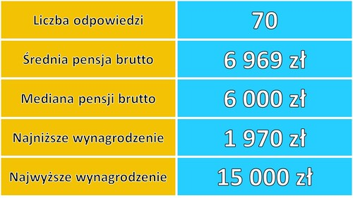
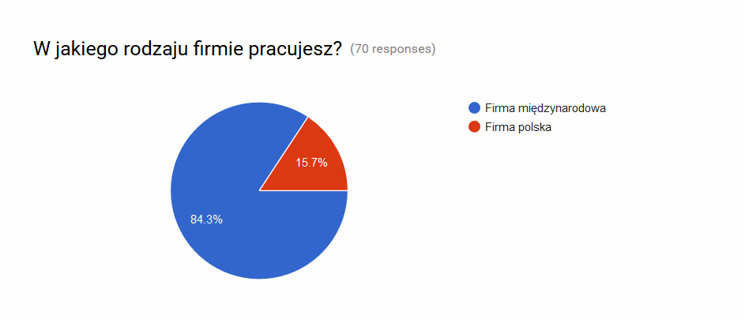
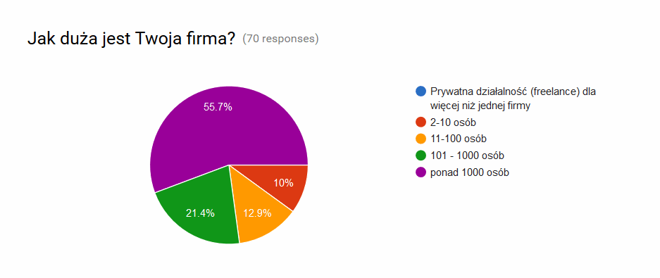
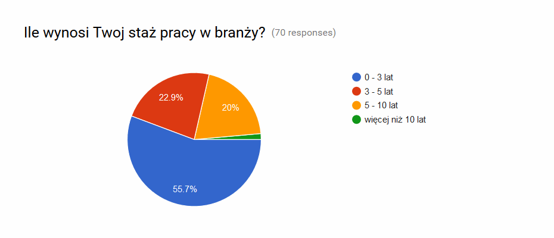
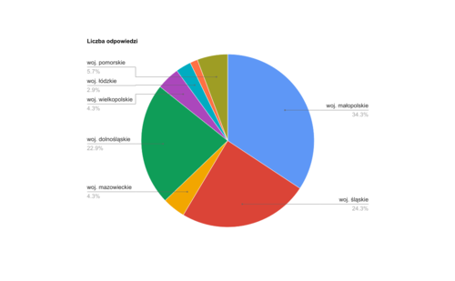
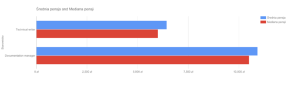
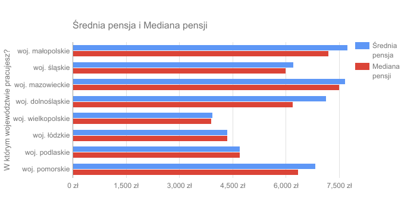
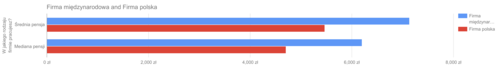
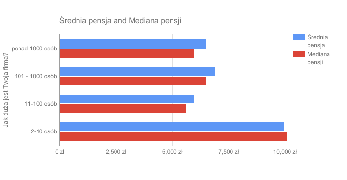
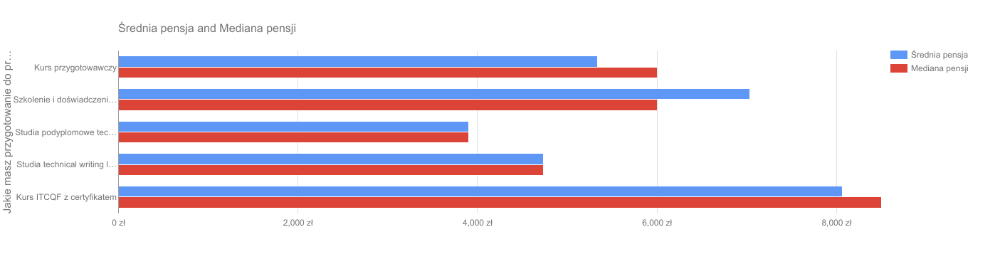

Ile zarabiają technical writerzy? Jak różnią się pensje w różnych województwach?
Jak na wynagrodzenie wpływa doświadczenie? Przeprowadziliśmy pierwsze w Polsce
badanie płac w branży komunikacji technicznej. Oto jego wyniki.

<!--truncate-->

## Przegląd odpowiedzi

W badaniu wzięło udział 70 osób. Jesteśmy bardzo zadowoleni, że udało się zebrać
tyle odpowiedzi, choć nadal nie jesteśmy w stanie oszacować ilu jest
przedstawicieli naszej branży w Polsce. Badanie nie ma więc mocy statystycznej,
ale pokazuje pewnie przykłady, albo ilustruje przynajmniej wycinek rynku.

Na początek ogólne cyfry:

Najwyższe wynagrodzenie (15,000 zł brutto) wskazały dwie osoby pracujące w
województwie małopolskim. Obydwie mają 5-10 lat doświadczenia w branży, z czego
jedna pracuje jako documentation manager (szef zespołu dokumentacji), a druga
jako technical writer (specjalista ds. dokumentacji technicznej).

Poniżej diagramy pokazujące ogólne liczby dotyczące wynagrodzeń, a analiza
zarobków w dalszej części artykułu.

Większość respondentów to technical writerzy

Większość zdobyła wiedzę i umiejętności w pracy.

Większość respondentów pracuje w firmie zagranicznej...

...zatrudniającej powyżej 1000 osób

Zdecydowana większość badanych ma doświadczenie poniżej 5 lat, tylko jeden
respondent ma więcej niż 10 lat doświadczenia.

Najliczniej
reprezentowane są województwa małopolskie, śląskie i dolnośląskie.

Liczba odpowiedzi na województwo:

- woj. małopolskie: 24
- woj. śląskie: 17
- woj. dolnośląskie: 16
- woj. pomorskie: 4
- woj. mazowieckie: 3
- woj. wielkopolskie: 3
- woj. łódzkie: 2
- woj. podlaskie: 1

## Przegląd wynagrodzeń

Od czego zależą wysokości wynagrodzeń? Żeby przybliżyć odpowiedź,
przeanalizowaliśmy wyniki ankiety pod kilkoma kątami.

### Stanowisko

Średnia i mediana pensji są wyższe na stanowiskach kierowniczych niż dla
technical writerów. Pozostałe grupy wymienione w badaniu miały po jednym
respondencie.

### Staż pracy

Staż pracy przekłada się na wyższe wynagrodzenie, natomiast przekroczenie progu
5 lat doświadczenia wydaje się przynosić największy skok w wysokości
wynagrodzenia. Być może jest to związane z tym jak rzadko spotyka się takie
osoby wśród naszych respondentów.

### Region

W kolejności od najlepiej zarabiających widzimy następujące województwa:

1. Małopolskie
2. Mazowieckie
3. Pomorskie i dolnośląskie
4. Śląskie

### Rodzaj i wielkość firmy

Zarówno średnia jak i mediana pensji jest wyższa dla pracowników firm
zagranicznych. Natomiast jeśli chodzi o wielkość firmy, najlepiej płacą firmy od
2 do 10 osób.

### Przygotowanie

Osoby, które ukończyły kurs ITCQF znajdują się wśród najlepiej zarabiających.
Czy to oznacza, że kurs przygotowuje najlepiej płatnych specjalistów, czy
właśnie ci specjaliści wzięli udział w kursie?

## Podsumowanie

Wyniki badania nie dają pełnego statystycznego obrazu w branży w Polsce, ale
pokazują pewne przykłady. Innymi słowy, możemy wywnioskować, że są ludzie w
danym województwie, którzy zarabiają X lub Y, ale nie możemy powiedzieć ogólnie,
statystycznie, średnio, ile zarabia technical writer. Nie wiemy też ilu nas jest
w kraju, bo liczba respondentów na pewno daleka jest od faktycznej liczby
zatrudnionych.

To pierwsza tego typu ankieta w Polsce i siłą rzeczy dotarła do niewielu
respondentów, ale mamy nadzieję, że w kolejnych latach to się poprawi.
Inspiracją do tej ankiety były działania naszych kolegów z Finlandii
([o ich konferencji niedawno pisaliśmy](http://techwriter.pl/tceurope-colloquium-2017/)),
i oni tez w pierwszym roku mieli niewiele odpowiedzi, ale w kolejnych latach
liczba respondentów ustabilizowała się na poziomie ok. 200. Mamy nadzieję, że to
samo spotka i nas w kolejnych latach, i że będziemy mogli porównywać wyniki z
roku na rok.
