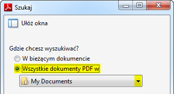

Jak wyszukać jakieś wyrażenie w wielu plikach PDF naraz? Można otworzyć każdy
plik z osobna za pomocą przeglądarki plików PDF, nacisnąć Ctrl+F i wyszukać
żądany tekst. Taka metoda jest oczywiście mało wydajna i w przypadku dużej
ilości plików niezwykle czasochłonna. Okazuje się, że jest dużo prostszy sposób,
który nie wymaga instalowania płatnych aplikacji.

<!--truncate-->

Wystarczy zaopatrzyć się w poczciwego
[Adobe Readera](http://get.adobe.com/pl/reader/). Aplikacja posiada funkcję
wyszukiwania zaawansowanego, która umożliwia sprawne znalezienie wyrażenia w
wielu plikach PDF. Poniżej przedstawiamy krótką instrukcję stworzoną na
przykładzie **Adobe Reader XI**.

1.  Otwórz aplikację Adobe Reader. 2) W górnym pasku, otwórz menu Edycja i
    wybierz opcję **Wyszukiwanie zaawansowane**.

Pojawi się okno wyszukiwania.

3. W oknie, zaznacz opcję **Wszystkie dokumenty PDF w** po czym z menu
   rozwijanego wybierz lokalizację z plikami PDF, które mają zostać przeszukane.

4. W polu **Jakiego wyrazu lub wyrażenia chciałbyś poszukać?** wpisz tekst,
   który chcesz wyszukać, np. imię.

Opcjonalnie, zmień pozostałe parametry wyszukiwania. Naciśnij _Szukaj_.

5. Jeśli pojawi się poniższe okno z ostrzeżeniem, naciśnij _Zezwalaj_.

Po zakończeniu wyszukiwania, rezultat zostanie wyświetlony w oknie wyszukiwania
w sekcji **Wyniki**.

6. Żeby przejść do miejsca, w którym tekst został znaleziony, kliknij na żądany
   plik.
