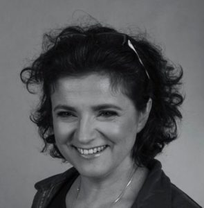

Nieraz mieliśmy okazję słyszeć Tech Writerów, którzy narzekali na swój ciężki
los, bo SMEsi nie chcieli z nimi współpracować. A jak już chcieli, to nie
stosowali dobrych praktyk i dostarczali im zdawkowe i trudne do przetrawienia
informacje naszpikowane wszelkiej maści osobliwościami językowymi.

<!--truncate-->

Niejednokrotnie też słyszeliśmy ubolewanie nad tym, że jesteśmy na samym końcu
procesu i że zawsze mamy najgorzej. W tym całym "cierpieniu" zapominamy jednak o
tym, że jest jeszcze ktoś dla kogo nasz koniec pracy oznacza początek wysiłku -
tłumacze. Nie dostrzegamy swoich grzeszków, które potem generują dla nich sporo
problemów.

Dlatego poprosiliśmy ekspertkę w dziedzinie tłumaczeń o gościnny wpis, który
rzuciłby trochę światła na kwestię dobrych praktyk związanych z tworzeniem
treści przyjaznej dla tłumaczy. Temat okazał się dość obszerny, dlatego autorka
postanowiła podzielić go na kilka części. Dzisiaj część pierwsza pt. "Za co
tłumacze lubią autorów - spójność".

# Kilka słów o autorce

Marta Bartnicka jest kierowniczką działu tłumaczeń dla Europy Środkowej w IBM. Z
działem tym związana jest od 20 lat, zajmując się między innymi tłumaczeniem,
weryfikacją, testowaniem lokalizacji, prowadzeniem projektów lokalizacyjnych dla
jednego i wielu języków, terminologią, a od kilku lat także wdrażaniem tłumaczeń
maszynowych oraz modelu Continuous Delivery. Obecnie koordynuje lokalizację
oprogramowania, dokumentacji i stron WWW na kilkanaście języków
środkowoeuropejskich (w tym polski). W pracy zebrała – i nieustająco zbiera
nadal - doświadczenie w poruszaniu się na styku kultur, na pograniczu polityki
korporacyjnej i lokalnych norm oraz zwyczajów. Z wykształcenia mgr inż.
informatyki (Systemy Informacji Naukowo-Technicznej, Politechnika Wrocławska).
Hobby w kolejności alfabetycznej: biegówki, dzieci, ogrodnictwo,
Tatry.

Jeśli chcecie skontaktować się z Martą, możecie wysłać jej maila
na [martab@kofeina.net](mailto:martab@kofeina.net).

# Za co tłumacze lubią autorów - spójność

Krótki cykl opowieści o tym, za co tłumacze lubią autorów dokumentacji, pomocy i
interfejsów.

Tworząc treści – czy to po polsku, po angielsku, czy niemiecku – warto mieć z
tyłu głowy myśl, że ktoś to kiedyś zechce przełożyć na inne języki. W idealnym,
dobrze zaprojektowanym świecie pomyślał już o tym zleceniodawca czy też
zamawiający dany content; w praktyce często nie przewiduje w ogóle publikowania
treści w innych językach, ale „za rok, za dzień, za chwilę” stanie przed taką
koniecznością.

Przyjrzyjmy się zatem kilku zagadnieniom, dzięki którym tłumacze nie będą
wbijali niczego w laleczki voodoo wyobrażające tech writera.

## Może być różowo, byle jednakowo

Wyrażanie tej samej myśli na trzy sposoby miało swoją rolę w wypracowaniach
szkolnych, kiedy nauczyciel wymagał co najmniej pięciu stóp pergaminu. Znajomość
synonimów świetnie sprawdzała się w testach językowych. Dla dobra ludzkości
odłóżmy jednak błyskotliwość na półkę i piszmy spójnie. Przede wszystkim:
użytkownik będzie szczęśliwszy bez domyślania się, że „rack” i „frame” to ta
sama szafa na sprzęt. W teorii reguluje to przewodnik stylistyczny i słowniki, z
jakich korzystamy – w praktyce… jak to w praktyce.  Jeśli wprowadzamy wiele
pojęć oznaczających to samo lub wiele wersji tego samego komunikatu, to
pamiętajmy: po tłumaczeniu będzie tylko gorzej – biorąc pod uwagę subtelności
wielu języków, na jakie nasz produkt zostanie przełożony, a o których na razie
nie mamy pojęcia.

Tu czas na odrobinę nostalgii. W roku 1995 miałam przyjemność wdrażać się do
zawodu tłumacza na podręczniku opisującym migrację systemów AS/400 z jednego
modelu do innego (nowszego albo mocniejszego). Na początku śmieszyło mnie
powtarzające się w każdym rozdziale zdanie “For more information, please contact
your IBM Service Representative.” Potem zaczęło irytować. W końcu doceniłam, że
jest pisane zawsze dokładnie tak samo. Dzięki temu nie musiałam wymyślać
kolejnych tłumaczeń o tym samym znaczeniu, a co ważniejsze – ustalać, czy to
znaczenie jest aby faktycznie identyczne. Bo przecież to samo po angielsku można
by wyrazić tak:

„IBM Service Representative will provide you more information on your request.”

Albo tak:

„More info is available on demand from the IBM Service Representative.”

A może nawet tak:

„Your IBM SR is there to help you in need.”

Być może wartość literacka podręcznika zostałaby w ten sposób nieznacznie
zwiększona. Tylko czy na pewno doceniłby to informatyk zakładowy, który ma na
głowie migrację z modelu X do Y według listy kontrolnej w rozdziale 17?

Dla tłumaczenia wyrażenie tej samej treści w ten sam sposób jest zbawienne.
Warto tu zajrzeć na warsztat pracy tłumacza, a konkretnie – do narzędzi CAT,
które służą przede wszystkim do tego, żeby dla fragmentów tekstu wcześniej
przetłumaczonych zaproponować gotowe tłumaczenie. Dzięki nim pracuje się
szybciej, nie tracąc czasu na szukanie, kopiowanie i wklejanie. Jeśli autor
wyraził tę samą myśl na kilka sposobów, to CAT w najlepszym razie zaproponuje
podpowiedź przybliżoną (ang. Fuzzy), nad którą tłumacz będzie musiał się
nagłowić; nie wiem jak koledzy po fachu – ja zawsze wolałam w tłumaczeniu
zużywać zasoby wewnętrznego procesora na coś nowego, a nie na mielenie
wariantów.

## Kantyczka dla STE

W niemal każdym projekcie obejmującym technical writing znajdziemy jakiś
zalecany słownik, jakiś rodzaj wytycznych co do stylu i języka – nawet jeśli
będą oparte głównie na legendach i przekazie ustnym. Zamiast fantazjować jak być
powinno, zajrzyjmy do specyfikacji Simplified Technical English
([http://www.asd-ste100.org/](http://www.asd-ste100.org/)), która pozostaje
niedościgłym wzorem tego, co można zrobić z językiem – dla dobra autorów,
odbiorców i tłumaczy. Specyfikacja ta nieprzypadkowo powstała (i jest rozwijana)
na potrzeby przemysłu lotniczego, potem zbrojeniowego i częściowo maszynowego. W
tych dziedzinach konsekwencje niezrozumienia instrukcji (przez osobę, dla której
angielski jest językiem wyuczonym) lub konsekwencje niedokładnego tłumaczenia
bywają bardzo poważne. Idąc tym tropem: im mniejsze ryzyko, że to, co
dokumentujemy, spowoduje śmierć lub kalectwo wielu osób, tym mniejsze szanse na
wdrożenie równie dobrych praktyk. (Do grupy produktów rozrywkowych należy na
przykład większość IT.)

Jeśli miałabym podać trzy reguły, dla których STE budzi mój zachwyt i polecam tę
specyfikację z całego serca, to będą to:

1. Jedno pojęcie dla jednego znaczenia. Jeśli na opadanie (ruch w dół pod
   wpływem grawitacji) mówimy „fall”, to nie używamy zamiennie słowa „decrease”,
   które przyda nam się w znaczeniu „zmniejszać wartość”.
2. Konstruowanie zdań w trybie czynnym, zgodnie z kolejnością i logiką
   działania. „If you want to drop bombs now, press the red button” – a nie „The
   red button should be pressed in case bombs are to be dropped.”
3. Ustalenie liczby rzeczowników, które można bezkarnie składać ze sobą bez słów
   wyjaśniających kto kogo czym. Zrozumie mnie każdy, kto próbował sparsować
   cuda w rodzaju „print buffer display timeout override”, wiedząc dodatkowo, że
   autor tekstu jest Chińczykiem i do szyku zdania ma podejście swobodne, a do
   przyimków - nieufne.

## Przez snippety do gwiazd

Oprócz słowników i poradników stylistycznych, na ratunek autorom – a w dalszej
perspektywie tłumaczom – śpieszą metody topic-based writing i narzędzia, które
wspierają ten styl pracy. Jeśli dzielimy tekst na małe dokumenty, zorientowane
wokół jednego zadania czy koncepcji, to tworzymy materiał wygodny do
tłumaczenia: każdy fragment pójdzie do tłumaczenia tylko raz, a podział
większego projektu między zespół tłumaczy da się zrobić w prosty sposób. Jest tu
tylko jeden mały haczyk: ważne, żeby ze środowiska technical writingu do
projektu lokalizacyjnego została przekazana pełna informacja o tym, jak
poszczególne dokumenty (pliki) się łączą i jak wygląda struktura całości. Im
mniej kontekstu, tym trudniejsze – i w efekcie gorsze – będzie tłumaczenie.

Z kolei stałe frazy, takie jak notki prawne czy wspomniane wcześniej przywołanie
przedstawiciela serwisu, dobrze sprawdzają się jako snippety. Nawet jeśli w
tekście do tłumaczenia pojawią się wiele razy, to mamy gwarancję, że po
przetłumaczeniu będą wyglądać identycznie; narzędzia CAT wykażą się niemal bez
absorbowania tłumacza.

Podobna technika przyda się, kiedy dokumentacja czy system pomocy odwołuje się
np. do elementów interfejsu; warto wstawiać je jako stałe tekstowe, żeby mieć
pewność, że wszędzie będą nazywać się tak samo – i że będzie to zgodne z tym, co
ustalono dla UI.

A skoro doszliśmy już do wstawiania tekstu, to na radarze pojawiła się właśnie
niewielka góra lodowa… której prawdziwe rozmiary opiszę następnym razem?
