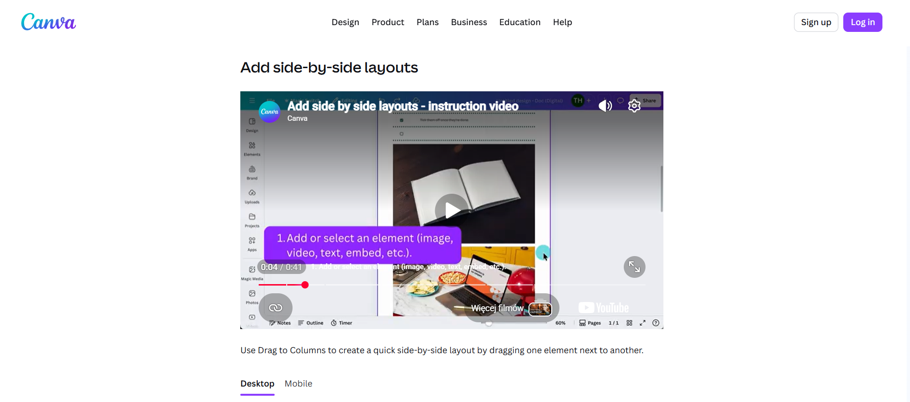
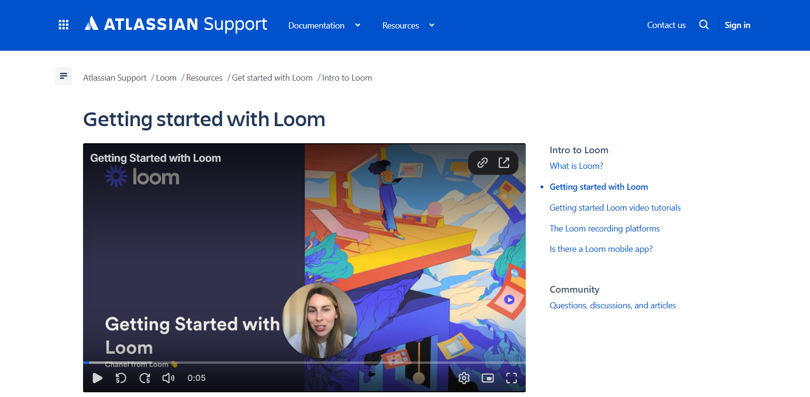
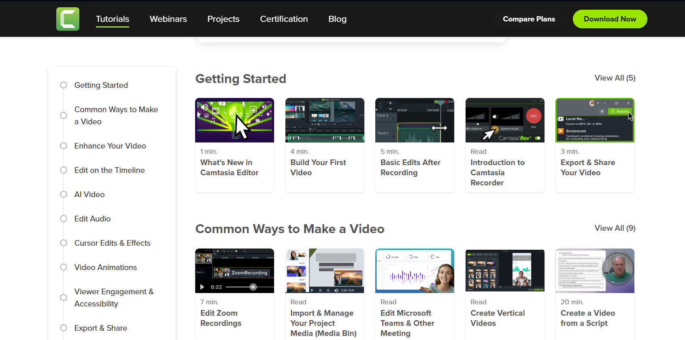
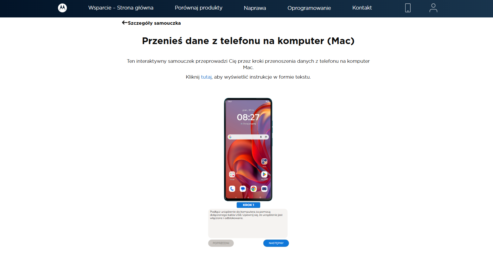

Materiały wideo w dokumentacji użytkownika to żadna nowość, bo pojawiły się tam już kilka lat temu. Jak ten trend wygląda dzisiaj?

<!--truncate-->

## Zacznijmy od początku

O początkach trendu umieszczania wideo w dokumentacji technicznej pisała już kilka lat temu Martyna Toporek w artykule pt. [Ilustracje i wideo w dokumentacji technicznej](../ilustracje-i-wideo-w-dokumentacji-technicznej/index.md). W mojej publikacji chciałabym pokazać, jak sytuacja wygląda kilka lat później, a także odpowiedzieć na pytanie kiedy tworzenie multimediów w postaci wideo czy interaktywnych treści ma sens w dokumentacji użytkownika. 

Sprawdziłam wybiórczo dokumentację takich firm jak Canva, Atlassian Loom, Camtasia i Motorola, aby przekonać się czy uda mi się szybko trafić na jakieś wideo. Zadanie okazało się bardzo proste, ponieważ już po kilku minutach analizy zauważyłam materiały wideo obecne w dokumentacji wszystkich wymienionych firm.

Canva jest z pewnością dobrze znana wśród pisarzy technicznych i zapewne większość z nich spodziewałaby się, że platforma do projektowania graficznego będzie wykorzystywać wideo w swojej dokumentacji, głównie ze względu na specyfikę tego narzędzia. [Wideo, które znalazłam](https://www.canva.com/help/create-canva-docs/#add-side-by-side-layouts) trwa 41 sekund i krótko przedstawia jak wykonać daną czynność. Wideo nie posiada lektora. Zamiast tego wykorzystano krótkie komunikaty tekstowe w formie punktów, które użytkownik musi sam przeczytać. Zaletą takiego rozwiązania jest to, że użytkownik może obejrzeć materiał bez dźwięku, a samo wideo pozostaje krótkie i dynamiczne. Z drugiej jednak strony konieczność czytania i oglądania w tym samym momencie może być niewygodna dla części odbiorców. 

Kolejnym przykładem jest Atlassian Loom, który w swojej [dokumentacji](https://support.atlassian.com/loom/docs/getting-started-with-loom/) umieścił prawie 6 minutowe wideo o tym, jak rozpocząć pracę z narzędziem Loom. Co ciekawe, do nagrania materiału najprawdopodobniej wykorzystano samo narzędzie Loom, co jednocześnie stanowi dobrą prezentację możliwości produktu.

Innym z kolei przykładem jest dokumentacja produktu Camtasia, który umożliwia nagrywanie, edycję i montaż wideo. Dokumentacja produktu zawiera osobną [sekcję](https://www.techsmith.com/learn/tutorials/camtasia/) poświęconą materiałom wideo, dzięki którym użytkownik może nie tylko poznać samo narzędzie, ale także zapoznać się z przykładami zastosowań czy praktycznymi poradami. Długość materiałów jest zróżnicowana. Część trwa kilka minut, podczas gdy inne mają formę kilkunasto- lub kilkudziesięciominutowych tutoriali, w zależności od omawianego tematu.

I na koniec inny przykład jakim jest Motorola. Firma, która w swojej dokumentacji wykorzystuje ciekawe rozwiązanie jakim jest [interaktywne demo](https://pl-pl.support.motorola.com/app/answers/tutorials/t_id/Przenies_dane_Mac), w którym użytkownik klikając przechodzi do kolejnych kroków instrukcji. Warto podkreślić, że użytkownik może również wyświetlić instrukcję w formie tekstowej, co wyróżnia ten przykład na tle wcześniej opisanych rozwiązań.

## Kiedy wideo ma sens

Opierając się na wcześniej opisanych przykładach możemy zauważyć, że wideo jest popularną formą stosowaną w dokumentacji użytkownika. Pojawia się więc pytanie, z czego wynika stopniowe odchodzenie od klasycznej dokumentacji pisanej. Odpowiedź jest prosta. W dużej mierze odpowiadają za to platformy i media, z których korzystamy na co dzień. To one przyzwyczaiły nas do częstszego oglądania niż czytania treści. 

Na przykładzie Atlassiana widzimy, że wideo może się sprawdzić dobrze jako materiał onboardingowy znajdujący się w sekcji _Getting started_, który ma ułatwić użytkownikowi zrozumienie jak działa produkt i zachęcić do jego dalszej eksploracji. 

Wideo może również lepiej sprawdzać się w przypadku bardziej złożonych produktów, których wartość łatwiej pokazać na konkretnym scenariuszu użycia niż opisywać wyłącznie w sposób teoretyczny. Podobnie dzieje się w sytuacji dynamicznych zmian na ekranie, gdzie pisanie instrukcji mogłoby nie zobrazować tak dobrze danej funkcji jak zaprezentowanie jej w wideo. 
Warto również zauważyć, że materiały wideo mogą pełnić nie tylko funkcję dokumentacyjną, ale także marketingową czy edukacyjną. Dla wielu firm może okazać się to dużą zaletą, gdyż stworzone wideo zostaną wykorzystane na różnych płaszczyznach. 

## Kiedy wideo może przeszkadzać użytkownikowi

Wideo nie zawsze jest najlepszym sposobem prezentowania wartości produktu i istnieje wiele sytuacji, w których taka forma może okazać się mało praktyczna. Jednym z nich jest grono produktów o bardzo prostym bądź wręcz ubogim interfejsie, gdzie wideo byłoby przerostem formy nad treścią i zrzut ekranu bywa w zupełności wystarczający. 

Innym przykładem mogą być obszary, w których użytkownik szuka konkretnej informacji, np. dokumentacja API. Deweloper zazwyczaj nie będzie chciał oglądać materiału wideo, lecz szybko przejrzy dokumentację w poszukiwaniu konkretnego pola, parametru lub fragmentu kodu. Podobnie wygląda sytuacja w przypadku konfiguratorów systemowych, terminali czy zaawansowanych narzędzi deweloperskich, gdzie szybkość znalezienia informacji jest kluczowa.
Nie można zapomnieć o produktach, które dopiero są rozwijane bądź zmieniają interfejs tak szybko, że w ich przypadku wideo może być aktualne zaledwie przez kilka dni. 

## Jak podjąć właściwą decyzję

Przy podejmowaniu decyzji o wykorzystaniu wideo kluczowa jest przede wszystkim znajomość odbiorców produktu. Jeśli są to użytkownicy nietechniczni, wideo może być dobrą formą prezentacji funkcjonalności i ułatwić zrozumienie produktu. W przypadku osób bardziej technicznych, takich jak deweloperzy czy administratorzy, preferowaną formą prawie zawsze pozostaje dokumentacja użytkownika, która umożliwia szybkie wyszukiwanie informacji. Co więcej, użytkownicy niechętnie oglądają długie wideo, bo social media przyzwyczaiły ich do szybkiego przewijania treści, więc wideo powyżej pięciu minut może okazać się nieefektywne. Warto o tym pamiętać, kiedy zdecydujemy się na tworzenie wideo.
 
Dobrą praktyką jest umieszczenie kilku wideo i obserwacja jak zostaną one odebrane przez użytkowników. Dla wielu osób materiały wideo stają się ważnym uzupełnieniem dokumentacji, choć nadal jej całkowicie nie zastępują. Przypomnijmy sobie wcześniejszy przykład od Motoroli, gdzie mogliśmy obejrzeć interaktywny tutorial albo przejść do klasycznej instrukcji krok po kroku. Takie rozwiązanie jest bardzo wygodne dla osób, które chętnie obejrzałyby wideo, ale np. pracują w danym momencie w open space i nie mogą skorzystać ze słuchawek, a nie chcą zakłócać pracy innych lub po prostu wolą szybko przejrzeć instrukcję.

Warto tutaj także wspomnieć o dostępności (accessibility), która powinna być ważnym aspektem podczas tworzenia takich materiałów. Nie każdy użytkownik będzie korzystał z wideo w ten sam sposób. Nie zawsze wynika to wyłącznie z preferencji, ale także problemów ze słuchem, trudnościami poznawczymi czy korzystania z technologii wspomagających. Dlatego dobrym rozwiązaniem może być dodanie transkrypcji lub alternatywnej instrukcji tekstowej, tak jak zaprezentowała to Motorola. 

## Kilka słów podsumowania 

Materiały wideo zaczęły pojawiać się w dokumentacji użytkownika już kilka lat temu. Dzisiaj multimedia z pewnością zyskują na popularności, co potwierdzają przytoczone wcześniej przykłady. Zanim podejmiemy decyzję o ich stworzeniu, warto zastanowić się nad tym kto jest naszym odbiorcą i czy na pewno skorzysta z takiej formy prezentacji produktu. W dalszej kolejności warto określić standardy i zasady tworzenia takich materiałów, jeśli zdecydujemy się na rozwijanie dokumentacji w tym kierunku. Kluczowe jest jednak to, że wideo w dokumentacji nie powinno być domyślnym wyborem, lecz świadomą decyzją wynikającą z potrzeb użytkownika i charakteru produktu. 

Warto również zauważyć, że tworzenie materiałów wideo coraz częściej staje się elementem pracy pisarza technicznego. Nie wszyscy zgadzają się z tym kierunkiem, jednak trend ten zdaje się umacniać na przestrzeni ostatnich lat. To jednak temat, który zasługuje na osobny artykuł. 🙂

