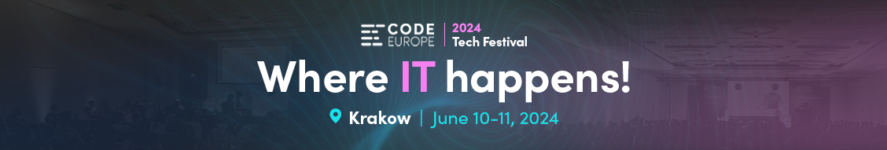
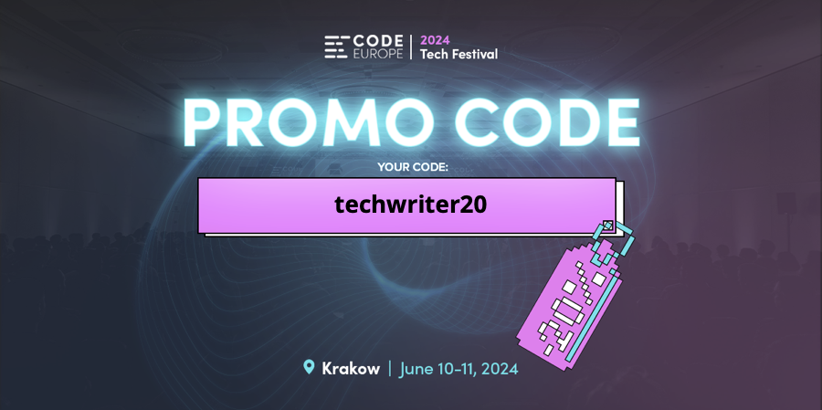

---
title:
  'Zapraszamy na Code Europe 2024'
authors: agnieszka
date: '2024-04-25'
tags:
  - 'news'
  - 'z-kraju'
  - 'kariera'
  - 'konferencje'
  - 'spolecznosc'
  - 'technologie'
coverImage: 'CE2024_Cover.png'
---

Z ogromną radością zapraszamy Was na największy festiwal technologiczny w Polsce, który w tym roku objęliśmy patronatem medialnym. Poniżej znajdziecie najważniejsze informacje.

<!--truncate-->

# O Code Europe

Zespół stojący za [Code Europe](https://www.codeeurope.pl/pl/) to ludzie, którzy czerpią inspirację z technologii i widzą ogromną wartość w możliwości wymiany wiedzy i doświadczeń. Dlatego właśnie w 2016 roku stworzyli wydarzenie Code Europe, które do tej pory doczekało się kilku edycji.

Celem wydarzenia jest zainteresowanie uczestników światem technologii i możliwościami, jakie daje. Wysoka jakość prelekcji i warsztatów oraz pozytywna atmosfera wyróżniają Code Europe na tle podobnych konferencji.

Uczestnicząc w tym wydarzeniu macie szansę odkryć najnowsze trendy i zdobyć kontakty, które mogą pomóc w kształtowaniu Waszej przyszłości w branży technologicznej. Na pokładzie jest już ponad 15 000 uczestników, co pokazuje jak dużym zainteresowaniem cieszy się festiwal. 

# Dla kogo?

Festiwal jest przeznaczony dla wszystkich zainteresowanych technologią, programistów, architektów oprogramowania, DevOps, miłośników bezpieczeństwa, profesjonalistów zajmujących się produktami, specjalistów od danych i entuzjastów kontroli jakości.

# Dlaczego warto być częścią Code Europe?

- Ucz się od najlepszych mówców, takich jak Venkat Subramaniam, José Valim, Sébastien Chopin, Sven Peters czy Michelle Sandford
- Nawiąż relacje z innymi entuzjastami technologii, które mogą mieć wpływ na Twoją ścieżkę kariery.
- Odkryj najgorętsze trendy technologiczne oraz poznaj gigantów branży IT

# Najważniejsze informacje

Code Europe odbędzie się **10–11 czerwca 2024 r. w ICE Kraków**. Topowi prelegenci z branży IT przez 2 dni będą się z Wami dzielić swoją wiedzą i doświadczeniem podczas ponad 50 warsztatów.

Oficjalne rozpoczęcie Code Europe odbędzie się o godzinie 9:30. Ostatnia sesja zacznie się około 16:00 pierwszego dnia i 16:00 drugiego dnia.

Po zakończeniu pierwszego dnia festiwalu odbędzie się impreza Afterparty, dla wszystkich uczestników, partnerów oraz prelegentów.

Szczegółowy harmonogram znajdziecie [na stronie wydarzenia](https://www.codeeurope.pl/pl/agenda).

W ramach patronatu mamy dla Was **20% zniżki** na kod **techwriter20**.

Rodzaje biletów i cennik znajdziecie [na stronie wydarzenia](https://www.codeeurope.pl/pl/kup-bilet).

Wszystkim uczestnikom życzymy dobrych wrażeń!
