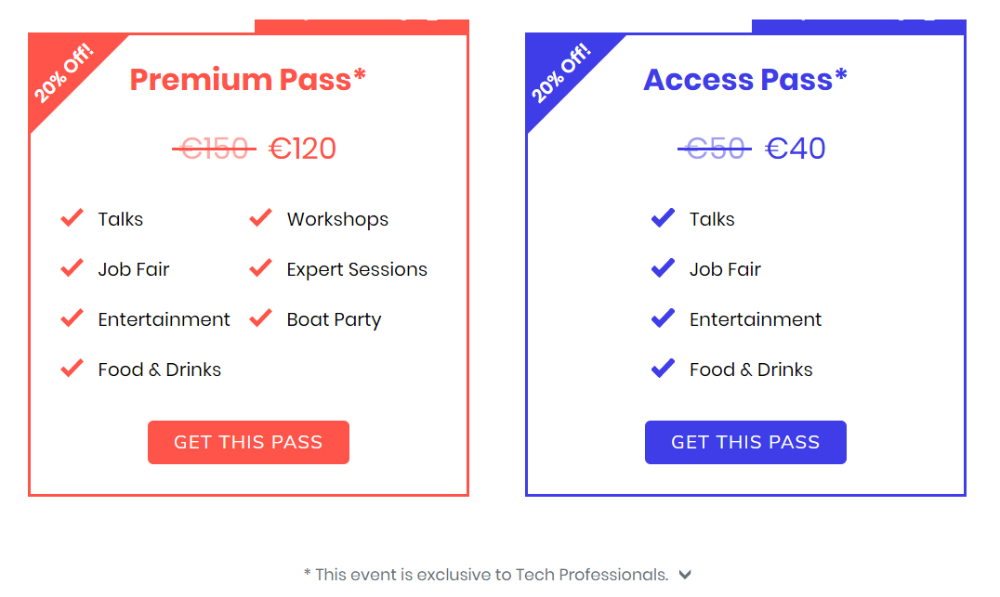

Z ogromną przyjemnością już dziś zapraszamy specjalistów IT do Berlina na
nadchodzący [Landing Festival 2018](https://landingfestival.com/berlin). Jest to
dla nas tym większa radość gdyż objęliśmy to wydarzenie patronatem medialnym 😊
.

<!--truncate-->

### Landing Festival - co to takiego?

Jest to jedno z najciekawszych wydarzeń dla osób chcących rozwijać swą karierę w
szeroko rozumianej branży IT. W tym roku przypada jego trzecia edycja.
Organizatorzy w trakcie dwóch dni trwania festiwalu zapewniają szereg warsztatów
znacznie poszerzających wiedzę uczestników, a także możliwość nawiązania
licznych kontaktów ze specjalistami z międzynarodowych firm takich jak: mytaxi,
SumUp, ThoughtWorks, Raisin czy SoundCloud.

### Kiedy i gdzie?

Landing Festival 2018 odbędzie się w dniach 14-15 marca
w [Deutche Telekom's Representative Office](http://www.telekom-hauptstadtrepraesentanz.com/en/),
biurowcu położonym w sercu Berlina. W jego otoczeniu znajdują się miejsca słynne
wśród turystów jak na przykład Brama Brandenburska, Katedra Berlińska czy
Reichstag. Więcej informacji praktycznych znajdziecie
[tutaj](https://landingfestival.com/berlin/about).

### Co nas czeka?

Otrzymujemy standardowy zestaw atrakcji charakterystycznych dla tego typu
wydarzenia. Będą oczywiście prelekcje i warsztaty, sesje eksperckie, a całość
zwieńczą targi pracy. Nie zabraknie także hackatonu, zaś jako dodatkowa atrakcja
wymieniany jest rejs łodzią. Impreza będzie miała także polski akcent - jedną z
prezenterek jest Agnieszka Naplocha z firmy Adobe.

### Ile to kosztuje?

Obecnie dostępne są dwa rodzaje biletów - Premium Pass oraz Acces Pass (ceny w
tabeli poniżej).

Wybierając Premium Pass macie dostęp do wszystkiego, co zapewnia organizator
(prelekcje, warsztaty, targi pracy, sesje eksperckie, rejs łodzią, dodatkowe
rozrywki oraz jedzenie i napoje).

Tańszy Access Pass zapewnia wstęp jedynie na prelekcje, targi pracy i
towarzyszące im atrakcje oraz jedzenie i napoje.

Dojazd oraz zakwaterowanie w Berlinie musicie zorganizować we własnym zakresie.

Zdecydowanych zapraszamy na
[stronę rejestracji](https://landingfestival.com/berlin/tickets).

### Top Talent Grant

Top Talent Grant to ciekawa inicjatywa towarzysząca festiwalowi, mająca na celu
wspieranie najlepszych technicznych talentów. Wybranej grupie specjalistów
organizatorzy pokryją koszta przelotu, ułatwiając tym samym uczestnictwo w
festiwalu oraz umożliwią wzięcie udziału w ekskluzywnych dniach otwartych
Company Open Days. Lista lokacji, z których loty mogą zostać sfinansowane
zawiera dwa miasta w Polsce - Kraków i Warszawę. Szczegóły dotyczące TTG
znajdziecie
[tutaj](https://github.com/LandingFestival/FAQ.md/blob/master/5.%20Top%20Talent%20Grant.md).
Gdybyście chcieli spróbować ruszyć na podbój berlińskiego rynku pracy, albo
macie znajomych, których mogłoby to zaciekawić - podajemy
link, [pod którym można się zarejestrować](https://www.google.com/url?q=https://landingfestival.com/berlin/top_talent?utm_source%3Dstartupberlin%26utm_medium%3Daffiliate%26utm_campaign%3Dlandingfriends&sa=D&ust=1517863790854000&usg=AFQjCNEjZlSX7iyITYmyJdQTi1B7Xz9nYg).

### A jak było rok temu?

Chcecie się dowiedzieć jak pracowali oraz bawili się uczestnicy zeszłorocznej
edycji Landing Festival? Wszelkie detale znajdziecie
[tutaj](https://landingfestival.com/berlin/previous-editions) - zachęcamy do
obejrzenia krótkiego filmu relacjonującego wydarzenie.

W imieniu organizatorów serdecznie zapraszamy do wzięcia udziału w Landing
Festival.
