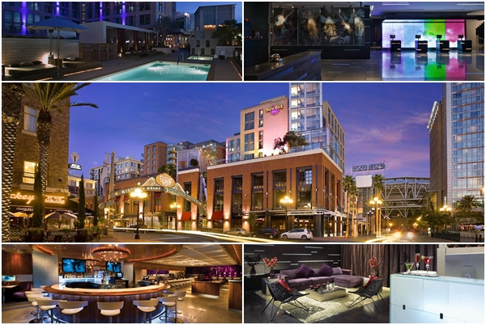
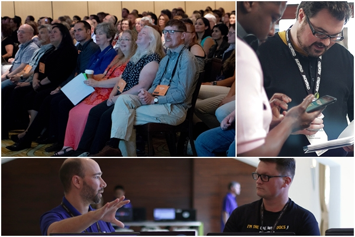
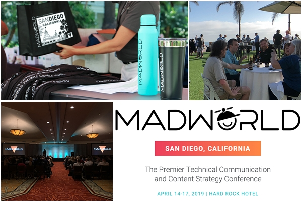

Tradycyjnie już zapraszamy Was do San Diego, gdzie wkrótce odbędzie się 6. edycja konferencji MadWorld. Czego się spodziewać? Jakie są ceny? Co szykują dla nas organizatorzy? Te i inne informacje na temat wydarzenia znajdziecie poniżej.

## Termin

MadWorld San Diego odbędzie się w dniach 14-17 kwietnia 2019 roku w San Diego, Kalifornia, USA.

## Miejsce

W tym roku MadWorld San Diego odbędzie się w innym miejscu niż ostatnio, a mianowicie w hotelu [Hard Rock](http://www.hardrockhotelsd.com/). Dla części uczestników lokacja ta może być dobrze znana, gdyż zorganizowano tam konferencję MadWorld w 2017 roku. Jest to nowoczesny hotel utrzymany w stylistyce rockowej z bogatą ofertą gastronomiczną oraz rozrywkową. Położony blisko oceanu, w śródmieściu miasta zapewnia komfort i możliwość relaksu, a jednocześnie pozwala być w centrum najważniejszych wydarzeń organizowanych w San Diego.

## Program konferencji

Podobnie jak w poprzednich latach, organizatorzy MadWorld zadbali, by pełna agenda wydarzenia była znana na długo przed terminem wydarzenia. Dzięki temu dokładnie wiemy za co płacimy, czego się należy spodziewać oraz jak zaplanować swój pobyt w San Diego, by wykorzystać ten czas jak najlepiej. Oczywiście, mogą wydarzyć się pewne sytuacje losowe, które wprowadzą zmiany w organizacji konferencji, jednak jak dotąd były to jedynie różnice kosmetyczne. Co nas zatem czeka w tym roku?

- Pierwszy dzień – rejestracja, warsztaty wprowadzające, Technical Support Lounge, przyjęcie powitalne
- Drugi i trzeci dzień – prelekcje - 20 prezentacji każdego dnia (5 sesji w 4 ścieżkach). W czasie trwania wykładów oraz w przerwach dostępni są eksperci w Technical Support Lounge. Każdy dzień zakończony jest imprezą
- Czwarty dzień – seria zaawansowanych warsztatów (14 sesji w 2 ścieżkach). Zakończenie konferencji tak zwanym Happy Hour czyli rozmowami przy piwie lub innym drinku nad basenem.

Warsztaty wprowadzające pierwszego dnia konferencji skierowane są do osób, dla których produkty MadCap Flare są nowością. Po całodziennym szkoleniu będziecie gotowi do tego, by rozpocząć swój pierwszy, w pełni samodzielny projekt Flare. Udział w warsztatach wymaga rejestracji. Mogą być one zakupione wraz z wejściówką na kolejne dni konferencji lub osobno.

W kolejnych dniach poznamy nie tylko nowości proponowane przez twórców narzędzi MadCap, ale także zapoznamy się z nowinkami ze świata komunikacji technicznej oraz zmianami, jakie wkrótce pojawią się w naszej branży, głównie dzięki rozwojowi coraz to nowocześniejszych technologii. Po dwóch dniach prelekcji poznaną teorię wykorzystamy w trakcie zaawansowanych warsztatów, dzięki czemu, po powrocie do domu, będziemy mogli unowocześnić dotychczasowy warsztat i przekazać nowe praktyki współpracownikom i kolegom z branży. Podobnie jak w przypadku warsztatów wprowadzających, wymagana jest dodatkowa rejestracja.

Szczegółowy program konferencji znajdziecie na  [stronie wydarzenia](https://www.madcapsoftware.com/conference/madworld-2019/schedule/#content).

Osobom chcącym bliżej poznać sylwetki prezenterów oraz tematykę ich wykładów polecamy [MadBlog](https://www.madcapsoftware.com/blog/) gdzie, poza informacjami o prelegentach, znajdziecie sporo ciekawostek ze świata MadCap.

## Ceny

Poniżej przedstawiamy zestawienie cen biletów.

<table><tbody><tr><td></td><td><strong>Ceny od 01.02-15.03.2019</strong></td><td><strong>Ceny od 16.03-17.04.2019</strong></td></tr><tr><td><strong>Konferencja</strong></td><td style="text-align: center;">$1,999</td><td style="text-align: center;">$2,199</td></tr><tr><td><strong>Warsztaty wprowadzające</strong></td><td style="text-align: center;">$499</td><td style="text-align: center;">$599</td></tr><tr><td><strong>Warsztaty zaawansowane</strong></td><td style="text-align: center;">$599</td><td style="text-align: center;">$699</td></tr></tbody></table>

Cena wejściówki na MadWorld San Diego obejmuje:

- Wstęp na pierwszy, drugi i trzeci dzień konferencji
- Dostęp do pracowników wsparcia technicznego MadCap w Technical Support Lounge
- Aplikację konferencyjną na urządzenia mobilne
- Przyjęcie na zakończenie każdego dnia konferencji
- Śniadanie drugiego i trzeciego dnia konferencji, a także lunch oraz przekąski i napoje w trakcie przerw oraz wieczornych eventów w trakcie wszystkich trzech dni wydarzenia
- Zestaw rejestracyjny (torba, koszulka, itp.)
- Dostęp do slajdów i nagrań audio prezentacji po konferencji.

Uczestnicy konferencji, mogą również skorzystać ze specjalnych cen na pobyt w hotelu Hard Rock, w którym odbywa się konferencja. Więcej szczegółów znajdziecie na stronie ([link](https://www.madcapsoftware.com/conference/madworld-2019/pricing.aspx#content)).

## Dlaczego warto?

Naszym zdaniem istnieje kilka powodów, dla których każdy użytkownik narzędzia MadCap Flare powinien rozważyć udział w konferencji MadWorld.

Po pierwsze, wydarzenie to oferuje szereg prezentacji oraz warsztatów (w tym roku aż dwa dni), podczas których teoria ściśle łączy się z praktyką, co zapewnia skuteczne przyswojenie bądź utrwalenie wiedzy z branży.

Po drugie, dostajemy bezpośredni dostęp do specjalistów. Zarówno prelegenci jak i osoby ze wsparcia technicznego (Technical Support Lounge) są ekspertami w swojej dziedzinie i chętnie dzielą się swoim doświadczeniem. Dzięki temu w dość krótkim czasie nie tylko zapoznamy się z nowinkami czy nauczymy się też czegoś nowego, ale także możemy rozwiązać całkiem sporo problemów, które nas trapią. Dla niektórych uczestników jest to główny powód, dla którego decydują się na udział w konferencji.

Po trzecie, na MadWorld panuje świetna atmosfera, a organizacja wydarzenia stoi na wysokim poziomie. Przyciąga to uczestników z całego świata, wśród których znajdują się zarówno przedstawiciele niewielkich firm, wielkich korporacji, świata naukowego, a nawet rządowych agencji. Daje to możliwość poznania nowych osób z różnych środowisk, które dzielą podobne problemy i zainteresowania.

Dodatkowo, dostajemy możliwość zwiedzenia ciekawych miejsc, skorzystania z pięknej pogody i wypoczynku na pobliskich plażach.

Jeśli nadal się wahacie, to możecie zapoznać się z [materiałami archiwalnymi](https://www.madcapsoftware.com/conference/) na temat poprzednich edycji MadWorld San Diego.
