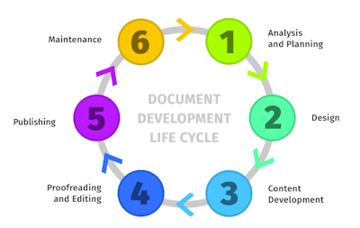

Dla osób, które ciekawi kim jest technical writer i dla tych, które chcą zrobić
pierwsze kroki w tym kierunku, przedstawiamy zestaw linków do materiałów.

<!--truncate-->

Oto "pakiet startowy" dla zainteresowanych dużą zmianą w życiu zawodowym.

## Podstawowe informacje o technical writingu

Wiele osób stawia sobie na początku pytania: "Jak to jest być technical
writerem?" i "Na czym to polega?". Po przeczytaniu tych materiałów powinno się
to stać bardziej jasne.

[Komunikacja techniczna - co to jest, kto się tym zajmuje i dlaczego?](../komunikacja-techniczna-co-to-jest-kto-sie-tym-zajmuje-i-dlaczego/index.md)

[Kapelusze tech writera](../kapelusze-tech-writera/index.md)

[Kim jest Subject Matter Expert (SME) i jak z nim rozmawiać?](../kim-jest-sme/index.md)

[Dobra dokumentacja - cechy i etapy tworzenia](../dobra-dokumentacja-cechy-i-etapy-tworzenia/index.md)

[Noty wydania (Release Notes) - co, jak, dla kogo?](../noty-wydania-release-notes-co-jak-dla-kogo/index.md)

[Co piszą tech writerzy? Zestawienie popularnych treści technicznych](../co-pisza-tech-writerzy-zestawienie-popularnych-tresci-technicznych/index.md)

[Jak pisać dobre instrukcje?](../jak-pisac-dobre-instrukcje/index.md)

[Prezentacja Andrzeja z podstawowymi informacjami](https://docs.google.com/presentation/d/1_jUze-3QpAw9kS3sLwJIzM-YOeklhd55/edit?usp=sharing&ouid=113147649678372892437&rtpof=true&sd=true)

[Strona konferencji Write The Docs z definicjami podstawowych pojęć](https://www.writethedocs.org/guide/)

[Film YouTube definiujacy technical writing i pokrewne specjalności](https://www.youtube.com/watch?v=6eXi6fGUSyE)

Jeśli chodzi o definicje istotnych kategorii i zagadnień to dla osób
początkujących to polecam Technical Writer HQ, bo regularnie dostarcza porcje
przydatnych informacji:

[Technical Writer HQ na LI](https://www.linkedin.com/company/technical-writer-hq/)

[Baza wiedzy na stronie Technical Writer HQ: Technical documentation](https://technicalwriterhq.com/documentation/technical-documentation/)

[Technical Writer HQ: Proces tworzenia dokumentacji](https://technicalwriterhq.com/writing/technical-writing/document-development-life-cycle/)

## Zarobki

Jednym z istotnych pytań jest to, ile się w tym zawodzie zarabia. Ankieta płac
pomoże Ci to oszacować.

[Wyniki badania płac](../wyniki-badania-plac-w-komunikacji-technicznej-2024/index.mdx)

## Zdobywanie doświadczenia: projekty Open Source

Dobrym pomysłem na zbudowanie portfolio jest zaangażować się w projekt Open
Source.

[Projekty open source technical writerów](../projekty-open-source-dla-technical-writerow/index.md)

## Jak dostać pierwszą pracę

Poniżej znajdziesz wiele wskazówek na bazie rzeczywistych doświadczeń.

### Spojrzenie całościowe

[Jak zostać technical writerem?](https://techwriter.pl/jak-zostac-technical-writerem/index.md)

[Jak dostać pierwszą pracę](../jak-dostac-pierwsza-prace-jako-technical-writer/index.md)

[Techwriter szuka pierwszej pracy](../techwriter-szuka-pierwszej-pracy/index.md)

### Jak opracować dobre CV

[CV - najważniejszy dokument Tech Writera](../cv-najwazniejszy-dokument-tech-writera/index.md)

[Skuteczne CV czyli jakie?](../skuteczne-cv-czyli-jakie/index.md)

### Testy rekrutacyjne

[Test dla nowego tech writera](../test-dla-tech-writera/index.md)

## Tłumacz odkrywa tech writing

Jeśli jesteś anglistką bądź anglistą, to mam dla Ciebie dobrą wiadomość: wiele
umiejętności, które już posiadasz, pomoże Ci w nowej roli. Poniżej relacje dwóch
osób, które taką drogę odbyły.

[Od tłumacza do techwritera](../od-tlumacza-do-tech-writera/index.md)

[Od anglisty do dokumentalisty](../od-anglisty-do-dokumentalisty/index.md)

## Gdzie szukać pomocy

[Tech Writer w opałach. Gdzie szukać pomocy?](../tech-writer-w-opalach-gdzie-szukac-pomocy/index.md)

## Kluczowe pojęcia

### DITA
![] [Seria artykułów o DITA](https://techwriter.pl/tags/dita)

## Standardy

### Podręczniki stylów

Spójność jest w cenie. Podręczniki stylów definiują to jak zwracamy się do
czytelnika, zalecane słowa i wyrażenia, ton wypowiedzi, formatowanie,
interpunkcja i wiele innych.

[The Chicago Manual of Style](https://www.chicagomanualofstyle.org/home.html)

[Microsoft Manual of Style](https://learn.microsoft.com/en-us/style-guide/welcome/)

[Google Style Guide](https://developers.google.com/style/)

Oprócz samego podręcznika stylu, znajdziesz też materiały dla osób
początkujących. Jest możliwość wzięcia udziału w darmowej sesji szkoleniowej
online:

[Kurs Google Developers Guidelines](https://developers.google.com/tech-writing)

[Splunk Style Guide](https://docs.splunk.com/Documentation/StyleGuide/current/StyleGuide/Howtouse)

### Prosty język

Simplified Technical English wywodzi się z branży lotniczej. Jeśli chcesz
poznać, jak używać bardziej zrozumiałych słów i wyrażeń w języku angielskim,
zapoznaj się z tym standardem. Jest on szczególnie przydatny podczas pisania
instrukcji.

[STE - wprowadzenie](../simplified-technical-english-wprowadzenie/index.md)

[STE - jak używać go w praktyce](../simplified-technical-english-ste-jak-go-uzywac-w-praktyce/index.md)

[Strona kursu STE, na której możecie zamówić bezpłatnie dostęp do PDF ze standardem](https://www.asd-ste100.org/)

### Diataxis

Krótkie opracowanie, które pomoże Ci dzielić typy tworzonych treści wedle
funkcji edukacyjnej jaką ona pełni. Szybko się czyta i dużo układa w głowie.
Oprócz tego podziału, znajdziesz też kryteria dla udanej dokumentacji.

 [Diataxis](https://diataxis.fr/)

### ITCQF

Mimo, że fundacja która stworzyła ten standard zakończyła swoją działalność, to
sam [sylabus ITCQF](https://edu.ittraining.pl/material/Sylabus-ITCQF-Technical-Communication-Professional-Foundation-Level-en-wersja-2-0) nie traci na aktualności. To opracowanie nakreślające ramy technical
writingu, kluczowe definicje i dobre praktyki.

[Perły z sylabusa ITCQF](../perly-z-sylabusa-itcqf/index.md)

## Dodatkowe źródła wiedzy

### Podcast

Warto wsłuchać się w to, co dwaj redaktorowie mają do powiedzenia, bo pięknie
przybliżają techniczną stronę technical writingu i zapraszają ciekawych gości.

[Techwriter Koduje](https://techwriterkoduje.pl/)

### Blog

Bardzo popularny blog o technical writingu, zawiera same konkrety pisane przez
bardzo doświadczonego profesjonalistę.

[I'd Rather Be Writing](https://idratherbewriting.com/)

### Meetupy

Jeśli interesujesz się technical writingiem i masz możliwość wzięcia udziału w
meetupie to koniecznie to zrób! Poznasz użyteczną wiedzę i szalenie pomocnych
ludzi.

[Lista nadchodzących wydarzeń](https://techwriter.pl/wydarzenia)

[MeetContent (Wrocław)](https://meetcontent.github.io/)

[Content Bytes (Kraków)](https://contentbytes.pl/)

### Konferencje

Konferencje to świetne okazje do nauki i networkingu.

[Cake conf](https://cakeconf.contentbytes.pl/)

[Write the Docs](https://www.writethedocs.org/)

[Nordic Tekom](https://dk.nordic-techkomm.com/)

### Kurs na Akademii Vistula

Kurs podyplomowy o komunikacji technicznej na Akademii Vistula to unikatowa
propozycja i szansa na poznanie szerokiej gamy narzędzi, którymi technical
writer zarabia na chleb 😊.

[Seria artykułów o studiach na Akademii Vistula](https://techwriter.pl/tags/studia)

[Kurs komunikacja techniczna](https://www.vistula.edu.pl/kierunki-studiow/kontynuacja-edukacji/studia-podyplomowe/informatyka/komunikacja-techniczna)

## Zakończenie

Powyżej zamieściliśmy garść linków. Znasz coś równie pomocnego, co powinno
trafić na tę listę? Daj nam znać!

Osobom, którym zależy na wiedzy i znalezieniu nowej pracy, życzymy udanych
poszukiwań.
