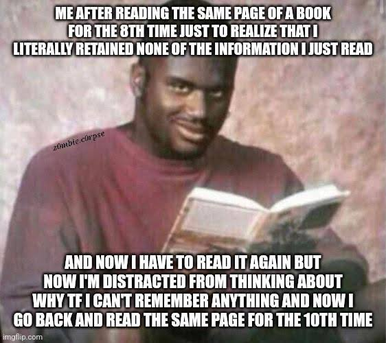

Czytanie własnej lub cudzej dokumentacji stanowi lwią część warsztatu technical
writera. Jak sprawić, by świeżym okiem przeczytać ten sam tekst po raz 28? W
artykule przedstawiam kilka faktów i pomysłów.

<!--truncate-->

## Wstęp

Każdy kto pracuje w technical writingu zna następujący scenariusz: pracujesz
wiele tygodni nad żmudnym, złożonym, wymagającym dużego skupienia tekstem w
ramach projektu dokumentacyjnego.

Stopniowo rozwijasz tekst. W miarę jak poszerza się Twoje rozumienie tematu,
otrzymujesz też sugestie ulepszeń. Znasz ten tekst od samego początku, każde
zdanie zostało wyrzeźbione przez Ciebie.

Wyzwanie polega na tym, jak sprawić, by po raz kolejny przeczytać ten tekst ze
zrozumieniem, by wychwycić błedy logiczne, niespójności i obszary do ulepszenia.

Dlaczego jest to takie trudne? Mimo, że przyjęło się uważać, że to eksperci
domenowi od których pozyskujesz informacje są obciążeni klątwą wiedzy, okazuje
się, że ta przypadłość jest zaraźliwa i dotknąć może również specjalistę
od dokumentacji, jak tylko dostatecznie dobrze zapoznasz się z tematem.

Za dodatkową trudność uważam to, że nasz mózg stara się oszczędzać energię.
Autor dokumentacji czyta swój materiał największą liczbę razy. Łatwiej skupić
uwagę na kompletnie nowej informacji niż na informacji która tylko nieznacznie
różni się od poprzedniej znanej już wersji. Analiza tekstu wymaga dużo wysiłku i
nasz mózg do sprawy podchodzi ekonomicznie: zamiast wiernie odczytywać na nowo
podobne rzeczy, stara się pomijać odczytywanie niektórych fragmentów, które już
mamy w pamięci.

Powszechnie znanym zjawiskiem jest to, że gdy litery w wyrazie są przemieszane,
ale pierwsza i ostatnia litera się zgadzają, nasz mózg i tak w locie odczyta
właściwy wyraz, który jest zgodny z intencją.

Powoduje to, że musimy być bardzo ostrożni przy kolejnych recenzjach własnego
tekstu, bo łatwo jest w nim zobaczyć coś, co powinno w nim być zamiast
krytycznie zobaczyć to, co faktycznie jest i może wymagać poprawy.

Różne zniekształcenia poznawcze powodują też, że czytając własny tekst jesteśmy
bardziej skłonni uznać, że coś jest wystarczająco jasne niż szukać dziury w
całym. Być może zapisaliśmy błędną informację na samym początku, opatrzyła się
nam i poprzez ponowne jej oglądanie utwierdzamy się w przekonaniu, że jest
właściwa.

Zdarzyć się mogą skróty myślowe wynikające z tego, że technical writer
niesłusznie uzna coś za powszechnie znaną informację, co finalnie przysporzy
kłopoty w zrozumieniu tekstu przez czytelników.

Skoro można mieć "writer's block" (brak weny do pisania, syndrom białej kartki
albo "Bartona Finka") to pomyślałem, że można też mieć "reader's block" (brak
chęci do czytania) lub "reader's fatigue" (znużenie czytaniem).

[Źródło](https://www.reddit.com/r/AutisticWithADHD/comments/1c77joz/why_dont_you_like_reading/)

W kontekscie komunikacji technicznej widzę też "reviewer's block" (znużenie
recenzowaniem materiału).

Z pewnością nie wyczerpuję tu listy pułapek, jakie stoją przed autorem
czytającym własne dzieło. Wiem doskonale jak trudne bywa krytyczne spojrzenie na
własny tekst.

## Jak zachęcić siebie do ponownego spojrzenia świeżym okiem?

Z powodu wymienionych trudności, myślałem o tym, co możemy zrobić, by lepiej
radzić sobie z tymi wyzwaniami. Poniżej kilka pomysłów.

### Przeczytaj na głos

Najczęściej czytam w myślach. Czytanie na głos stanowi pewną odmianę i pozwala
usłyszeć tekst nieco inaczej. Słysząc własny głos, aktywujemy inne obszary
mózgu, mocniej skupiamy się nad czytanym tekstem.

### Zamień tekst na wygenerowaną mowę

Często korzystam z opcji automatycznego czytania przez wygenerowany głos. W
przeglądarce Edge korzystam ze skrótu `Ctrl+Shift+U`. Można wybrać sobie rodzaj
głosu, dobrać odpowiednie tempo. W przypadku angielskiego można sobie poszaleć i
wybrać egzotyczną wymowę. Dokumentacja czytana z nowozelandzkim czy
australijskim akcentem? Czemu nie?

Warto zmieniać sobie rodzaje głosów, żeby znana Ci wcześniej treść mogła
zabrzmieć na nowo.

Obecnie dużo słyszy się o produkcie do generowania syntetycznych głosów 11Labs,
jeszcze z niego nie korzystałem. Ciekawe czy można usłyszeć dokumentację czytaną
głosem Morgana Freemana. To byłoby epickie 😃!

### Immersive Reading

W wielu aplikacjach i przeglądarkach można czytać tekst w trybie Immersive
Reading. Tekst jest wyświetlony w wybranych czcionkach, z ustawionym kolorem
tła. Dla lepszego skupienia się nad tekstem, podczas gdy lektor czyta tekst
widoczna od jednej do kilku linijek tekstu, a reszta jest zaciemniona. Widoczny
też jest znacznik obecnie wypowiadanego słowa, co pomaga śledzić tekst wraz z
lektorem.

Duże, czytelne litery, inny wygląd czcionki, inny kolor, skupienie na czytanym
fragmencie i generowany głos sprawiają, że tę samą treść odbierasz inaczej. Ze
słuchu łatwiej wyłapać nienaturalne wyrażenia w tekscie albo braki w
interpunkcji.

### Copilot i inni asystenci AI

W obecnych czasach wspierać się można rozwiązaniami GenAI. Można sprawdzić tekst
pod względem logiki prezentowania informacji, spójności terminologii lub
przetestować go pod kątem persony odbiorcy. Być może w ten sposób
zidentyfikujesz brakujące elementy i aspekty, które mogą wymagać poprawy.

Gdy GenAI wskaże Ci fragmenty, które trzeba przeczytać ponownie, być może
łatwiej będzie przyjrzeć się sprawie ponownie.

### Recenzja drugiej osoby

Nic nie zastąpi recenzji drugiej osoby, dlatego gdy już faktycznie nie jesteś w
stanie znaleźć obszarów do usprawnienia, pozostaje zdać się na oko recenzenta.

To tyle na dziś. Życzę samych udanych recenzji!

## Materiały dodatkowe

### YouTube

- [The Unbelievable Science of How We Read: Be Smart](https://www.youtube.com/watch?v=Wt7rR0MCYsg)

- [How the Brain Learns to Read - Prof. Stanislas Dehaene](https://www.youtube.com/watch?v=25GI3-kiLdo&t=1479s)
