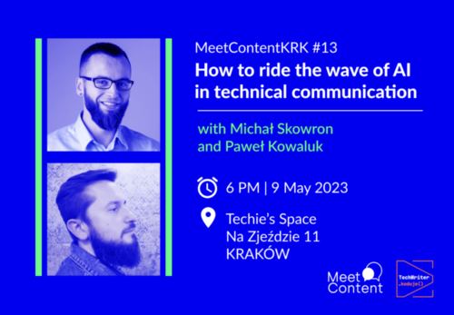

Mamy dla Was świetne wieści z Krakowa. Swą działalność wznawia społeczność
MeetContentKRK!

<!--truncate-->

Po (zbyt) wielu miesiącach nieobecności MeetContentKRK powraca z zupełnie nowymi
tematami, miejscami spotkań i możliwością poznania twórców związanych z
technical writingiem.

#### **Czas i miejsce**

Już 9 maja 2023 o godzinie 18:00 odbędzie się pierwsze, inauguracyjne spotkanie
zorganizowane przez społeczność techwriterską z Krakowa. Prelegenci będą na Was
czekać w [Techie’s Space](https://www.facebook.com/techies.krakow/), Na Zjeździe
11, 30-527 Kraków.

#### **Temat**

Na spotkaniu zostanie poruszony jeden z najgorętszych obecnie tematów, a
mianowicie: sztuczna inteligencja i jej rola w tworzeniu treści.

Sztuczna inteligencja budzi zarówno ciekawość jaki i lęk ludzi w każdej już
chyba branży. Zjawisko to nie omija też komunikacji technicznej. Co powinniśmy
zrobić, aby pozostać aktualnym i nie zostać zastąpionym? Czego trzeba się
nauczyć? Jakie są korzyści i zagrożenia związane z korzystaniem z tej
technologii?

#### **Prelegenci**

Prezentację poprowadzą założyciele i prowadzący podcast
[Tech Writer koduje](https://techwriterkoduje.pl/) (a także nasi dawni
redaktorzy) - Michał Skowron i Paweł Kowaluk.

- Michał jest zagorzałym zwolennikiem automatyzacji dostarczania treści, który
  woli inteligentne tworzenie dokumentacji od tradycyjnego pisania. W latach
  2012-2020 pracował jako tech writer. Obecnie zajmuje się narzędziami
  dokumentacyjnymi w Guidewire Software oraz pełni funkcję członka zarządu w
  ITCQF.
- Paweł pracuje w branży tech writingu od 2008 roku. Pracował jako tech writer,
  manager, kierownik projektu, konsultant, sprzedawca, instruktor i programista
  narzędzi doc. Obecnie pisze teksty techniczne dla Guidewire Software i jest
  członkiem zarządu ITCQF.

#### Kilka słów o sponsorze

Majowa edycja MeetContentKRK jest sponsorowana przez
[Codete](https://codete.com/).

Codete to firma programistyczna z siedzibą w Polsce, która specjalizuje się w
tworzeniu oprogramowania na zamówienie i doradztwie IT. Codete w liczbach:

- Ponad 350 specjalistów.
- 3 biura w Krakowie, Lublinie, Berlinie oraz przestrzenie coworkingowe w
  największych polskich miastach (Warszawa, Wrocław, Gdańsk).
- Ponad 120 projektów.
- Ponad 70 klientów z całego świata.

W styczniu 2022 roku Codete otworzyło własny resto-bar Techie’s, w którym
odbywają się najlepsze imprezy technologiczne w mieście i właśnie tam spotkacie
się w ramach MeetContent.

#### Formularz zgłoszeniowy

Podobie jak w przypadku innych spotkań tego typu, i tu organizatorzy proszą o
rejestrację poprzez dedykowany formularz zgłoszeniowy. Znajdziecie go pod
[tym linkiem](https://docs.google.com/forms/d/e/1FAIpQLSd0w-3Zb9weQspmrzWuuNPN__IdUFPjNZ6uXNjJYQ-rbouOig/viewform).

Po spotkaniu, osoby zarejestrowane otrzymają dodatkowe informacje i materiały
związane z meetup'em.

Wszystkim uczestnikom życzymy dobrych wrażeń.
